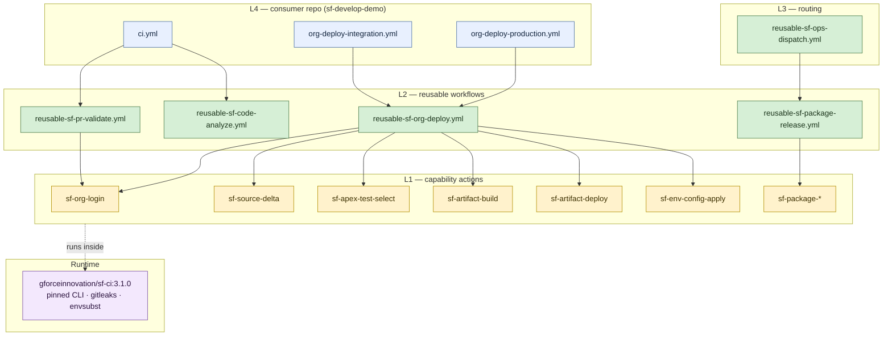
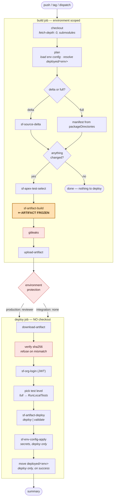

# The CI pipeline, on one page

How this repository is organised, what each layer is for, and how a commit
becomes a deployment.

---

## Naming: you can tell what a file is from its name

Every filename answers two questions — **what kind of thing is this**, and
**what does it act on**.

### Workflows: `<kind>-<domain>-<subject>.yml`

| Prefix      | Kind                                   | Who runs it                | Example |
|-------------|----------------------------------------|----------------------------|---------|
| `reusable-` | Callable by other repos (`workflow_call`) | consumer repos via `uses:` | `reusable-sf-org-deploy.yml` |
| `smoke-`    | Proves one capability actually works   | this repo, on its own PRs  | `smoke-sf-artifact.yml` |
| *(none)*    | This repo's own housekeeping           | this repo                  | `ci.yml`, `release.yml` |

The rule that makes it useful: **if it is prefixed `reusable-`, someone else
depends on it, so changing its inputs is a breaking change.** Anything else is
internal and free to move.

### Actions: `<domain>-<object>-<verb>`

```
sf-org-login          sf-  Salesforce      org       login
sf-package-promote    sf-  Salesforce      package   promote
sf-artifact-build     sf-  Salesforce      artifact  build
aws-secret-get        aws- AWS             secret    get
github-branch-sync    github- GitHub       branch    sync
```

Domain first so related actions sort together; verb last so the list reads as a
capability catalogue. All fourteen actions follow it — see
[ADR 0002](adr/0002-naming-and-repo-structure.md).

---

## The four layers



**The rules that keep it from tangling:**

- **L1 never calls L1.** An action that only picks between two other actions is
  routing, and routing belongs one layer up.
- **L4 contains no Salesforce logic.** No `sf` command appears in a consumer
  repo — it picks a trigger, an environment and a mode, nothing else.
- **No pass-through layer** that forwards inputs unchanged.
- **Nesting caps at 4**, and `L4 → L3 → L2 → action` already spends three.

---

## How a commit becomes a deployment



### Why the deploy job has no checkout

It is not an oversight. Without source it **cannot** rebuild what it deploys, so
"build once, deploy the same artifact" is enforced by the shape of the workflow
rather than by a rule someone has to remember.

Everything the deploy job needs therefore travels **inside the artifact**:

```
artifact/
├── mdapi/                    metadata, replacements already applied
│   ├── package.xml
│   └── destructiveChangesPost.xml
├── secret-templates/         ${PLACEHOLDER} markers only
│   ├── customMetadata/*.tpl
│   └── env-config.json       non-secret per-environment values
├── deployment.json           the audit record
└── checksums.txt
```

The checksum covers `mdapi/` **and** `secret-templates/`, because both are
deployed. Covering only one is a hole in the guarantee.

---

## The gates, and what each one is actually for

| Gate | Where | Refuses when |
|---|---|---|
| Unset replacement | build | a value is missing from `config/environments/<env>.json` — a placeholder must never reach an org |
| **gitleaks** | build, before upload | a secret is in the artifact; names rule, file and line |
| **Checksum** | deploy, before the org | the artifact changed after it was frozen |
| Empty substitution | deploy | a template variable is unset — `envsubst` would silently write a blank field |
| Environment protection | deploy | production, until a reviewer approves |
| Marker move | after deploy | never moves on failure, or on `validate` |

Two of these have already caught real problems on their first live run: gitleaks
found an API key committed in a public repo, and the checksum caught a
build/deploy scope mismatch.

---

## Deploy modes

| `deploy-mode` | Contacts the org | Commits | Applies secrets | Moves the marker |
|---|---|---|---|---|
| `validate` | yes — compiles and runs tests | no | no | no |
| `deploy` | yes | yes | yes | yes, on success |

`validate` is a real check-only deployment. It is how the pipeline gets proven
against a live org without changing one.

| `mode` | Manifest | Test level |
|---|---|---|
| `delta` | `sfdx-git-delta` from `deployed/<env>` | `RunSpecifiedTests` when the delta selects tests |
| `full` | every `packageDirectories` entry | always `RunLocalTests` |

Full deployments must use `RunLocalTests`: every class is being deployed, so
running only the delta's tests leaves the rest at 0% coverage and Salesforce
rejects it.

---

## Where to make a change

| You want to… | Change |
|---|---|
| add a deployment target | a new `org-deploy-<env>.yml` in the consumer repo, plus its GitHub Environment |
| change what a deployment does | `reusable-sf-org-deploy.yml` |
| add a Salesforce capability | a new `sf-<object>-<verb>` action |
| change the toolchain | `sf-docker-images`, then bump the pinned tag |
| add a per-environment value | `config/environments/<env>.json` in the consumer repo |
| add a credential | a GitHub Environment secret + a template in `config/secret-templates/` |

## Related

- [org-deploy-engine.md](org-deploy-engine.md) — the deployment engine in detail
- [ADR 0002](adr/0002-naming-and-repo-structure.md) — naming and layering
- [pipeline-map.md](pipeline-map.md) — the Salesforce-triggered dispatch chain
- [`sf-docker-images/docs/using-in-github-actions.md`](https://github.com/Gforce-Innovation-Kft/sf-docker-images/blob/main/docs/using-in-github-actions.md) — container job rules
