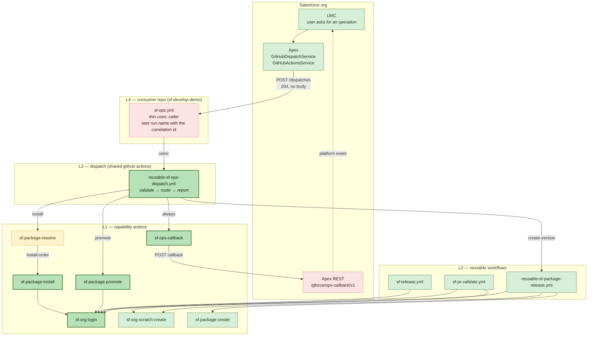
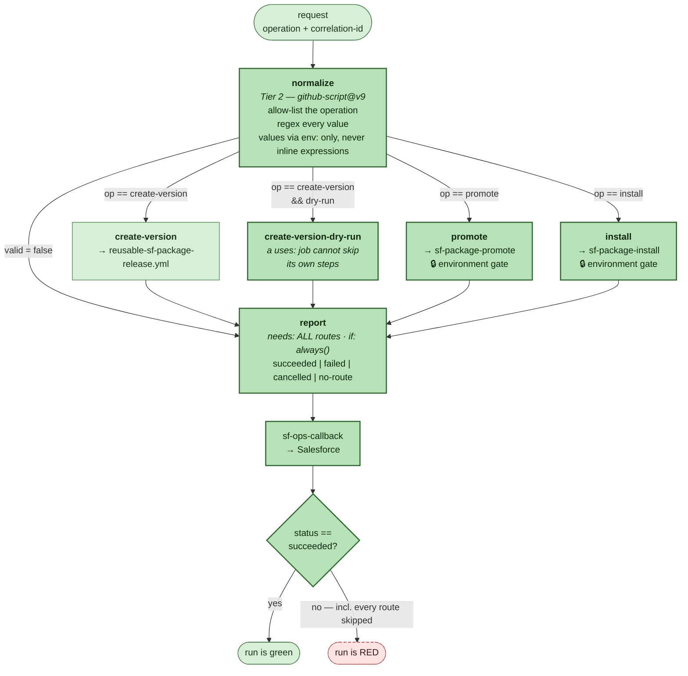
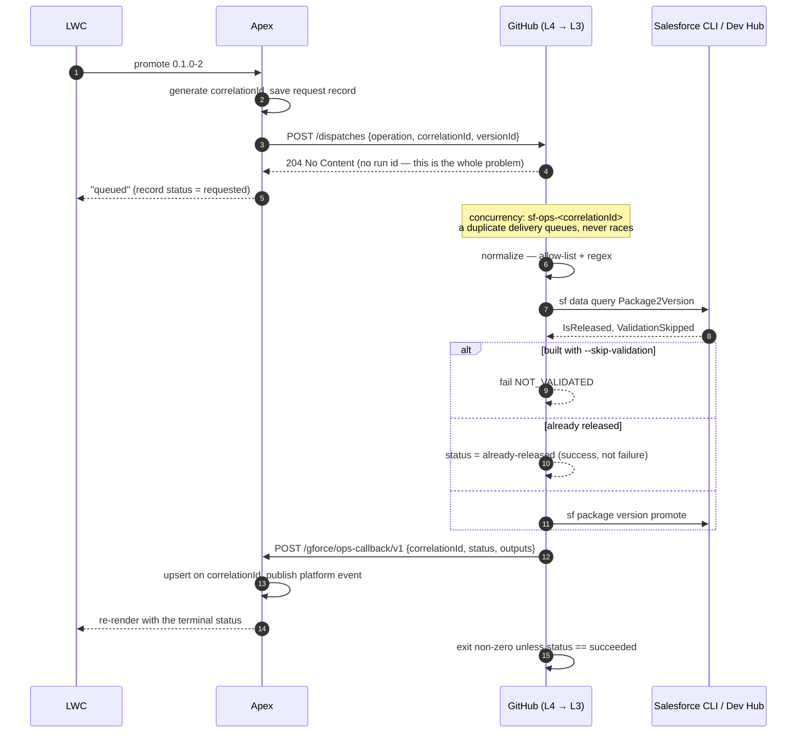
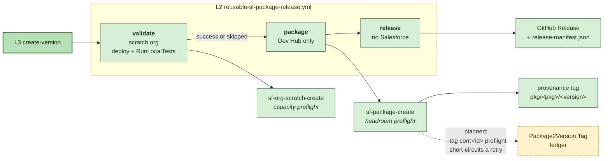
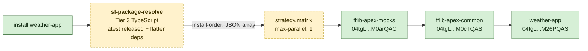
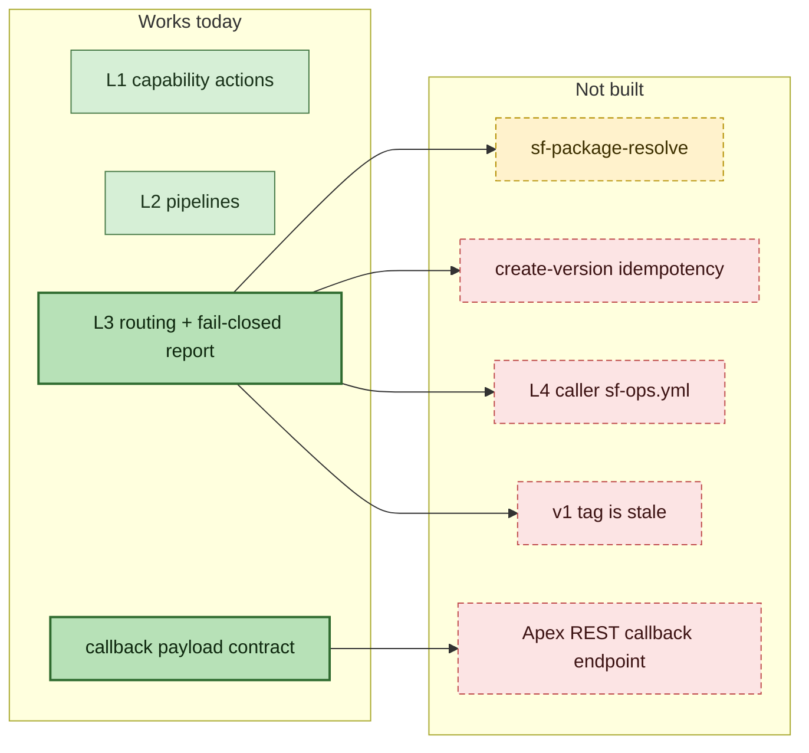
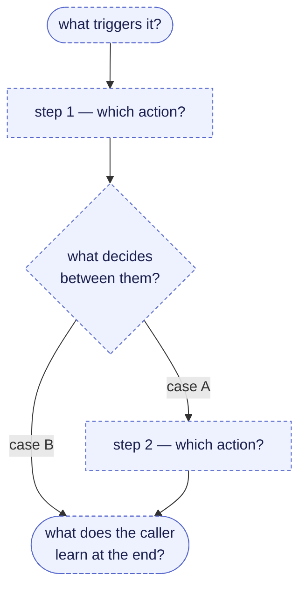

# Pipeline map — the Salesforce CI/CD chain

The whole system on one page. The tables live in
[`sf-cicd-pipeline-map.xlsx`](sf-cicd-pipeline-map.xlsx); the diagrams live here
because **the diagrams are the editable part**.

> **How to steer the work with this file.** Edit a diagram below — add a box,
> redraw an arrow, cross something out, write `?` on a node you want explained —
> and hand it back. Mermaid is plain text, so a diff of this file is a
> specification. That is faster and less ambiguous than describing a pipeline in
> prose.
>
> Conventions used in the diagrams:
> `:::built` = exists and works · `:::new` = added in this change ·
> `:::planned` = designed, not written · `:::gap` = missing and it matters.

---

## 1. The four layers

**The layer rules, in one line each.** L1 never calls L1 — an action that only
picks between two other actions is routing. L3 inlines no Salesforce logic. No
pass-through layer that forwards inputs unchanged. Nesting caps at 4 and
L4→L3→L2→action already spends three.

---

## 2. Inside the dispatcher — where a request actually goes

Three properties this shape exists to hold:

| Hazard | What stops it |
|---|---|
| **A skipped job is green.** An operation matching no route would report success. | `report` needs every route; all-skipped → `no-route` → the run fails. |
| **Both dispatch APIs return 204 with no body**, so the requester never learns a run id. Polling means searching runs by name after the 204 — racy in a way the client cannot fix. | The run calls Salesforce back, keyed by the correlation id. |
| **A rejected request would die in `normalize`**, leaving the LWC waiting forever. | `normalize` sets `valid=false` instead of failing, so `report` still calls back — *then* the run goes red. |

---

## 3. The round trip, in time order

---

## 4. The create-version pipeline (the expensive one)

**Why validate runs first:** a tree that does not compile costs zero
`Package2VersionCreates` slots. There are 6 per Dev Hub per day.

**What is still missing:** `sf-package-create` hardcodes `--tag "$GITHUB_SHA"`.
Making it an input and passing `corr:<correlation-id>` would let a preflight SOQL
resolve an existing `04t` for a retried request without spending a slot. This is
the one operation that is **not** idempotent today.

---

## 5. Installing a chain — why order is not optional

**2GP dependencies are not transitive.** Salesforce installs exactly the version
you name and does not walk the graph — declaring only `fflib-apex-common` fails
with *"Install package 'fflib-apex-mocks' before you install
'fflib-apex-common'"*. That is why the order is computed, not assumed, and why
`sf-package-resolve` is the one Tier 3 action in this batch: version-number
ordering plus dependency flattening is a data model and an algorithm, which is
exactly what earns a unit test.

Until it lands, `install` takes an explicit `04t` and Apex issues one request per
version, waiting for each callback.

---

## 6. What is missing, drawn honestly

| Missing | Why it matters | Where it lands |
|---|---|---|
| `sf-package-resolve` | Nothing can answer *"latest released version of X"* or produce an install order | New Tier 3 action + a Tooling API client under `gforce-gha-src/clients/salesforce/` |
| `create-version` idempotency | A retry with the same correlation id builds a second version and spends a second slot out of 6/day | `sf-package-create`: `--tag` as an input + a `Package2Version.Tag` preflight |
| Apex REST callback endpoint | Every callback currently 404s | `sf-develop-demo` — upsert on `correlationId`, publish a platform event |
| L4 caller `sf-ops.yml` | Nothing in the app repo receives `sf_ops_requested` | Copy the template from [consuming-sf-dispatch.md](consuming-sf-dispatch.md) §6 |
| `v1` tag is stale | It predates `sf-org-login`, `sf-package-create` and `sf-org-scratch-create`, so `@v1` refs do not resolve | `release.yml` force-moves the floating tag — cut a release |

---

## 7. A blank diagram to draw on

Copy this, change it, hand it back. Anything in it becomes the plan.

Questions worth answering on the drawing, because they are the ones that change
the shape:

1. **Who triggers it** — a human, a push, a tag, or Salesforce?
2. **Is any step irreversible or metered?** Promotion is irreversible; package
   creates are 6/day; scratch orgs are capped both concurrently and daily.
3. **What must the caller learn, and how?** A run that goes silent is worse than
   one that fails.
4. **What happens on a retry?** If the answer is "it runs again", say whether
   that is acceptable.

---

## Related

- [ADR 0001 — Salesforce dispatch layer](adr/0001-salesforce-dispatch-layer.md) — the five decisions and what was rejected
- [consuming-sf-dispatch.md](consuming-sf-dispatch.md) — the exact contract the Apex/LWC side codes against
- [architecture.md](architecture.md) — L1–L4 plus the code layering inside a TypeScript action
- [sf-cicd-pipeline-map.xlsx](sf-cicd-pipeline-map.xlsx) — the same content as sortable tables
