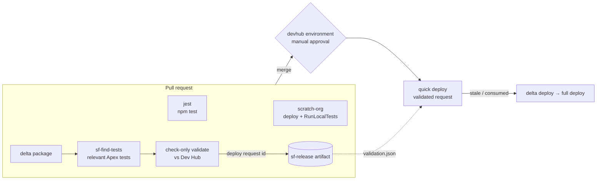

# SF CI/CD Redesign Implementation Plan

> **For agentic workers:** REQUIRED SUB-SKILL: Use superpowers:subagent-driven-development (recommended) or superpowers:executing-plans to implement this plan task-by-task. Steps use checkbox (`- [ ]`) syntax for tracking.

**Goal:** Replace the sf-validate/sf-deploy reusable-workflow pair with `sf-pr-validate.yml` + `sf-release.yml` (composed from composites and a new `sf-find-tests` TypeScript action), consumed by two thin callers in `sfdx_template_enterprise`.

**Architecture:** Shared repo owns all logic behind `@v1` release tags; the template carries ~10–15-line callers. PR events run Jest + scratch-org validation and a delta check-only validate against DevHub with auto-selected tests; merge to main quick-deploys the validated request behind a manually-approved `devhub` environment gate, with delta→full fallbacks.

**Tech Stack:** GitHub reusable workflows + composite actions, TypeScript action (npm workspaces, ts-jest, ncc), Salesforce CLI (`sf`), sfdx-git-delta, container `gforceinnovation/sf-ci:latest`.

**Spec:** `docs/superpowers/specs/2026-07-12-sf-cicd-redesign-design.md`

## Global Constraints

- Shared repo work happens on branch `feat/sf-cicd-workflows` (PR #6); template work on `feat/shared-cicd-callers` (PR #5). Template repo path: `/Users/demetergabor/gforce/sfdx_template_enterprise`.
- Shared repo commit prefixes: `Add:` / `Update:` / `Fix:` / `Docs:`. Template repo uses conventional commits (`feat:`, `docs:`, `chore:`). Every commit ends with `Co-Authored-By: Claude Fable 5 <noreply@anthropic.com>`.
- All action references use release tags (`@v1` for own repo, `@v5`/`@v4`/`@v8` for actions/*) — never commit SHAs.
- Own composites/actions inside reusable workflows use absolute refs `Gforce-Innovation-Kft/shared-github-actions/.github/actions/<name>@v1` (they resolve against the caller's checkout).
- JSON parsing in workflow shell steps uses `node -pe` / `node -e`, never `jq` (not guaranteed in the container).
- Secrets/credential files are cleaned up in `if: always()` steps; auth URLs are never committed or echoed.
- TypeScript: strict mode, per-package 90% jest coverage threshold, `@actions/core` only in adapters/runtime — never in `packages/core`.
- Before any shared-repo push: `npm run all` passes (format:check + lint + typecheck + bundle + test + dist:verify) and `actionlint` is clean.
- The working tree currently has uncommitted modifications to `.github/workflows/sf-validate.yml` and `.github/workflows/sf-deploy.yml` — do NOT commit them; both files are deleted in Task 4 (`git rm -f` handles the dirty state). `ci_flow.md` at repo root is the user's scratch note — do not commit it.
- Do not touch `~/gforce/sf-docker-images` (owned by another session).

---

### Task 1: Core use case `findRelevantTests`

**Files:**
- Create: `packages/core/src/actions/findRelevantTests/types.ts`
- Create: `packages/core/src/actions/findRelevantTests/validateFindTestsInputs.ts`
- Create: `packages/core/src/actions/findRelevantTests/nodeSourceFileReader.ts`
- Create: `packages/core/src/actions/findRelevantTests/findRelevantTests.ts`
- Modify: `packages/core/src/index.ts` (append exports)
- Test: `packages/core/__tests__/findRelevantTests.test.ts`
- Test: `packages/core/__tests__/validateFindTestsInputs.test.ts`
- Test: `packages/core/__tests__/nodeSourceFileReader.test.ts`

**Interfaces:**
- Consumes: `Result`/`ok`/`err`, `asAppError`, `requireNonEmpty`/`parseList`, `Logger`/`NoopLogger`, `ActionContext` — all existing `@gforce/core` exports.
- Produces (Task 2 relies on these exact names): `findRelevantTests(request: FindTestsRequest, deps: FindTestsDeps): FindTestsResult`, `runFindTestsAction(input: ValidatedFindTestsInputs, context: ActionContext): Promise<Result<FindTestsResult>>`, `validateFindTestsInputs(raw: RawFindTestsInputs): ValidatedFindTestsInputs`, `parseApexMembers(xml: string): { names: string[]; hasWildcard: boolean }`, `createNodeSourceFileReader(): SourceFileReader`. `FindTestsResult` = `{ tests: readonly string[]; testCount: number; hasApex: boolean; changedApexNames: readonly string[] }`. `RawFindTestsInputs` = `{ packageXml, sourceDir, testSuffixes, githubToken }` (all strings).

- [ ] **Step 1: Write the failing core tests**

`packages/core/__tests__/findRelevantTests.test.ts`:

```ts
import { findRelevantTests, parseApexMembers } from '../src/actions/findRelevantTests/findRelevantTests';
import { NoopLogger } from '../src/utils/logging/logger';
import type { SourceFileReader } from '../src/actions/findRelevantTests/types';

const MANIFEST = `<?xml version="1.0" encoding="UTF-8"?>
<Package xmlns="http://soap.sforce.com/2006/04/metadata">
  <types>
    <members>InvoicesSelector</members>
    <members>FxRateService</members>
    <name>ApexClass</name>
  </types>
  <types>
    <members>InvoiceTrigger</members>
    <name>ApexTrigger</name>
  </types>
  <types>
    <members>Invoice__c.Due_Date__c</members>
    <name>CustomField</name>
  </types>
  <version>65.0</version>
</Package>`;

const NO_APEX_MANIFEST = `<?xml version="1.0" encoding="UTF-8"?>
<Package xmlns="http://soap.sforce.com/2006/04/metadata">
  <types>
    <members>Invoice__c.Due_Date__c</members>
    <name>CustomField</name>
  </types>
  <version>65.0</version>
</Package>`;

const WILDCARD_MANIFEST = `<Package>
  <types><members>*</members><name>ApexClass</name></types>
</Package>`;

function fakeReader(manifest: string, classes: Record<string, string>): SourceFileReader {
  return {
    readFile(path: string): string {
      if (path === 'delta/package/package.xml') return manifest;
      const name = path.split('/').pop()!.replace(/\.cls$/, '');
      if (name in classes) return classes[name];
      throw new Error(`unreadable: ${path}`);
    },
    listApexClassFiles(): string[] {
      return Object.keys(classes).map((n) => `force-app/main/default/classes/${n}.cls`);
    },
  };
}

const REQUEST = {
  packageXmlPath: 'delta/package/package.xml',
  sourceDir: 'force-app',
  testSuffixes: ['Test', '_Test', 'Tests'],
};

describe('parseApexMembers', () => {
  it('extracts ApexClass and ApexTrigger members, ignoring other types', () => {
    const { names, hasWildcard } = parseApexMembers(MANIFEST);
    expect(names.sort()).toEqual(['FxRateService', 'InvoiceTrigger', 'InvoicesSelector']);
    expect(hasWildcard).toBe(false);
  });

  it('flags wildcard members', () => {
    expect(parseApexMembers(WILDCARD_MANIFEST)).toEqual({ names: [], hasWildcard: true });
  });
});

describe('findRelevantTests', () => {
  it('returns hasApex=false for a metadata-only delta', () => {
    const result = findRelevantTests(REQUEST, {
      files: fakeReader(NO_APEX_MANIFEST, {}),
      logger: NoopLogger,
    });
    expect(result).toEqual({ tests: [], testCount: 0, hasApex: false, changedApexNames: [] });
  });

  it('defers to the caller (empty test list) on a wildcard manifest', () => {
    const result = findRelevantTests(REQUEST, {
      files: fakeReader(WILDCARD_MANIFEST, { AnyTest: '@IsTest class AnyTest {}' }),
      logger: NoopLogger,
    });
    expect(result.hasApex).toBe(true);
    expect(result.tests).toEqual([]);
  });

  it('selects naming matches, reference matches, and changed test classes', () => {
    const classes = {
      InvoicesSelector: 'public class InvoicesSelector {}',
      InvoicesSelectorTest: '@IsTest private class InvoicesSelectorTest {}',
      FxRateService: 'public class FxRateService {}',
      InvoiceServiceTest:
        '@IsTest private class InvoiceServiceTest { static void t() { FxRateService.convert(); } }',
      UnrelatedTest: '@IsTest private class UnrelatedTest {}',
      Helper: 'public class Helper { FxRateService s; }',
    };
    const result = findRelevantTests(REQUEST, {
      files: fakeReader(MANIFEST, classes),
      logger: NoopLogger,
    });
    expect(result.tests).toEqual(['InvoiceServiceTest', 'InvoicesSelectorTest']);
    expect(result.testCount).toBe(2);
    expect(result.hasApex).toBe(true);
  });

  it('includes a changed class that is itself a test class', () => {
    const manifest = `<Package><types><members>InvoicesSelectorTest</members><name>ApexClass</name></types></Package>`;
    const result = findRelevantTests(REQUEST, {
      files: fakeReader(manifest, {
        InvoicesSelectorTest: '@IsTest private class InvoicesSelectorTest {}',
      }),
      logger: NoopLogger,
    });
    expect(result.tests).toEqual(['InvoicesSelectorTest']);
  });

  it('matches names case-insensitively (Apex is case-insensitive)', () => {
    const manifest = `<Package><types><members>fxrateservice</members><name>ApexClass</name></types></Package>`;
    const result = findRelevantTests(REQUEST, {
      files: fakeReader(manifest, {
        FxRateService: 'public class FxRateService {}',
        FxRateServiceTest: '@IsTest class FxRateServiceTest {}',
      }),
      logger: NoopLogger,
    });
    expect(result.tests).toEqual(['FxRateServiceTest']);
  });

  it('recognizes legacy testMethod classes as tests', () => {
    const manifest = `<Package><types><members>Foo</members><name>ApexClass</name></types></Package>`;
    const result = findRelevantTests(REQUEST, {
      files: fakeReader(manifest, {
        Foo: 'public class Foo {}',
        LegacyFooTest: 'private class LegacyFooTest { static testMethod void t() { new Foo(); } }',
      }),
      logger: NoopLogger,
    });
    expect(result.tests).toEqual(['LegacyFooTest']);
  });
});
```

`packages/core/__tests__/validateFindTestsInputs.test.ts`:

```ts
import { validateFindTestsInputs } from '../src/actions/findRelevantTests/validateFindTestsInputs';
import { ValidationError } from '../src/utils/errors/errors';

const RAW = {
  packageXml: 'delta/package/package.xml',
  sourceDir: 'force-app',
  testSuffixes: '',
  githubToken: 'tok',
};

describe('validateFindTestsInputs', () => {
  it('applies the default suffixes when blank', () => {
    expect(validateFindTestsInputs(RAW).testSuffixes).toEqual(['Test', '_Test', 'Tests']);
  });

  it('parses a comma-separated suffix list', () => {
    expect(validateFindTestsInputs({ ...RAW, testSuffixes: 'Spec, UT' }).testSuffixes).toEqual([
      'Spec',
      'UT',
    ]);
  });

  it('requires package-xml', () => {
    expect(() => validateFindTestsInputs({ ...RAW, packageXml: ' ' })).toThrow(ValidationError);
  });

  it('requires github-token (runtime contract)', () => {
    expect(() => validateFindTestsInputs({ ...RAW, githubToken: '' })).toThrow(ValidationError);
  });
});
```

`packages/core/__tests__/nodeSourceFileReader.test.ts`:

```ts
import { mkdtempSync, mkdirSync, writeFileSync, rmSync } from 'node:fs';
import { tmpdir } from 'node:os';
import { join } from 'node:path';
import { createNodeSourceFileReader } from '../src/actions/findRelevantTests/nodeSourceFileReader';

describe('createNodeSourceFileReader', () => {
  let dir: string;

  beforeEach(() => {
    dir = mkdtempSync(join(tmpdir(), 'sf-find-tests-'));
    mkdirSync(join(dir, 'classes', 'nested'), { recursive: true });
    writeFileSync(join(dir, 'classes', 'A.cls'), 'public class A {}');
    writeFileSync(join(dir, 'classes', 'nested', 'B.cls'), '@IsTest class B {}');
    writeFileSync(join(dir, 'classes', 'A.cls-meta.xml'), '<xml/>');
  });

  afterEach(() => rmSync(dir, { recursive: true, force: true }));

  it('lists .cls files recursively, ignoring meta files', () => {
    const files = createNodeSourceFileReader().listApexClassFiles(dir).sort();
    expect(files).toEqual([join(dir, 'classes', 'A.cls'), join(dir, 'classes', 'nested', 'B.cls')]);
  });

  it('reads a file as UTF-8', () => {
    expect(createNodeSourceFileReader().readFile(join(dir, 'classes', 'A.cls'))).toBe(
      'public class A {}',
    );
  });
});
```

- [ ] **Step 2: Run the tests to verify they fail**

Run: `npm run test -w @gforce/core -- --coverage=false findRelevantTests validateFindTestsInputs nodeSourceFileReader`
Expected: FAIL — `Cannot find module '../src/actions/findRelevantTests/...'`

- [ ] **Step 3: Implement the types**

`packages/core/src/actions/findRelevantTests/types.ts`:

```ts
/** Types for the portable find-relevant-tests use case. */
import type { Logger } from '../../utils/logging/logger';

export interface FindTestsRequest {
  readonly packageXmlPath: string;
  readonly sourceDir: string;
  readonly testSuffixes: readonly string[];
}

export interface FindTestsResult {
  readonly tests: readonly string[];
  readonly testCount: number;
  readonly hasApex: boolean;
  readonly changedApexNames: readonly string[];
}

/** Filesystem port so the use case stays testable without touching disk. */
export interface SourceFileReader {
  /** Read a file as UTF-8; throws when unreadable. */
  readFile(path: string): string;
  /** Recursively list paths of `*.cls` files under `dir`. */
  listApexClassFiles(dir: string): string[];
}

export interface FindTestsDeps {
  readonly files: SourceFileReader;
  readonly logger: Logger;
}

/** Raw, unvalidated inputs as read from the GitHub Action runtime. */
export interface RawFindTestsInputs {
  readonly packageXml: string;
  readonly sourceDir: string;
  readonly testSuffixes: string;
  readonly githubToken: string;
}

/** Normalized, validated inputs ready to build a request. */
export interface ValidatedFindTestsInputs {
  readonly packageXml: string;
  readonly sourceDir: string;
  readonly testSuffixes: string[];
  readonly githubToken: string;
}
```

- [ ] **Step 4: Implement the validator**

`packages/core/src/actions/findRelevantTests/validateFindTestsInputs.ts`:

```ts
/**
 * Validate and normalize the raw sf-find-tests inputs. Portable: plain strings
 * in, never touches `@actions/core`.
 */
import { parseList, requireNonEmpty } from '../../utils/validation/validation';
import type { RawFindTestsInputs, ValidatedFindTestsInputs } from './types';

const DEFAULT_SUFFIXES = ['Test', '_Test', 'Tests'];

export function validateFindTestsInputs(raw: RawFindTestsInputs): ValidatedFindTestsInputs {
  const suffixes = parseList(raw.testSuffixes);
  return {
    packageXml: requireNonEmpty('package-xml', raw.packageXml),
    sourceDir: requireNonEmpty('source-dir', raw.sourceDir),
    githubToken: requireNonEmpty('github-token', raw.githubToken),
    testSuffixes: suffixes.length > 0 ? suffixes : DEFAULT_SUFFIXES,
  };
}
```

- [ ] **Step 5: Implement the Node file reader**

`packages/core/src/actions/findRelevantTests/nodeSourceFileReader.ts`:

```ts
/**
 * Node `fs`-backed SourceFileReader. Kept apart from the use case so tests can
 * inject an in-memory fake; `node:fs` is portable Node, not a runner API.
 */
import { readFileSync, readdirSync } from 'node:fs';
import { join } from 'node:path';
import type { SourceFileReader } from './types';

export function createNodeSourceFileReader(): SourceFileReader {
  return {
    readFile(path: string): string {
      return readFileSync(path, 'utf8');
    },
    listApexClassFiles(dir: string): string[] {
      const found: string[] = [];
      const walk = (current: string): void => {
        for (const entry of readdirSync(current, { withFileTypes: true })) {
          const path = join(current, entry.name);
          if (entry.isDirectory()) {
            walk(path);
          } else if (entry.isFile() && entry.name.toLowerCase().endsWith('.cls')) {
            found.push(path);
          }
        }
      };
      walk(dir);
      return found;
    },
  };
}
```

- [ ] **Step 6: Implement the use case + action seam**

`packages/core/src/actions/findRelevantTests/findRelevantTests.ts`:

```ts
/**
 * Select the Apex test classes relevant to a delta package: naming-convention
 * matches plus a reference scan of every test class in the source tree. Pure
 * and filesystem-agnostic — file access goes through the injected reader.
 */
import { ok, err, type Result } from '../../utils/result/result';
import { asAppError } from '../../utils/errors/errors';
import type { ActionContext } from '../types';
import { createNodeSourceFileReader } from './nodeSourceFileReader';
import type {
  FindTestsDeps,
  FindTestsRequest,
  FindTestsResult,
  ValidatedFindTestsInputs,
} from './types';

const APEX_TYPES = new Set(['ApexClass', 'ApexTrigger']);
// @IsTest annotation or the legacy testMethod keyword marks a test class.
const TEST_MARKER = /@IsTest|\btestmethod\b/i;

interface ApexSource {
  readonly name: string;
  readonly body: string;
  readonly isTest: boolean;
}

/** Pull ApexClass/ApexTrigger member names out of a package.xml manifest. */
export function parseApexMembers(manifestXml: string): { names: string[]; hasWildcard: boolean } {
  const names: string[] = [];
  let hasWildcard = false;
  for (const block of manifestXml.match(/<types>[\s\S]*?<\/types>/g) ?? []) {
    const typeName = block.match(/<name>\s*([^<\s]+)\s*<\/name>/)?.[1] ?? '';
    if (!APEX_TYPES.has(typeName)) {
      continue;
    }
    for (const member of block.matchAll(/<members>\s*([^<]+?)\s*<\/members>/g)) {
      if (member[1] === '*') {
        hasWildcard = true;
      } else {
        names.push(member[1]);
      }
    }
  }
  return { names, hasWildcard };
}

export function findRelevantTests(request: FindTestsRequest, deps: FindTestsDeps): FindTestsResult {
  const manifest = deps.files.readFile(request.packageXmlPath);
  const { names: changedNames, hasWildcard } = parseApexMembers(manifest);
  if (changedNames.length === 0 && !hasWildcard) {
    deps.logger.info('Delta contains no Apex classes or triggers — no tests to select.');
    return { tests: [], testCount: 0, hasApex: false, changedApexNames: [] };
  }
  if (hasWildcard) {
    deps.logger.warning(
      'Delta manifest uses a wildcard Apex member — cannot scope tests; caller should run local tests.',
    );
    return { tests: [], testCount: 0, hasApex: true, changedApexNames: changedNames };
  }

  const sources: ApexSource[] = deps.files.listApexClassFiles(request.sourceDir).map((path) => {
    const body = deps.files.readFile(path);
    const fileName = path.replace(/\\/g, '/').split('/').pop() ?? '';
    return { name: fileName.replace(/\.cls$/i, ''), body, isTest: TEST_MARKER.test(body) };
  });
  const testClasses = sources.filter((source) => source.isTest);
  const changedLower = new Set(changedNames.map((name) => name.toLowerCase()));

  const selected = new Set<string>();
  // A changed class that is itself a test class runs directly.
  for (const test of testClasses) {
    if (changedLower.has(test.name.toLowerCase())) {
      selected.add(test.name);
    }
  }
  const changedNonTest = changedNames.filter(
    (name) => !testClasses.some((test) => test.name.toLowerCase() === name.toLowerCase()),
  );
  for (const name of changedNonTest) {
    const reference = new RegExp(`\\b${escapeRegExp(name)}\\b`, 'i');
    for (const test of testClasses) {
      const nameMatch = request.testSuffixes.some(
        (suffix) => test.name.toLowerCase() === `${name}${suffix}`.toLowerCase(),
      );
      if (nameMatch || reference.test(test.body)) {
        selected.add(test.name);
      }
    }
  }

  const tests = [...selected].sort((a, b) => a.localeCompare(b));
  deps.logger.info(
    `Selected ${tests.length} test class(es) for ${changedNames.length} changed Apex member(s).`,
  );
  return { tests, testCount: tests.length, hasApex: true, changedApexNames: changedNames };
}

function escapeRegExp(value: string): string {
  return value.replace(/[.*+?^${}()|[\]\\]/g, '\\$&');
}

/** Action seam: map validated inputs + context onto the use case. */
export async function runFindTestsAction(
  input: ValidatedFindTestsInputs,
  context: ActionContext,
): Promise<Result<FindTestsResult>> {
  try {
    const result = findRelevantTests(
      {
        packageXmlPath: input.packageXml,
        sourceDir: input.sourceDir,
        testSuffixes: input.testSuffixes,
      },
      { files: createNodeSourceFileReader(), logger: context.logger },
    );
    return ok(result);
  } catch (error) {
    return err(asAppError(error));
  }
}
```

Note: if `asAppError` has a different name/signature in `packages/core/src/utils/errors/errors.ts`, read that file and use the existing unknown→AppError helper; do not add a new one.

- [ ] **Step 7: Export from the core index**

Append to `packages/core/src/index.ts` (after the createReleasePr export block):

```ts
// find-relevant-tests use case + action seam
export {
  findRelevantTests,
  parseApexMembers,
  runFindTestsAction,
} from './actions/findRelevantTests/findRelevantTests';
export { validateFindTestsInputs } from './actions/findRelevantTests/validateFindTestsInputs';
export { createNodeSourceFileReader } from './actions/findRelevantTests/nodeSourceFileReader';
export type {
  FindTestsRequest,
  FindTestsResult,
  FindTestsDeps,
  SourceFileReader,
  RawFindTestsInputs,
  ValidatedFindTestsInputs,
} from './actions/findRelevantTests/types';
```

- [ ] **Step 8: Run the core tests to verify they pass**

Run: `npm run test -w @gforce/core`
Expected: PASS, coverage ≥ 90% on all four metrics (the new files are fully exercised by the three test files).

- [ ] **Step 9: Commit**

```bash
git add packages/core/src/actions/findRelevantTests packages/core/src/index.ts packages/core/__tests__/findRelevantTests.test.ts packages/core/__tests__/validateFindTestsInputs.test.ts packages/core/__tests__/nodeSourceFileReader.test.ts
git commit -m "Add: findRelevantTests core use case (Apex test selection)

Co-Authored-By: Claude Fable 5 <noreply@anthropic.com>"
```

---

### Task 2: `sf-find-tests` action adapter

**Files:**
- Create: `.github/actions/sf-find-tests/action.yml`
- Create: `.github/actions/sf-find-tests/package.json`
- Create: `.github/actions/sf-find-tests/tsconfig.json`
- Create: `.github/actions/sf-find-tests/jest.config.js`
- Create: `.github/actions/sf-find-tests/src/index.ts`, `src/inputReader.ts`, `src/outputWriter.ts`
- Create: `.github/actions/sf-find-tests/__tests__/inputReader.test.ts`, `__tests__/outputWriter.test.ts`, `__tests__/main.test.ts`
- Create: `.github/actions/sf-find-tests/__integration__/sf-find-tests.integration.test.ts` + `__integration__/fixtures/`
- Modify: root `package.json` (workspaces array)

**Interfaces:**
- Consumes: `runFindTestsAction`, `validateFindTestsInputs`, `RawFindTestsInputs`, `ValidatedFindTestsInputs`, `FindTestsResult`, `NoopLogger`, `GitHubService` from `@gforce/core`; `runGitHubAction`, `GitHubActionDefinition` from `@gforce/github-actions-runtime`.
- Produces: action `Gforce-Innovation-Kft/shared-github-actions/.github/actions/sf-find-tests@v1` with inputs `package-xml` (required), `source-dir` (default `force-app`), `test-suffixes` (default `Test,_Test,Tests`), `github-token` (default `${{ github.token }}`); outputs `tests` (space-separated), `test-count`, `has-apex` — consumed by `sf-release.yml` in Task 4.

- [ ] **Step 1: Scaffold config files**

`.github/actions/sf-find-tests/action.yml`:

```yaml
name: 'SF Find Tests'
description: >-
  Select the Apex test classes relevant to a delta package.xml — naming-convention
  matches plus a reference scan of test classes in the source tree.
inputs:
  package-xml:
    description: 'Path to the delta package.xml manifest'
    required: true
  source-dir:
    description: 'Salesforce source directory to scan for Apex classes'
    required: false
    default: 'force-app'
  test-suffixes:
    description: 'Comma-separated test-class name suffixes for naming matches'
    required: false
    default: 'Test,_Test,Tests'
  github-token:
    description: 'Token for the shared action runtime (this action makes no API calls)'
    required: false
    default: ${{ github.token }}
outputs:
  tests:
    description: 'Space-separated selected Apex test class names'
  test-count:
    description: 'Number of selected test classes'
  has-apex:
    description: 'true when the delta contains Apex classes or triggers'
runs:
  using: node20
  main: dist/index.js
```

`.github/actions/sf-find-tests/package.json`:

```json
{
  "name": "@gforce/sf-find-tests",
  "version": "0.1.0",
  "private": true,
  "description": "GitHub Action: select the Apex test classes relevant to a delta package.",
  "license": "MIT",
  "scripts": {
    "typecheck": "tsc -p tsconfig.json --noEmit",
    "test": "jest --coverage --config jest.config.js",
    "bundle": "ncc build src/index.ts -o dist"
  },
  "dependencies": {
    "@actions/core": "^1.10.1",
    "@gforce/core": "*",
    "@gforce/github-actions-runtime": "*"
  }
}
```

Copy `tsconfig.json` and `jest.config.js` verbatim from `.github/actions/create-release-pr/` (the jest `moduleNameMapper` paths are relative and identical).

- [ ] **Step 2: Register the workspace and install**

In the root `package.json`, extend the `workspaces` array:

```json
"workspaces": [
  "packages/core",
  "packages/github-actions-runtime",
  ".github/actions/sync-branches",
  ".github/actions/create-release-pr",
  ".github/actions/sf-find-tests"
]
```

Run: `npm install`
Expected: exit 0, `node_modules/@gforce/sf-find-tests` symlink exists.

- [ ] **Step 3: Write the failing adapter tests**

`.github/actions/sf-find-tests/__tests__/inputReader.test.ts`:

```ts
import { readInputs } from '../src/inputReader';

describe('readInputs', () => {
  beforeEach(() => {
    process.env['INPUT_PACKAGE-XML'] = 'delta/package/package.xml';
    process.env['INPUT_SOURCE-DIR'] = 'force-app';
    process.env['INPUT_TEST-SUFFIXES'] = 'Test,_Test';
    process.env['INPUT_GITHUB-TOKEN'] = 'tok';
  });

  afterEach(() => {
    for (const key of Object.keys(process.env)) {
      if (key.startsWith('INPUT_')) delete process.env[key];
    }
  });

  it('reads raw inputs without validating', () => {
    expect(readInputs()).toEqual({
      packageXml: 'delta/package/package.xml',
      sourceDir: 'force-app',
      testSuffixes: 'Test,_Test',
      githubToken: 'tok',
    });
  });
});
```

`.github/actions/sf-find-tests/__tests__/outputWriter.test.ts`:

```ts
import * as core from '@actions/core';
import { writeOutputs } from '../src/outputWriter';

describe('writeOutputs', () => {
  it('maps the result onto kebab-case outputs', () => {
    const setOutput = jest.spyOn(core, 'setOutput').mockImplementation(() => undefined);
    jest.spyOn(core, 'info').mockImplementation(() => undefined);

    writeOutputs({
      tests: ['ATest', 'BTest'],
      testCount: 2,
      hasApex: true,
      changedApexNames: ['A', 'B'],
    });

    expect(setOutput).toHaveBeenCalledWith('tests', 'ATest BTest');
    expect(setOutput).toHaveBeenCalledWith('test-count', '2');
    expect(setOutput).toHaveBeenCalledWith('has-apex', 'true');
    jest.restoreAllMocks();
  });
});
```

`.github/actions/sf-find-tests/__tests__/main.test.ts`:

```ts
import { runFindTestsAction, validateFindTestsInputs } from '@gforce/core';
import { runGitHubAction } from '@gforce/github-actions-runtime';
import { sfFindTestsAction, run } from '../src/index';
import { readInputs } from '../src/inputReader';
import { writeOutputs } from '../src/outputWriter';

jest.mock('@gforce/github-actions-runtime', () => ({
  ...jest.requireActual('@gforce/github-actions-runtime'),
  runGitHubAction: jest.fn().mockResolvedValue(undefined),
}));

describe('sf-find-tests action definition', () => {
  it('wires the shared pieces', () => {
    expect(sfFindTestsAction.readInputs).toBe(readInputs);
    expect(sfFindTestsAction.validateInputs).toBe(validateFindTestsInputs);
    expect(sfFindTestsAction.execute).toBe(runFindTestsAction);
    expect(sfFindTestsAction.writeOutputs).toBe(writeOutputs);
  });

  it('run() delegates to runGitHubAction', async () => {
    await run();
    expect(runGitHubAction).toHaveBeenCalledWith(sfFindTestsAction, undefined);
  });
});
```

`.github/actions/sf-find-tests/__integration__/sf-find-tests.integration.test.ts` — first read `.github/actions/create-release-pr/__integration__/create-release-pr.integration.test.ts` and mirror its conventions; the substance must be:

```ts
import { existsSync } from 'node:fs';
import { join } from 'node:path';
import * as core from '@actions/core';
import { NoopLogger, type GitHubService } from '@gforce/core';
import { run } from '../src/index';

describe('sf-find-tests integration', () => {
  const fixtures = join(__dirname, 'fixtures');
  let outputs: Record<string, string>;

  beforeEach(() => {
    outputs = {};
    jest.spyOn(core, 'setOutput').mockImplementation((name, value) => {
      outputs[name] = String(value);
    });
    jest.spyOn(core, 'setFailed').mockImplementation(() => undefined);
    jest.spyOn(core, 'info').mockImplementation(() => undefined);
    process.env['INPUT_PACKAGE-XML'] = join(fixtures, 'package.xml');
    process.env['INPUT_SOURCE-DIR'] = join(fixtures, 'force-app');
    process.env['INPUT_TEST-SUFFIXES'] = '';
    process.env['INPUT_GITHUB-TOKEN'] = 'test-token';
  });

  afterEach(() => {
    jest.restoreAllMocks();
    for (const key of Object.keys(process.env)) {
      if (key.startsWith('INPUT_')) delete process.env[key];
    }
  });

  it('selects naming and reference matches end-to-end against real files', async () => {
    await run({
      github: {} as GitHubService,
      logger: NoopLogger,
      repo: { owner: 'gforce', repo: 'fixture' },
    });
    expect(outputs['has-apex']).toBe('true');
    expect(outputs['test-count']).toBe('2');
    expect(outputs['tests']).toBe('InvoiceServiceTest InvoicesSelectorTest');
  });

  it('ships a committed bundle', () => {
    expect(existsSync(join(__dirname, '..', 'dist', 'index.js'))).toBe(true);
  });
});
```

Fixtures under `__integration__/fixtures/`:

`package.xml`:

```xml
<?xml version="1.0" encoding="UTF-8"?>
<Package xmlns="http://soap.sforce.com/2006/04/metadata">
  <types>
    <members>InvoicesSelector</members>
    <members>FxRateService</members>
    <name>ApexClass</name>
  </types>
  <version>65.0</version>
</Package>
```

`force-app/main/default/classes/InvoicesSelector.cls`: `public class InvoicesSelector {}`
`force-app/main/default/classes/InvoicesSelectorTest.cls`: `@IsTest private class InvoicesSelectorTest {}`
`force-app/main/default/classes/FxRateService.cls`: `public class FxRateService {}`
`force-app/main/default/classes/InvoiceServiceTest.cls`: `@IsTest private class InvoiceServiceTest { static void covers() { FxRateService.class.getName(); } }`
`force-app/main/default/classes/UnrelatedTest.cls`: `@IsTest private class UnrelatedTest {}`

- [ ] **Step 4: Run the adapter tests to verify they fail**

Run: `npm run test -w @gforce/sf-find-tests`
Expected: FAIL — `Cannot find module '../src/inputReader'`

- [ ] **Step 5: Implement the three adapter files**

`src/inputReader.ts`:

```ts
import * as core from '@actions/core';
import type { RawFindTestsInputs } from '@gforce/core';

/** Read raw inputs from the Action runtime. No validation happens here. */
export function readInputs(): RawFindTestsInputs {
  return {
    packageXml: core.getInput('package-xml'),
    sourceDir: core.getInput('source-dir'),
    testSuffixes: core.getInput('test-suffixes'),
    githubToken: core.getInput('github-token'),
  };
}
```

`src/outputWriter.ts`:

```ts
import * as core from '@actions/core';
import type { FindTestsResult } from '@gforce/core';

/** Map the typed result onto kebab-case Action outputs. */
export function writeOutputs(result: FindTestsResult): void {
  core.setOutput('tests', result.tests.join(' '));
  core.setOutput('test-count', String(result.testCount));
  core.setOutput('has-apex', String(result.hasApex));
  core.info(`sf-find-tests: hasApex=${result.hasApex} selected=${result.testCount}`);
}
```

`src/index.ts`:

```ts
import {
  runFindTestsAction,
  validateFindTestsInputs,
  type ActionContext,
  type RawFindTestsInputs,
  type ValidatedFindTestsInputs,
  type FindTestsResult,
} from '@gforce/core';
import { runGitHubAction, type GitHubActionDefinition } from '@gforce/github-actions-runtime';
import { readInputs } from './inputReader';
import { writeOutputs } from './outputWriter';

/** The sf-find-tests action wired from portable, shared pieces. */
export const sfFindTestsAction: GitHubActionDefinition<
  RawFindTestsInputs,
  ValidatedFindTestsInputs,
  FindTestsResult
> = {
  readInputs,
  validateInputs: validateFindTestsInputs,
  execute: runFindTestsAction,
  writeOutputs,
};

/** Action entrypoint. `overrides` is for tests; production passes nothing. */
export function run(overrides?: Partial<ActionContext>): Promise<void> {
  return runGitHubAction(sfFindTestsAction, overrides);
}

/* istanbul ignore next -- runner-only entry guard; tests import and call run() directly */
if (require.main === module) {
  void run();
}
```

- [ ] **Step 6: Bundle, then run the tests to verify they pass**

```bash
npm run bundle -w @gforce/sf-find-tests
npm run test -w @gforce/sf-find-tests
```

Expected: bundle writes `dist/index.js`; tests PASS with coverage ≥ 90%.

- [ ] **Step 7: Run the full quality gate**

Run: `npm run all`
Expected: exit 0 (format:check may require `npm run format` first — run it if format:check fails, then re-run).

- [ ] **Step 8: Commit**

```bash
git add .github/actions/sf-find-tests package.json package-lock.json
git commit -m "Add: sf-find-tests TypeScript action (delta-scoped Apex test selection)

Co-Authored-By: Claude Fable 5 <noreply@anthropic.com>"
```

(The pre-commit hook re-bundles `dist/` — if it modifies `dist/index.js`, `git add` it and commit again.)

---

### Task 3: `sf-pr-validate.yml` reusable workflow

**Files:**
- Create: `.github/workflows/sf-pr-validate.yml`

**Interfaces:**
- Consumes: composite `sf-org-login@v1` (inputs `sfdx-auth-url`, `org-alias`, `set-default-dev-hub`).
- Produces: reusable workflow `sf-pr-validate.yml` with secret `sfdx-auth-url` (required) and inputs `container-image` (default `gforceinnovation/sf-ci:latest`), `checkout-submodules` (default `recursive`), `retention-days` (default 90). Jobs named `jest` and `scratch-org` — these names become the caller's required checks. Called by the template's `pr-validate.yml` (Task 7).

- [ ] **Step 1: Write the workflow**

`.github/workflows/sf-pr-validate.yml` (complete file):

````yaml
name: Salesforce PR Validate (Reusable)

on:
  workflow_call:
    secrets:
      sfdx-auth-url:
        description: 'SFDX auth URL of the Dev Hub (used to create the scratch org)'
        required: true
    inputs:
      container-image:
        description: 'Docker image the jobs run in'
        required: false
        default: 'gforceinnovation/sf-ci:latest'
        type: string
      checkout-submodules:
        description: 'Passed to actions/checkout submodules (false, true, recursive)'
        required: false
        default: 'recursive'
        type: string
      retention-days:
        description: 'Retention for the scratch-org test results artifact'
        required: false
        default: 90
        type: number

jobs:
  jest:
    runs-on: ubuntu-latest
    container:
      image: ${{ inputs.container-image }}
    permissions:
      contents: read
    steps:
      - name: Check out files
        uses: actions/checkout@v5
        with:
          submodules: ${{ inputs.checkout-submodules }}

      - name: Detect npm test script
        id: detect
        shell: bash
        run: |
          set -euo pipefail
          HAS_TESTS=$(node -pe "(() => { try { return ((require('./package.json').scripts || {}).test) ? 'true' : 'false'; } catch { return 'false'; } })()")
          echo "has-tests=$HAS_TESTS" >> "$GITHUB_OUTPUT"
          if [ "$HAS_TESTS" != "true" ]; then
            echo "::notice::No npm test script found — skipping Jest tests."
          fi

      - name: Install dependencies
        if: steps.detect.outputs.has-tests == 'true'
        shell: bash
        run: npm ci

      - name: Run Jest tests
        if: steps.detect.outputs.has-tests == 'true'
        shell: bash
        run: npm test

  scratch-org:
    runs-on: ubuntu-latest
    container:
      image: ${{ inputs.container-image }}
    permissions:
      contents: read
    steps:
      - name: Check out files
        uses: actions/checkout@v5
        with:
          submodules: ${{ inputs.checkout-submodules }}

      # Own-repo absolute ref: actions inside a reusable workflow resolve against
      # the caller's checkout. Referenced by release tag (@v1) per repo policy.
      - name: Salesforce Dev Hub login
        uses: Gforce-Innovation-Kft/shared-github-actions/.github/actions/sf-org-login@v1
        with:
          sfdx-auth-url: ${{ secrets.sfdx-auth-url }}
          org-alias: devhub
          set-default-dev-hub: 'true'

      - name: Create scratch org
        shell: bash
        run: |
          set -euo pipefail
          sf org create scratch \
            --definition-file config/scratch-orgs/ci.json \
            --alias ci-scratch \
            --duration-days 1 \
            --set-default \
            --wait 30

      - name: Push source
        shell: bash
        run: |
          set -euo pipefail
          sf project deploy start --target-org ci-scratch --wait 60

      - name: Assign permission sets
        shell: bash
        run: |
          set -euo pipefail
          shopt -s globstar nullglob
          for PS_FILE in force-app/**/permissionsets/*.permissionset-meta.xml; do
            PS_NAME=$(basename "$PS_FILE" .permissionset-meta.xml)
            sf org assign permset --name "$PS_NAME" --target-org ci-scratch \
              || echo "::warning::Could not assign permission set $PS_NAME"
          done

      - name: Run Apex tests
        shell: bash
        run: |
          set -euo pipefail
          sf apex run test \
            --target-org ci-scratch \
            --test-level RunLocalTests \
            --wait 30 \
            --result-format human \
            --code-coverage | tee scratch-org-tests.txt
          {
            echo '## Scratch org test results'
            echo '```'
            tail -n 40 scratch-org-tests.txt
            echo '```'
          } >> "$GITHUB_STEP_SUMMARY"

      - name: Upload test results
        if: always()
        uses: actions/upload-artifact@v4
        with:
          name: scratch-org-tests-${{ github.run_number }}
          path: scratch-org-tests.txt
          retention-days: ${{ inputs.retention-days }}
          if-no-files-found: ignore

      - name: Delete scratch org
        if: always()
        shell: bash
        run: |
          sf org delete scratch --target-org ci-scratch --no-prompt || true
````

- [ ] **Step 2: Lint**

Run: `actionlint .github/workflows/sf-pr-validate.yml`
Expected: no output, exit 0.

- [ ] **Step 3: Commit**

```bash
git add .github/workflows/sf-pr-validate.yml
git commit -m "Add: sf-pr-validate reusable workflow (Jest + scratch-org validation)

Co-Authored-By: Claude Fable 5 <noreply@anthropic.com>"
```

---

### Task 4: `sf-release.yml` reusable workflow; remove the superseded pair

**Files:**
- Create: `.github/workflows/sf-release.yml`
- Delete: `.github/workflows/sf-validate.yml`, `.github/workflows/sf-deploy.yml` (both have uncommitted edits — use `git rm -f`)

**Interfaces:**
- Consumes: composites `sf-delta-package@v1` (inputs `from-ref`/`to-ref`/`source-dir`/`generate-delta`; outputs `package-path`/`has-changes`/`component-count`), `sf-org-login@v1` (outputs `org-id`/`username`/`instance-url`), action `sf-find-tests@v1` (Task 2 outputs `tests`/`test-count`/`has-apex`).
- Produces: reusable workflow `sf-release.yml` — secret `sfdx-auth-url`; inputs `environment` (string, default `devhub`), `container-image`, `checkout-submodules`, `retention-days`, `full-deploy` (boolean, default false); outputs `component-count`, `deploy-request-id`, `tests`, `deploy-id`, `quick-deployed`. Jobs `validate` (PR events) and `quick-deploy` (push/dispatch). The handoff contract is the `sf-release-<run_number>` artifact containing `validation.json` with keys `deployId, orgId, username, headSha, baseSha, componentCount, testLevel, tests, validatedAt` (`tests` is a JSON array of class names; `testLevel` is `RunSpecifiedTests`, `RunLocalTests`, or `""` for metadata-only deltas).

- [ ] **Step 1: Write the workflow**

`.github/workflows/sf-release.yml` (complete file):

```yaml
name: Salesforce Release (Reusable)

# One workflow, two phases, selected by the caller's trigger:
#   pull_request  -> validate: delta package -> test selection -> check-only
#                    deploy against the target org; saves the deploy request id
#                    in the sf-release-<run_number> artifact (quick-deploy handoff).
#   push / workflow_dispatch -> quick-deploy: behind the caller's environment
#                    gate, quick-deploys the validated request, falling back to
#                    a delta deploy, then a full deploy.

on:
  workflow_call:
    secrets:
      sfdx-auth-url:
        description: 'SFDX auth URL of the target org (Dev Hub / production)'
        required: true
    inputs:
      environment:
        description: 'GitHub Environment on the caller repo gating the deploy'
        required: false
        default: 'devhub'
        type: string
      container-image:
        description: 'Docker image the jobs run in'
        required: false
        default: 'gforceinnovation/sf-ci:latest'
        type: string
      checkout-submodules:
        description: 'Passed to actions/checkout submodules (false, true, recursive)'
        required: false
        default: 'recursive'
        type: string
      retention-days:
        description: 'Retention for the validation and deploy audit artifacts'
        required: false
        default: 90
        type: number
      full-deploy:
        description: 'Deploy every package directory instead of a delta (bootstrap / re-baseline)'
        required: false
        default: false
        type: boolean
    outputs:
      component-count:
        description: 'Number of components in the validated delta (PR runs)'
        value: ${{ jobs.validate.outputs.component-count }}
      deploy-request-id:
        description: 'Deploy request id of the check-only validation (PR runs)'
        value: ${{ jobs.validate.outputs.deploy-request-id }}
      tests:
        description: 'Apex test classes selected for the validation (PR runs)'
        value: ${{ jobs.validate.outputs.tests }}
      deploy-id:
        description: 'Salesforce deploy request id of the deployment (push runs)'
        value: ${{ jobs.quick-deploy.outputs.deploy-id }}
      quick-deployed:
        description: 'true when the PR-validated request was quick-deployed (push runs)'
        value: ${{ jobs.quick-deploy.outputs.quick-deployed }}

jobs:
  validate:
    if: github.event_name == 'pull_request'
    runs-on: ubuntu-latest
    container:
      image: ${{ inputs.container-image }}
    permissions:
      contents: read
    outputs:
      has-changes: ${{ steps.delta.outputs.has-changes }}
      component-count: ${{ steps.delta.outputs.component-count }}
      deploy-request-id: ${{ steps.check-deploy.outputs.deploy-request-id }}
      tests: ${{ steps.find-tests.outputs.tests }}
    steps:
      - name: Check out files
        uses: actions/checkout@v5
        with:
          fetch-depth: 0
          submodules: ${{ inputs.checkout-submodules }}

      # Own-repo absolute refs below: actions inside a reusable workflow resolve
      # against the caller's checkout. Referenced by release tag (@v1) per repo
      # policy.
      - name: Generate delta package
        id: delta
        uses: Gforce-Innovation-Kft/shared-github-actions/.github/actions/sf-delta-package@v1
        with:
          from-ref: ${{ github.event.pull_request.base.sha }}
          to-ref: HEAD
          generate-delta: 'true'

      - name: Select relevant Apex tests
        id: find-tests
        if: steps.delta.outputs.has-changes == 'true'
        uses: Gforce-Innovation-Kft/shared-github-actions/.github/actions/sf-find-tests@v1
        with:
          package-xml: ${{ steps.delta.outputs.package-path }}

      - name: Derive test level
        id: test-plan
        if: steps.delta.outputs.has-changes == 'true'
        shell: bash
        env:
          HAS_APEX: ${{ steps.find-tests.outputs.has-apex }}
          TEST_COUNT: ${{ steps.find-tests.outputs.test-count }}
          TESTS: ${{ steps.find-tests.outputs.tests }}
        run: |
          set -euo pipefail
          if [ "$HAS_APEX" = "true" ] && [ "${TEST_COUNT:-0}" -gt 0 ]; then
            TEST_LEVEL="RunSpecifiedTests"
            echo "Running specified tests: $TESTS"
          elif [ "$HAS_APEX" = "true" ]; then
            TEST_LEVEL="RunLocalTests"
            echo "::warning::Apex changed but no covering test classes were found — falling back to RunLocalTests."
          else
            TEST_LEVEL=""
            echo "Metadata-only delta — validating without a test run."
          fi
          echo "test-level=$TEST_LEVEL" >> "$GITHUB_OUTPUT"

      - name: Salesforce login
        id: login
        if: steps.delta.outputs.has-changes == 'true'
        uses: Gforce-Innovation-Kft/shared-github-actions/.github/actions/sf-org-login@v1
        with:
          sfdx-auth-url: ${{ secrets.sfdx-auth-url }}
          org-alias: validation

      - name: Check-only deploy of the delta
        id: check-deploy
        if: steps.delta.outputs.has-changes == 'true'
        shell: bash
        env:
          PACKAGE_PATH: ${{ steps.delta.outputs.package-path }}
          TEST_LEVEL: ${{ steps.test-plan.outputs.test-level }}
          TESTS: ${{ steps.find-tests.outputs.tests }}
        run: |
          set -euo pipefail

          ARGS=(--manifest "$PACKAGE_PATH" --target-org validation --json --wait 60)
          if [ -n "$TEST_LEVEL" ]; then
            ARGS+=(--test-level "$TEST_LEVEL")
          fi
          if [ "$TEST_LEVEL" = "RunSpecifiedTests" ]; then
            for CLASS in $TESTS; do
              ARGS+=(--tests "$CLASS")
            done
          fi

          set +e
          sf project deploy validate "${ARGS[@]}" > validate-result.json
          EXIT_CODE=$?
          set -e

          DEPLOY_ID=$(node -pe "const r = JSON.parse(require('fs').readFileSync('validate-result.json','utf8')); (r.result && r.result.id) || ''")
          echo "deploy-request-id=$DEPLOY_ID" >> "$GITHUB_OUTPUT"

          node -e "
            const r = JSON.parse(require('fs').readFileSync('validate-result.json','utf8')).result || {};
            console.log('Status: ' + (r.status || 'unknown'));
            console.log('Components: ' + (r.numberComponentsDeployed || 0) + '/' + (r.numberComponentsTotal || 0));
            console.log('Tests: ' + (r.numberTestsCompleted || 0) + ' completed, ' + (r.numberTestErrors || 0) + ' errors');
            const failures = ((r.details || {}).componentFailures) || [];
            for (const f of [].concat(failures)) console.log('❌ ' + f.fullName + ': ' + f.problem);
          "

          if [ "$EXIT_CODE" -ne 0 ]; then
            echo "::error::Check-only validation failed (deploy request $DEPLOY_ID)" >&2
            exit "$EXIT_CODE"
          fi
          echo "✅ Check-only validation succeeded (deploy request $DEPLOY_ID)"

      # validation.json is the quick-deploy handoff consumed by the quick-deploy
      # job after merge. Written even for empty deltas (componentCount 0) so the
      # merge side knows there is nothing to deploy.
      - name: Write validation record
        if: always()
        shell: bash
        env:
          DEPLOY_ID: ${{ steps.check-deploy.outputs.deploy-request-id }}
          ORG_ID: ${{ steps.login.outputs.org-id }}
          ORG_USERNAME: ${{ steps.login.outputs.username }}
          HEAD_SHA: ${{ github.event.pull_request.head.sha }}
          BASE_SHA: ${{ github.event.pull_request.base.sha }}
          COMPONENT_COUNT: ${{ steps.delta.outputs.component-count }}
          TEST_LEVEL: ${{ steps.test-plan.outputs.test-level }}
          TESTS: ${{ steps.find-tests.outputs.tests }}
        run: |
          set -euo pipefail
          node -e "
            require('fs').writeFileSync('validation.json', JSON.stringify({
              deployId: process.env.DEPLOY_ID || '',
              orgId: process.env.ORG_ID || '',
              username: process.env.ORG_USERNAME || '',
              headSha: process.env.HEAD_SHA,
              baseSha: process.env.BASE_SHA,
              componentCount: Number(process.env.COMPONENT_COUNT || 0),
              testLevel: process.env.TEST_LEVEL || '',
              tests: (process.env.TESTS || '').split(' ').filter(Boolean),
              validatedAt: new Date().toISOString(),
            }, null, 2));
          "

      - name: Upload validation artifact
        if: always()
        uses: actions/upload-artifact@v4
        with:
          name: sf-release-${{ github.run_number }}
          path: |
            delta
            validate-result.json
            validation.json
          retention-days: ${{ inputs.retention-days }}
          if-no-files-found: warn

  quick-deploy:
    if: github.event_name == 'push' || github.event_name == 'workflow_dispatch'
    runs-on: ubuntu-latest
    container:
      image: ${{ inputs.container-image }}
    # The caller's environment gate (required reviewers) pauses this job; GitHub
    # records the deployment automatically for environment-bound jobs.
    environment:
      name: ${{ inputs.environment }}
      url: ${{ steps.login.outputs.instance-url }}
    permissions:
      contents: read
      actions: read
    outputs:
      deploy-id: ${{ steps.deploy.outputs.deploy-id }}
      quick-deployed: ${{ steps.deploy.outputs.quick-deployed }}
    steps:
      - name: Check out files
        uses: actions/checkout@v5
        with:
          fetch-depth: 0
          submodules: ${{ inputs.checkout-submodules }}

      - name: Salesforce login
        id: login
        uses: Gforce-Innovation-Kft/shared-github-actions/.github/actions/sf-org-login@v1
        with:
          sfdx-auth-url: ${{ secrets.sfdx-auth-url }}
          org-alias: ${{ vars.SF_ORG_ALIAS || inputs.environment }}

      - name: Find quick-deploy candidate
        id: candidate
        if: ${{ !inputs.full-deploy }}
        uses: actions/github-script@v8
        with:
          script: |
            core.setOutput('found', 'false');
            const { data: prs } = await github.rest.repos.listPullRequestsAssociatedWithCommit({
              owner: context.repo.owner,
              repo: context.repo.repo,
              commit_sha: context.sha,
            });
            const pr = prs.find((p) => p.merge_commit_sha === context.sha) || prs[0];
            if (!pr) {
              core.info('No pull request associated with this commit — skipping quick deploy.');
              return;
            }
            const headSha = pr.head.sha;
            const { data: runs } = await github.rest.actions.listWorkflowRunsForRepo({
              owner: context.repo.owner,
              repo: context.repo.repo,
              head_sha: headSha,
              status: 'success',
              per_page: 50,
            });
            const sorted = runs.workflow_runs.sort(
              (a, b) => new Date(b.created_at) - new Date(a.created_at)
            );
            for (const run of sorted) {
              const { data: arts } = await github.rest.actions.listWorkflowRunArtifacts({
                owner: context.repo.owner,
                repo: context.repo.repo,
                run_id: run.id,
              });
              const artifact = arts.artifacts.find(
                (a) => a.name.startsWith('sf-release-') && !a.expired
              );
              if (artifact) {
                core.setOutput('run-id', String(run.id));
                core.setOutput('artifact-name', artifact.name);
                core.setOutput('head-sha', headSha);
                core.setOutput('found', 'true');
                core.info(`Found validation artifact ${artifact.name} in run ${run.id} (PR #${pr.number}).`);
                return;
              }
            }
            core.info(`No successful validation run with an sf-release artifact found for ${headSha}.`);

      - name: Download validation artifact
        if: steps.candidate.outputs.found == 'true'
        continue-on-error: true
        uses: actions/download-artifact@v4
        with:
          name: ${{ steps.candidate.outputs.artifact-name }}
          run-id: ${{ steps.candidate.outputs.run-id }}
          github-token: ${{ github.token }}
          path: validated

      - name: Decide quick deploy
        id: decision
        shell: bash
        env:
          CANDIDATE_FOUND: ${{ steps.candidate.outputs.found }}
          CANDIDATE_HEAD_SHA: ${{ steps.candidate.outputs.head-sha }}
          TARGET_ORG_ID: ${{ steps.login.outputs.org-id }}
        run: |
          set -euo pipefail
          # Records the decision either way — part of the audit artifact.
          node -e "
            const fs = require('fs');
            const decision = { useQuick: false, reason: '', validation: null };
            const finish = () => {
              fs.writeFileSync('quick-deploy-decision.json', JSON.stringify(decision, null, 2));
              console.log(decision.useQuick ? '✅ ' : 'ℹ️ ', decision.reason);
            };
            if (process.env.CANDIDATE_FOUND !== 'true') {
              decision.reason = 'No validation artifact candidate found.';
              finish(); return;
            }
            let v;
            try {
              v = JSON.parse(fs.readFileSync('validated/validation.json', 'utf8'));
            } catch {
              decision.reason = 'Validation artifact has no readable validation.json.';
              finish(); return;
            }
            decision.validation = v;
            const ageDays = (Date.now() - Date.parse(v.validatedAt)) / 86400000;
            if (!v.deployId) decision.reason = 'validation.json has no deployId.';
            else if (v.orgId !== process.env.TARGET_ORG_ID) decision.reason = 'Validated against a different org (' + v.orgId + ').';
            else if (v.headSha !== process.env.CANDIDATE_HEAD_SHA) decision.reason = 'Validated SHA does not match the merged PR head.';
            else if (!(ageDays < 10)) decision.reason = 'Validation is older than the 10-day quick-deploy window.';
            else { decision.useQuick = true; decision.reason = 'Quick deploy of request ' + v.deployId + ' (validated ' + ageDays.toFixed(1) + ' days ago).'; }
            finish();
          "
          USE_QUICK=$(node -pe "JSON.parse(require('fs').readFileSync('quick-deploy-decision.json','utf8')).useQuick")
          QUICK_ID=$(node -pe "(JSON.parse(require('fs').readFileSync('quick-deploy-decision.json','utf8')).validation || {}).deployId || ''")
          {
            echo "use-quick=$USE_QUICK"
            echo "quick-id=$QUICK_ID"
          } >> "$GITHUB_OUTPUT"

      - name: Resolve delta base ref
        id: resolve-from
        shell: bash
        env:
          EVENT_BEFORE: ${{ github.event.before }}
          FULL_DEPLOY: ${{ inputs.full-deploy }}
        run: |
          set -euo pipefail
          git config --global --add safe.directory "$GITHUB_WORKSPACE"

          FROM_REF="$EVENT_BEFORE"
          DELTA_VALID=true
          if [ "$FULL_DEPLOY" = "true" ]; then
            DELTA_VALID=false
            echo "full-deploy requested — skipping delta generation"
          elif [ -z "$FROM_REF" ] || [ "$FROM_REF" = "0000000000000000000000000000000000000000" ]; then
            DELTA_VALID=false
            echo "::warning::No usable delta base ref (new branch, force push or dispatch) — falling back to a full deploy."
          elif ! git rev-parse --verify --quiet "${FROM_REF}^{commit}" > /dev/null; then
            DELTA_VALID=false
            echo "::warning::Delta base ref $FROM_REF cannot be resolved — falling back to a full deploy."
          fi
          {
            echo "from-ref=$FROM_REF"
            echo "delta-valid=$DELTA_VALID"
          } >> "$GITHUB_OUTPUT"

      - name: Generate delta package
        id: delta
        if: steps.resolve-from.outputs.delta-valid == 'true'
        uses: Gforce-Innovation-Kft/shared-github-actions/.github/actions/sf-delta-package@v1
        with:
          from-ref: ${{ steps.resolve-from.outputs.from-ref }}
          to-ref: HEAD

      - name: Deploy
        id: deploy
        shell: bash
        env:
          USE_QUICK: ${{ steps.decision.outputs.use-quick }}
          QUICK_ID: ${{ steps.decision.outputs.quick-id }}
          DELTA_VALID: ${{ steps.resolve-from.outputs.delta-valid }}
          HAS_CHANGES: ${{ steps.delta.outputs.has-changes }}
          PACKAGE_PATH: ${{ steps.delta.outputs.package-path }}
          ORG_ALIAS: ${{ vars.SF_ORG_ALIAS || inputs.environment }}
        run: |
          set -euo pipefail

          # Fallback deploys reuse the test plan the PR validation recorded.
          TEST_LEVEL="RunLocalTests"
          TESTS=""
          if [ -f validated/validation.json ]; then
            TEST_LEVEL=$(node -pe "JSON.parse(require('fs').readFileSync('validated/validation.json','utf8')).testLevel || ''")
            TESTS=$(node -pe "(JSON.parse(require('fs').readFileSync('validated/validation.json','utf8')).tests || []).join(' ')")
          fi
          TEST_ARGS=()
          if [ -n "$TEST_LEVEL" ]; then
            TEST_ARGS+=(--test-level "$TEST_LEVEL")
          fi
          if [ "$TEST_LEVEL" = "RunSpecifiedTests" ] && [ -n "$TESTS" ]; then
            for CLASS in $TESTS; do
              TEST_ARGS+=(--tests "$CLASS")
            done
          fi

          MODE="none"
          EXIT_CODE=0

          if [ "$USE_QUICK" = "true" ]; then
            echo "Attempting quick deploy of validated request $QUICK_ID"
            set +e
            sf project deploy quick --job-id "$QUICK_ID" --target-org "$ORG_ALIAS" --wait 60 --json > deploy-result.json
            EXIT_CODE=$?
            set -e
            if [ "$EXIT_CODE" -eq 0 ]; then
              MODE="quick"
            else
              echo "::warning::Quick deploy failed (request may be consumed or expired) — falling back to a delta deploy."
              node -pe "try { JSON.parse(require('fs').readFileSync('deploy-result.json','utf8')).message || '' } catch (e) { '' }"
            fi
          fi

          if [ "$MODE" = "none" ]; then
            if [ "$DELTA_VALID" != "true" ]; then
              echo "Full deploy of all package directories"
              mapfile -t DIRS < <(node -pe "JSON.parse(require('fs').readFileSync('sfdx-project.json','utf8')).packageDirectories.map(d => d.path).join('\n')")
              DIR_ARGS=()
              for DIR in "${DIRS[@]}"; do
                DIR_ARGS+=(--source-dir "$DIR")
              done
              set +e
              sf project deploy start "${DIR_ARGS[@]}" --target-org "$ORG_ALIAS" --test-level RunLocalTests --wait 120 --json > deploy-result.json
              EXIT_CODE=$?
              set -e
              MODE="full"
            elif [ "$HAS_CHANGES" = "true" ]; then
              echo "Delta deploy of $PACKAGE_PATH"
              set +e
              sf project deploy start --manifest "$PACKAGE_PATH" --target-org "$ORG_ALIAS" "${TEST_ARGS[@]}" --wait 60 --json > deploy-result.json
              EXIT_CODE=$?
              set -e
              MODE="delta"
            else
              echo "No deployable metadata changes — nothing to deploy."
              echo '{"result": {"status": "Skipped"}}' > deploy-result.json
              MODE="skip"
            fi
          fi

          DEPLOY_ID=$(node -pe "try { JSON.parse(require('fs').readFileSync('deploy-result.json','utf8')).result.id || '' } catch (e) { '' }")
          {
            echo "deploy-id=$DEPLOY_ID"
            echo "quick-deployed=$([ "$MODE" = "quick" ] && echo true || echo false)"
            echo "mode=$MODE"
          } >> "$GITHUB_OUTPUT"

          echo "Deploy mode: $MODE (request: ${DEPLOY_ID:-n/a})"
          if [ "$EXIT_CODE" -ne 0 ]; then
            node -e "
              const r = JSON.parse(require('fs').readFileSync('deploy-result.json','utf8')).result || {};
              const failures = ((r.details || {}).componentFailures) || [];
              for (const f of [].concat(failures)) console.log('❌ ' + f.fullName + ': ' + f.problem);
            " || true
            echo "::error::Deploy failed (mode: $MODE, request: ${DEPLOY_ID:-n/a})" >&2
            exit "$EXIT_CODE"
          fi
          echo "✅ Deploy succeeded"

      - name: Export test results
        if: always() && steps.deploy.outputs.deploy-id != ''
        continue-on-error: true
        shell: bash
        env:
          DEPLOY_ID: ${{ steps.deploy.outputs.deploy-id }}
          ORG_ALIAS: ${{ vars.SF_ORG_ALIAS || inputs.environment }}
        run: |
          sf project deploy report \
            --job-id "$DEPLOY_ID" \
            --target-org "$ORG_ALIAS" \
            --junit \
            --results-dir test-results

      - name: Write deploy summary
        if: always()
        shell: bash
        env:
          MODE: ${{ steps.deploy.outputs.mode }}
          DEPLOY_ID: ${{ steps.deploy.outputs.deploy-id }}
          INSTANCE_URL: ${{ steps.login.outputs.instance-url }}
        run: |
          set -euo pipefail
          {
            echo "## Salesforce deploy"
            echo ""
            echo "- Mode: \`${MODE:-n/a}\`"
            echo "- Deploy request: \`${DEPLOY_ID:-n/a}\`"
            if [ -n "${DEPLOY_ID:-}" ] && [ -n "${INSTANCE_URL:-}" ]; then
              ADDRESS=$(node -pe "encodeURIComponent('/changemgmt/monitorDeploymentsDetails.apexp?asyncId=' + process.env.DEPLOY_ID)")
              echo "- [Deploy status in Salesforce](${INSTANCE_URL}/lightning/setup/DeployStatus/page?address=${ADDRESS})"
            fi
          } >> "$GITHUB_STEP_SUMMARY"

      # The audit record of the deployment: what was deployed (delta manifest),
      # the deploy result, the tests that ran, and why quick deploy was or was
      # not used.
      - name: Upload deploy audit artifact
        if: always()
        uses: actions/upload-artifact@v4
        with:
          name: sf-deploy-${{ github.run_number }}
          path: |
            delta
            deploy-result.json
            quick-deploy-decision.json
            validated/validation.json
            test-results
          retention-days: ${{ inputs.retention-days }}
          if-no-files-found: warn

      - name: Logout
        if: always()
        shell: bash
        env:
          ORG_ALIAS: ${{ vars.SF_ORG_ALIAS || inputs.environment }}
        run: |
          sf org logout --target-org "$ORG_ALIAS" --no-prompt || true
```

- [ ] **Step 2: Remove the superseded workflows**

```bash
git rm -f .github/workflows/sf-validate.yml .github/workflows/sf-deploy.yml
```

- [ ] **Step 3: Lint**

Run: `actionlint .github/workflows/sf-release.yml`
Expected: no output, exit 0. (If SC2016 fires on single-quoted `$` in the summary heredoc-style block, prefer adjusting quoting over disabling the rule.)

- [ ] **Step 4: Commit**

```bash
git add .github/workflows/sf-release.yml
git commit -m "Add: sf-release reusable workflow; remove superseded sf-validate/sf-deploy

PR events validate the delta against the target org with auto-selected
tests and save the deploy request id; push/dispatch events quick-deploy
the validated request behind the caller's environment gate, with
delta -> full fallbacks.

Co-Authored-By: Claude Fable 5 <noreply@anthropic.com>"
```

---

### Task 5: Shared-repo docs and examples

**Files:**
- Rewrite: `docs/consuming-sf-cicd.md`
- Modify: `README.md`, `CLAUDE.md`
- Delete: `examples/sf-validate.yml`, `examples/sf-deploy.yml`
- Create: `examples/sf-pr-validate.yml`, `examples/sf-release.yml`
- Modify: `examples/README.md`

**Interfaces:**
- Consumes: the workflow/action contracts from Tasks 2–4.
- Produces: docs matching the shipped surface; the example callers are byte-for-byte the template callers from Task 7 (except the leading comment).

- [ ] **Step 1: Replace the examples**

```bash
git rm examples/sf-validate.yml examples/sf-deploy.yml
```

`examples/sf-pr-validate.yml` and `examples/sf-release.yml`: use exactly the two caller files defined in Task 7 Step 1 and Step 2 (same content the template ships). Update `examples/README.md`: replace the `sf-validate.yml` / `sf-deploy.yml` rows with rows for the two new files, described as "PR code health (Jest + scratch org)" and "Release: delta validation on PRs, gated quick deploy on merge".

- [ ] **Step 2: Rewrite `docs/consuming-sf-cicd.md`**

Full new content:

```markdown
# Consuming the Salesforce CI/CD workflows

Two reusable workflows give a Salesforce project a complete trunk-based
CI/CD pipeline against a single org (Dev Hub / production). The consumer
carries two thin callers; all logic lives here behind the `v1` release tag.

## The flows

**PR validation** (`sf-pr-validate.yml`) — code health on every PR:

- `jest` — runs `npm test` when the consumer's `package.json` has a `test`
  script; skips with a notice otherwise.
- `scratch-org` — creates a 1-day scratch org from
  `config/scratch-orgs/ci.json`, deploys the project, assigns permission
  sets, runs `RunLocalTests` with coverage, uploads the results, always
  deletes the org.

**Release** (`sf-release.yml`) — one workflow, two phases:

- On `pull_request`: generates a delta package (sfdx-git-delta), selects
  the relevant Apex tests with `sf-find-tests` (naming + reference scan),
  check-only deploys the delta against the target org
  (`RunSpecifiedTests`; falls back to `RunLocalTests` when Apex changed but
  no covering tests were found; no test run for metadata-only deltas), and
  saves the deploy request id in the `sf-release-<run_number>` artifact.
- On `push` to main (or `workflow_dispatch`): behind the caller's
  environment gate, quick-deploys the validated request
  (`sf project deploy quick`). Falls back to a delta deploy (same recorded
  test plan), then to a full deploy of every `packageDirectories` entry.
  `full-deploy: true` forces the full path (bootstrap / re-baseline).

Quick deploy is only used when the validated org id and PR head SHA match
and the validation is under 10 days old — pair this with a `main` branch
ruleset that requires branches to be up to date before merging.

## Caller setup

1. Repo secret `DEVHUB_AUTH_URL` — the SFDX auth URL of the target org
   (`sf org display --verbose --json` → `sfdxAuthUrl`). Never commit it.
2. GitHub Environment `devhub` with required reviewers — the manual deploy
   gate.
3. The two caller workflows — copy `examples/sf-pr-validate.yml` and
   `examples/sf-release.yml`.
4. A `main` ruleset: require PRs, require the `jest`, `scratch-org` and
   `validate` checks, and require branches to be up to date.

## Inputs, secrets, outputs

See the workflow files' `workflow_call` blocks for the full typed list:

- [`sf-pr-validate.yml`](../.github/workflows/sf-pr-validate.yml) —
  `container-image`, `checkout-submodules`, `retention-days`; secret
  `sfdx-auth-url`.
- [`sf-release.yml`](../.github/workflows/sf-release.yml) — adds
  `environment` (default `devhub`) and `full-deploy`; outputs the deploy
  request ids and the selected tests.

## Building blocks

| Piece | Role |
|-------|------|
| `sf-org-login` (composite) | SFDX auth-URL login with `if: always()` cleanup |
| `sf-delta-package` (composite) | Delta `package.xml` between two refs + component table |
| `sf-find-tests` (TypeScript action) | Delta-scoped Apex test selection |

Composite/TS actions inside the reusable workflows are referenced by
absolute `@v1` refs because actions resolve against the **caller's**
checkout. Everything ships together in one release: consumers on `@v1`
always get matching workflow + action versions.

## Fork limitation

Both workflows need the `sfdx-auth-url` secret; GitHub does not expose
secrets to `pull_request` runs from forks, so fork PRs fail validation.
Use same-repo branches.
```

- [ ] **Step 3: Update `README.md` and `CLAUDE.md`**

In both files: remove the `sf-validate` and `sf-deploy` workflow entries; add entries for `sf-pr-validate` (PR code health: Jest + scratch org), `sf-release` (delta validation on PRs + gated quick deploy on merge, with the `sf-release-<run_number>` handoff artifact), and the `sf-find-tests` TypeScript action (inputs `package-xml`/`source-dir`/`test-suffixes`, outputs `tests`/`test-count`/`has-apex`; note it makes no GitHub API calls — `github-token` exists only for the shared runtime). Follow each file's existing entry format (README rows, CLAUDE.md subsections with Key inputs / Secrets / Outputs / Caller permissions). Caller permissions to document: `sf-pr-validate` → `contents: read`; `sf-release` → `contents: read`, `actions: read`.

- [ ] **Step 4: Verify docs mention nothing stale**

Run: `grep -rn -e 'sf-validate' -e 'sf-deploy\b' -e 'scratch-org-validation' -e 'lwc-tests' README.md CLAUDE.md docs/consuming-sf-cicd.md examples/ | grep -v 'sf-deploy-'`
Expected: no hits (the `sf-deploy-<run_number>` artifact name is allowed).

- [ ] **Step 5: Commit**

```bash
git add docs/consuming-sf-cicd.md README.md CLAUDE.md examples/
git commit -m "Docs: align consumer guide, README, CLAUDE and examples with the two-workflow layer

Co-Authored-By: Claude Fable 5 <noreply@anthropic.com>"
```

---

### Task 6: Ship the shared repo — quality gates, push, merge PR #6, tag v1.2.0

**Files:** none new — verification and release only.

**Interfaces:**
- Produces: `v1.2.0` release; `v1` major tag pointing at it. Everything Tasks 7–10 reference as `@v1` becomes resolvable only after this task.

- [ ] **Step 1: Full quality gate**

```bash
npm run all
actionlint
git status --short
```

Expected: `npm run all` exit 0; `actionlint` (no args scans `.github/workflows/`) exit 0; `git status` shows only the untracked `ci_flow.md` and (possibly) `graphify-out/` noise — discard graphify noise with `git checkout -- graphify-out/` if present, never commit `ci_flow.md`.

- [ ] **Step 2: Push and verify PR #6 CI**

```bash
git push origin feat/sf-cicd-workflows
gh pr checks 6 --watch
```

Expected: all checks pass (the `quality` workflow runs `npm run all` + actionlint).

- [ ] **Step 3: Merge PR #6 (user pre-authorized) and tag**

```bash
gh pr merge 6 --squash --delete-branch
git checkout main && git pull origin main
git tag v1.2.0
git push origin v1.2.0
```

Expected: merge succeeds; the repo's `release.yml` workflow (triggered by the tag) creates the GitHub release and force-moves the `v1` tag.

- [ ] **Step 4: Verify the v1 tag moved**

```bash
gh run list --workflow=release.yml --limit 1
git ls-remote --tags origin | grep -E 'v1(\.2\.0)?$'
```

Expected: release run completed successfully; `v1` and `v1.2.0` point at the same commit (the merge commit of PR #6).

---

### Task 7: Template thin callers

**Files (repo `/Users/demetergabor/gforce/sfdx_template_enterprise`, branch `feat/shared-cicd-callers`):**
- Rewrite: `.github/workflows/pr-validate.yml`
- Create: `.github/workflows/release.yml`
- Delete: `.github/workflows/deploy.yml`

**Interfaces:**
- Consumes: `sf-pr-validate.yml@v1` and `sf-release.yml@v1` (Tasks 3–4, released in Task 6); repo secret `DEVHUB_AUTH_URL`; environment `devhub` (created in Task 9).
- Produces: the caller check names the ruleset (Task 10) will require.

- [ ] **Step 1: Rewrite `pr-validate.yml`**

```bash
cd /Users/demetergabor/gforce/sfdx_template_enterprise
git checkout feat/shared-cicd-callers && git pull origin feat/shared-cicd-callers
```

`.github/workflows/pr-validate.yml` (complete file):

```yaml
# Thin caller — all validation logic lives in shared-github-actions.
# See docs/CICD.md for the pipeline overview and required setup.
name: PR Validate
on:
  pull_request:
    branches: [main]

concurrency:
  group: pr-validate-${{ github.event.pull_request.number }}
  cancel-in-progress: true

permissions:
  contents: read

jobs:
  validate:
    uses: Gforce-Innovation-Kft/shared-github-actions/.github/workflows/sf-pr-validate.yml@v1
    secrets:
      sfdx-auth-url: ${{ secrets.DEVHUB_AUTH_URL }}
```

- [ ] **Step 2: Create `release.yml`, delete `deploy.yml`**

`.github/workflows/release.yml` (complete file):

```yaml
# Thin caller — delta validation on PRs, gated quick deploy on merge.
# The `devhub` GitHub Environment holds the required-reviewer gate.
# Bootstrap a fresh org with: gh workflow run release.yml -f full-deploy=true
name: Release
on:
  pull_request:
    branches: [main]
  push:
    branches: [main]
  workflow_dispatch:
    inputs:
      full-deploy:
        description: 'Deploy every package directory (bootstrap / re-baseline)'
        type: boolean
        default: false

concurrency:
  group: release-${{ github.event_name == 'pull_request' && github.event.pull_request.number || 'main' }}
  cancel-in-progress: ${{ github.event_name == 'pull_request' }}

permissions:
  contents: read
  actions: read

jobs:
  release:
    uses: Gforce-Innovation-Kft/shared-github-actions/.github/workflows/sf-release.yml@v1
    with:
      environment: devhub
      full-deploy: ${{ github.event_name == 'workflow_dispatch' && inputs.full-deploy }}
    secrets:
      sfdx-auth-url: ${{ secrets.DEVHUB_AUTH_URL }}
```

```bash
git rm .github/workflows/deploy.yml
```

- [ ] **Step 3: Lint and commit**

```bash
actionlint .github/workflows/pr-validate.yml .github/workflows/release.yml
git add .github/workflows
git commit -m "feat: two-workflow CI/CD — pr-validate + release with gated quick deploy

Co-Authored-By: Claude Fable 5 <noreply@anthropic.com>"
```

Expected: actionlint exit 0. Do NOT push yet — Task 8 lands in the same push.

---

### Task 8: Template docs

**Files (template repo, same branch):**
- Rewrite: `docs/CICD.md`
- Modify: `.claude/references/deployment-devops.md`, `README.md`, `CONTRIBUTING.md`

**Interfaces:**
- Consumes: the flow shipped in Tasks 3–7.
- Produces: consumer-facing docs; `docs/CICD.md` is the LinkedIn-post reference material.

- [ ] **Step 1: Rewrite `docs/CICD.md`**

Full new content:

````markdown
# CI/CD Pipeline

Trunk-based flow against a single Dev Hub (production) org. Two thin
workflows call the reusable layer in
[shared-github-actions](https://github.com/Gforce-Innovation-Kft/shared-github-actions)
at the `v1` release tag — all pipeline logic is versioned there.

## Flow



**PR Validate** (`pr-validate.yml` → `sf-pr-validate.yml@v1`)
- `jest` — runs `npm test` (skips with a notice if no test script exists).
- `scratch-org` — 1-day scratch org from `config/scratch-orgs/ci.json`:
  deploy, assign permission sets, `RunLocalTests` with coverage, always
  deleted.

**Release** (`release.yml` → `sf-release.yml@v1`)
- On PR: delta `package.xml` (sfdx-git-delta) → `sf-find-tests` selects the
  Apex tests covering the changed classes (naming match + reference scan) →
  check-only deploy against the Dev Hub (`RunSpecifiedTests`; falls back to
  `RunLocalTests` when Apex changed but no tests matched; no tests for
  metadata-only deltas). The deploy request id is saved in the
  `sf-release-<run_number>` artifact.
- On merge: the `quick-deploy` job waits for approval on the `devhub`
  environment, then runs `sf project deploy quick` with the validated
  request — no tests re-run, the org accepts the already-validated
  package. Fallbacks: delta deploy (same recorded test plan) → full deploy
  of every `packageDirectories` entry. Manual bootstrap:
  `gh workflow run release.yml -f full-deploy=true`.

## Why quick deploy is safe here

The `main` ruleset requires branches to be up to date before merging, so
the merged tree is identical to the validated PR head. The deploy job
additionally checks: same org id, same head SHA, validation younger than
10 days — otherwise it falls back to a real deploy.

## Required setup

| Piece | Value |
|-------|-------|
| Repo secret | `DEVHUB_AUTH_URL` — SFDX auth URL of the Dev Hub |
| Environment | `devhub`, required reviewer = release manager |
| Ruleset on `main` | require PR, require `jest` / `scratch-org` / `validate` checks, require branch up to date |

## Audit trail

Every run leaves artifacts (90-day retention by default): the delta
manifest and generated source, the validate/deploy results, the selected
tests, and `quick-deploy-decision.json` recording why quick deploy was or
was not used. Deployments to `devhub` also appear in the repo's
Deployments sidebar (recorded automatically by the environment binding).
For longer retention, sync artifacts to external storage (e.g. S3) from a
scheduled workflow.

## Limitations

- Fork PRs fail validation (secrets are not exposed to forks) — use
  same-repo branches.
- Approving a deploy more than 10 days after validation falls back to a
  full delta redeploy (tests re-run).
````

- [ ] **Step 2: Align the remaining docs**

Run: `grep -n -e 'sf-validate' -e 'sf-deploy' -e 'deploy\.yml' -e 'production' -e 'analyzer' -e 'sticky' -e 'scratch-org-validation' .claude/references/deployment-devops.md README.md CONTRIBUTING.md`

Update every hit using this mapping (keep each file's tone and format):
- `sf-validate.yml` / `sf-deploy.yml` → `sf-pr-validate.yml` / `sf-release.yml`
- caller `deploy.yml` → `release.yml`; environment `production` → `devhub`
- Remove claims about Code Analyzer and the sticky PR comment (both dropped).
- PR checks are now: `jest`, `scratch-org` (PR Validate) and `validate` (Release).
- Deploy = merge → `devhub` approval → quick deploy (fallback delta → full).

Re-run the grep. Expected: remaining hits only in historical/changelog context, none describing the current pipeline.

- [ ] **Step 3: Commit and push**

```bash
git add docs/CICD.md .claude/references/deployment-devops.md README.md CONTRIBUTING.md
git commit -m "docs: CI/CD guide for the two-workflow pipeline (gated quick deploy)

Co-Authored-By: Claude Fable 5 <noreply@anthropic.com>"
git push origin feat/shared-cicd-callers
```

Expected: push triggers PR #5's checks; they now resolve `sf-pr-validate.yml@v1` / `sf-release.yml@v1` (Task 6 shipped them).

---

### Task 9: `devhub` environment + PR #5 green

**Files:** none — GitHub configuration via `gh api`.

**Interfaces:**
- Produces: environment `devhub` with required reviewer `gambe94`; old `production` environment removed. PR #5 checks green. **User merges PR #5** (their call, per the agreed landing flow).

- [ ] **Step 1: Create `devhub`, drop `production`**

```bash
REVIEWER_ID=$(gh api /users/gambe94 --jq .id)
gh api -X PUT /repos/Gforce-Innovation-Kft/sfdx_template_enterprise/environments/devhub \
  --input - <<EOF
{ "reviewers": [{ "type": "User", "id": $REVIEWER_ID }] }
EOF
gh api -X DELETE /repos/Gforce-Innovation-Kft/sfdx_template_enterprise/environments/production
```

Expected: PUT returns the environment JSON with `protection_rules` containing a `required_reviewers` entry; DELETE returns 204. (No `SF_ORG_ALIAS` variable needed — the org alias defaults to the environment name `devhub`.)

- [ ] **Step 2: Watch PR #5 checks**

```bash
gh pr checks 5 --repo Gforce-Innovation-Kft/sfdx_template_enterprise --watch
```

Expected: `jest` (may be pass-with-run since the template has a `test` script), `scratch-org`, and `validate` all green. PR #5's own delta contains no `force-app` changes → `validate` reports "no deployable changes" and passes.

- [ ] **Step 3: USER CHECKPOINT — merge PR #5**

Report to the user that PR #5 is green and ready; the user merges it. Do not merge it yourself.

---

### Task 10: Rollout — bootstrap deploy, demo PR, ruleset, deliverables

**Files:** demo branch `feat/invoice-due-date` (template repo, local commit `91ac05a`).

**Interfaces:**
- Consumes: everything shipped above; requires PR #5 merged and the user available to approve the `devhub` gate.
- Produces: a bootstrapped Dev Hub, an open demo PR showing `RunSpecifiedTests` in action, the `main` ruleset, and the LinkedIn deliverables.

- [ ] **Step 1: Post-merge release run (empty delta)**

After the user merges #5, the push to main triggers `Release` → `quick-deploy` waits on the `devhub` gate. Ask the user to approve it. Expected result: mode `skip` (no deployable metadata in PR #5) — job green.

- [ ] **Step 2: Bootstrap full deploy**

```bash
gh workflow run release.yml --repo Gforce-Innovation-Kft/sfdx_template_enterprise -f full-deploy=true
gh run watch --repo Gforce-Innovation-Kft/sfdx_template_enterprise
```

User approves the gate. Expected: mode `full`, all `packageDirectories` (fflib submodules + force-app) deployed to the Dev Hub with `RunLocalTests`.

- [ ] **Step 3: Rebase and open the demo PR (leave open)**

```bash
cd /Users/demetergabor/gforce/sfdx_template_enterprise
git checkout feat/invoice-due-date
git rebase origin/main
git push --force-with-lease origin feat/invoice-due-date
gh pr create --title "feat: add Due Date to Invoice" --body "Demo PR for the CI/CD pipeline — delta validation with auto-selected tests (InvoicesSelectorTest). Leave open for the LinkedIn series.

🤖 Generated with [Claude Code](https://claude.com/claude-code)"
```

Expected in the PR's Release/validate job: delta = `Due_Date__c` field + permission set + `InvoicesSelector` + `InvoicesSelectorTest`; `sf-find-tests` selects `InvoicesSelectorTest` (changed test class + naming match for `InvoicesSelector`); test level `RunSpecifiedTests`. Verify in the run log, then LEAVE THE PR OPEN.

- [ ] **Step 4: Create the `main` ruleset from observed check names**

```bash
SHA=$(gh pr view feat/invoice-due-date --repo Gforce-Innovation-Kft/sfdx_template_enterprise --json headRefOid --jq .headRefOid)
gh api /repos/Gforce-Innovation-Kft/sfdx_template_enterprise/commits/$SHA/check-runs --jq '.check_runs[].name'
```

Take the exact reported names for the jest, scratch-org, and validate checks (reusable-workflow checks surface as `<caller job> / <called job>`, e.g. `validate / jest`), then:

```bash
gh api -X POST /repos/Gforce-Innovation-Kft/sfdx_template_enterprise/rulesets --input - <<'EOF'
{
  "name": "main-protection",
  "target": "branch",
  "enforcement": "active",
  "conditions": { "ref_name": { "include": ["~DEFAULT_BRANCH"], "exclude": [] } },
  "rules": [
    { "type": "deletion" },
    { "type": "non_fast_forward" },
    { "type": "pull_request", "parameters": {
        "required_approving_review_count": 0,
        "dismiss_stale_reviews_on_push": true,
        "require_code_owner_review": false,
        "require_last_push_approval": false,
        "required_review_thread_resolution": false
    } },
    { "type": "required_status_checks", "parameters": {
        "strict_required_status_checks_policy": true,
        "required_status_checks": [
          { "context": "OBSERVED_JEST_CHECK_NAME" },
          { "context": "OBSERVED_SCRATCH_ORG_CHECK_NAME" },
          { "context": "OBSERVED_VALIDATE_CHECK_NAME" }
        ]
    } }
  ]
}
EOF
```

Replace the three `OBSERVED_*` contexts with the names from the previous command before running. Expected: 201; verify with `gh api /repos/Gforce-Innovation-Kft/sfdx_template_enterprise/rulesets --jq '.[].name'`.

- [ ] **Step 5: Deliverables + memory**

Report to the user, in the final message:
1. The exact contents of `release.yml` (the ~20-line caller) and `pr-validate.yml` (~15 lines) as the "this is all a consumer needs" snippet for LinkedIn post 2.
2. Screenshot list: the Release/validate run summary (delta table + selected tests), the `devhub` approval prompt, the Deployments sidebar, the `sf-release-*`/`sf-deploy-*` artifact list, the demo PR checks pane.
3. Three quotable facts, e.g.: "merge-to-production in under N minutes because tests already ran at validation"; "the pipeline picks the Apex tests your diff actually touches"; "two YAML files, everything else versioned behind @v1".

Update `~/.claude/projects/-Users-demetergabor-gforce/memory/sf-cicd-pipeline-rollout.md`: mark the redesign shipped (two-workflow layer, sf-find-tests, devhub env, ruleset), remove the stale pending sequence. Also save a feedback memory: user prefers release-tag action refs over commit-SHA pins, and prefers minimal pipelines (dropped analyzer + PR comment when offered).
