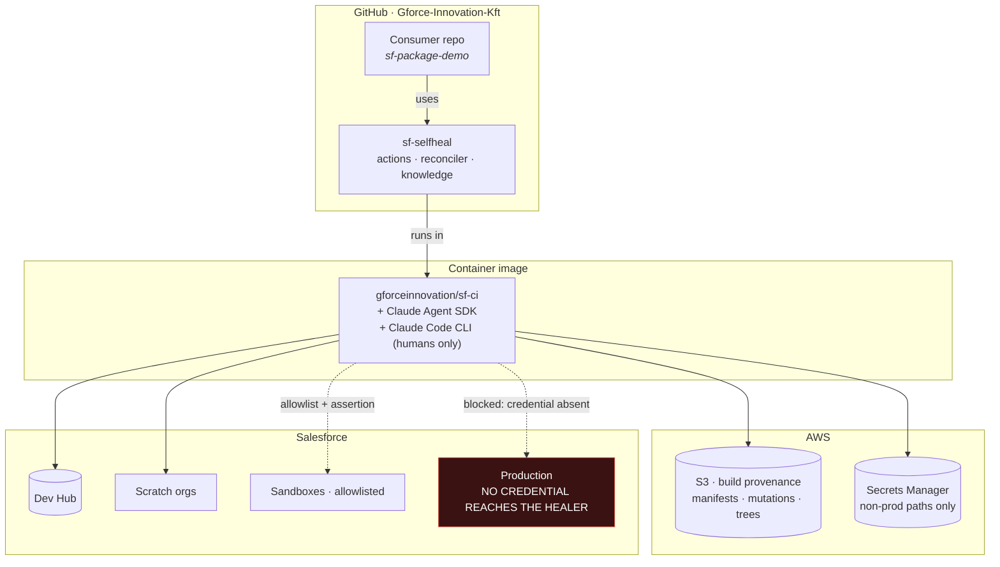
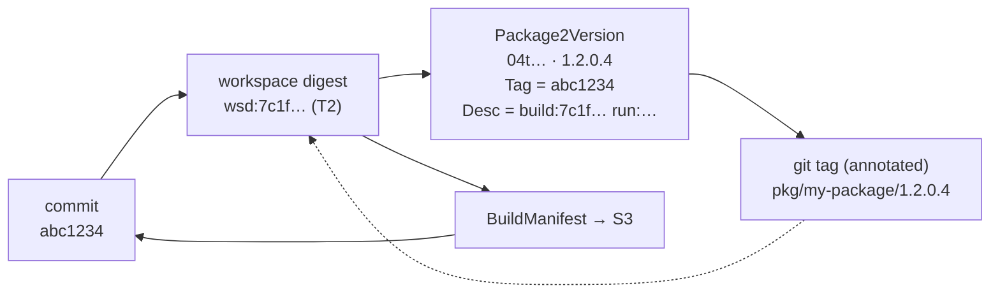
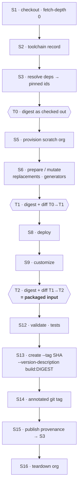
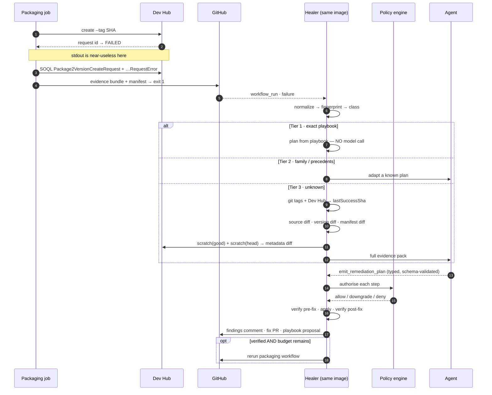
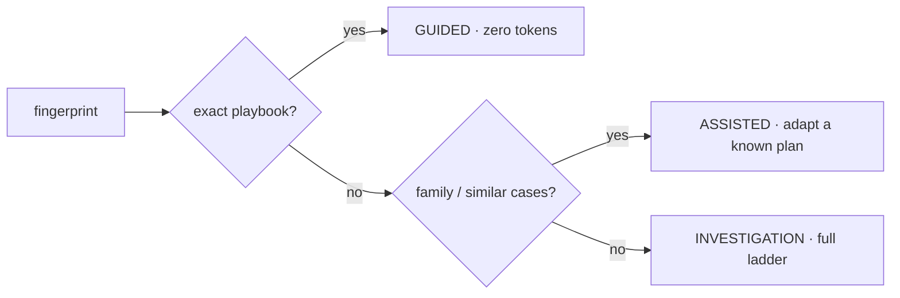
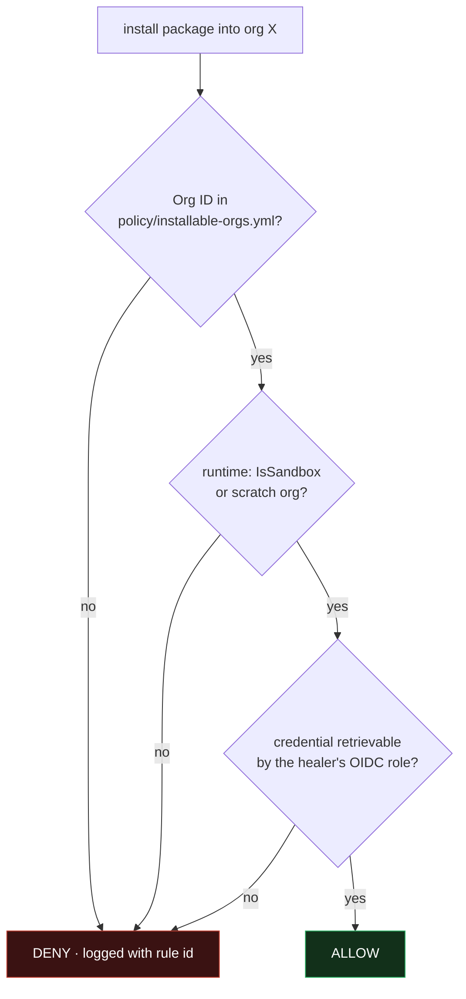

# sf-selfheal — Plan

**Status:** design complete, ready for v0 implementation planning
**Date:** 2026-08-05
**Supersedes:** the three separate design documents (packaging architecture, flow design, build
provenance) — consolidated here.

An AI-driven system that diagnoses and, where safe, repairs Salesforce CI failures. Skill #1 is
2GP package version creation; the architecture treats it as the first of many.

---

## 1. The problem

A package version creation fails. An engineer reads logs, forms a hypothesis, edits config,
reruns, repeats. It takes an afternoon, and the knowledge evaporates when it's done.

The command is deterministic. The failures are not — dependencies, ancestors, aliases, metadata,
Apex, tests, namespaces, quotas, platform blips, and a long tail nobody has named yet.

**What we build:** a bounded reconciliation loop. Deterministic tools act; the model only
reasons, and only when a cheaper tier has already failed. Every failure becomes a case; enough
cases become a rule; a rule removes that failure class from the paid path forever.

---

## 2. Premises we changed

Five things in the original framing were wrong or incomplete. Everything below assumes the
revised versions.

### 2.1 `sf package version create` is not a free retry

Every attempt consumes a `Package2VersionCreateRequest` against an edition-dependent daily
quota; every success advances the build number and leaves a permanent, promotable artifact.
"Retry until it works" destroys a scarce resource.

→ The most valuable component is not the healer, it's the **reproducer**: a cheap check that
reproduces a failure class *without* spending a real create. Creation becomes verification-gated
and capped at **3 attempts** per `(repo, package, headSha)`.

### 2.2 Confidence is the wrong gate

Model self-reported confidence is uncalibrated and self-serving.

→ The hard gate is **verification**: did a deterministic reproducer confirm the diagnosis, and
does it confirm the fix clears it? Self-assessment is recorded for calibration analysis and
authorises nothing above read-only. Low confidence **downgrades the action class** rather than
stopping — a diagnosis plus a draft PR is still useful output.

### 2.3 Prompt injection is the real security boundary

The agent reads logs, metadata, git history and Dev Hub records a PR author controls. Because
`workflow_run` executes the **base branch's** workflow with a read/write token, this is a
repository-write exposure — strictly larger than "don't deploy to production".

→ Mitigations are structural, never prompt-based: evidence is data never instruction; **no bash
tool**; writes confined to a path allowlist; policy in code; fork PRs diagnose-only; the agent
cannot modify its own policy, workflow or tool registry.

### 2.4 The commit hash does not identify what was packaged

The build mutates source in place. Your `sf-develop-demo` already does it — `sfdx-project.json`
`replacements` substituting `GITHUB_PRIVATE_KEY_BASE64` from the environment. So two builds at
the same commit can differ, and `git diff SHA_good..SHA_head` describes what a *developer*
changed, not what the *build* fed the packager.

→ Every build produces a **materialization record**: three workspace snapshots, a classified
mutation record, and environment fingerprints. See §5.

### 2.5 Taxonomy is data, not an enum

A hardcoded failure-class enum guarantees the "unknown" branch is second-class.

→ A YAML registry of signatures with `unknown` as a first-class, instrumented bucket, and an
explicit promotion path: `unknown → agent-proposed playbook → human-merged PR → deterministic
rule`.

---

## 3. The landscape



| Piece | Role |
|---|---|
| **Consumer repo** | The 2GP project. Calls two reusable workflows. Owns nothing of the healer. |
| **`sf-selfheal`** | New repo. Actions, workflows, reconciler, tools, policy, knowledge corpus. |
| **`sf-ci` image** | SF CLI + plugins + Node + Agent SDK. **Same image for pipeline and healer** — reproducer fidelity depends on it. |
| **S3** | Build provenance. GH artifacts expire at 90 days; the corpus needs older builds. |
| **Production** | Not a participant. The healer's OIDC role has no IAM permission on production secret paths. |

---

## 4. Correlation — commit ↔ digest ↔ version

Everything downstream depends on answering *"what changed since this package last built
successfully?"* Recorded in both directions, at creation, never mutated.



| Direction | Record | Read when |
|---|---|---|
| SF → git | `Package2Version.Tag = <sha>` | authority, needs Dev Hub auth |
| git → SF | annotated tag `pkg/<package>/<version>` | instant, offline, browsable in the GitHub UI |
| build → both | `BuildManifest.workspaceDigest` | what was *actually* packaged |

**Resolution order:** git tags first (instant, offline) → Dev Hub (authority) → cross-check.
**When they disagree, that disagreement is a finding** — a version created outside CI, or a
failed tag push. The redundancy is the point; the system reports divergence rather than silently
picking one.

`Package2Version.Tag` holds the commit SHA only, so it stays a git-resolvable ref. The digest
rides in `--version-description` and the tag message.

**Rule:** every create passes `--tag <sha>` and `--branch <branch>`; every *successful* create
pushes the annotated tag. Requires `contents: write` on the packaging job.

---

## 5. The build pipeline and its provenance



**Three snapshots, not one.** T0 = what was committed. T1 isolates *build mutations* from *human
changes*. T2 = the truth about what was packaged. **T1 ≠ T2 means a customization step is
writing into a package directory** — usually a bug, always surfaced.

**Packaging is from the working tree only.** The scratch org deploys, customizes, validates and
tests; it is never a source of packaged content. A `sf project retrieve` into a package
directory is `build.contamination` and fails in strict mode.

S15 runs `if: always()` — provenance for a *failed* build is worth more than for a successful one.

### The workspace digest

```
inputs = package directories after .forceignore filtering
       + sfdx-project.json (post-mutation)
       + .forceignore                      ← changes the packaged file set without touching source
digest = sha256( per file, sorted by path: path | mode | sha256(content) )
```

### Mutation classes

| Class | Example | Reproducible? | Handling |
|---|---|---|---|
| Declared-deterministic | literal `replacements` | yes | record the diff |
| **Env-dependent** | `replaceWithEnv: GITHUB_PRIVATE_KEY_BASE64` | only with the same value | record a **fingerprint**, never the value |
| Generated | script emits perm sets | if the generator is pinned | record generator version + output diff |
| Dependency-resolved | alias → concrete `04t` at build time | only if pinned | record ids; flag floats |
| Toolchain-driven | plugin rewrites on deploy prep | version-dependent | toolchain record covers it |
| **Contamination** | build junk in a package dir | no | detected, never silently packaged |

**Env fingerprints earn their place.** `{ name, valueSha256, length }` — never the value. If a
secret rotates and the new value is malformed, the package breaks with an opaque error and
*nothing in git changed*. Comparing fingerprints between the last good build and this one names
the cause in one step. There is no other cheap way to find it.

**Contamination detection:** at T2, every file must be explained by presence in git at
`sourceSha` or by a mutation entry. Anything else is untracked junk entering the package.

### Storage

```
s3://gforce-sf-build-provenance/<repo>/<package>/
  manifests/<sha>/<buildId>.json          # ~10-50KB · indefinite
  mutations/<sha>/<buildId>.patch.zst     # ~1-500KB · indefinite
  trees/<workspaceDigest>.tar.zst         # content-addressed, deduplicated
  evidence/<buildId>/evidence-bundle.json # failures only · 1 year
```

Trees are content-addressed, so identical mutations store once — storage grows with *distinct
packaged content*, not build count. Redaction happens before upload.

---

## 6. The failure path



**Three exits, always exactly one:** `fixed` (verified, applied, rerun queued), `proposed` (fix
identified, action class or budget forbids applying), `escalated` (no verified fix). There is no
"keep trying".

### Routing by specificity



Three paths, not two. Most "new" failures are a known family with different specifics, and
adapting a proven plan is cheaper and safer than reasoning from a blank slate.

---

## 7. The investigation ladder

```
L0   Capture       exit code, stdout/stderr, request id
L1   Enrich    ★   SOQL Dev Hub: Package2VersionCreateRequest + …RequestError
L2   Match         fingerprint → playbook / similar cases → jump to L7 on hit
L3   Delta (source) git diff lastSuccessSha..HEAD scoped to the package dir,
                    sfdx-project.json field diff, dependency-resolution diff
L3b  Delta (build)★ manifest diff: toolchain · resolved deps · env fingerprints ·
                    workspace digests · mutation records
L4   Reproduce     cheapest check that would have caught it
L5   Environment   Dev Hub limits, platform status, CLI/plugin versions vs last success
L6   Hypothesise   ranked root causes, each citing specific evidence
L7   Plan          typed RemediationPlan: steps + verifier + action classes
L8   Verify        re-run the reproducer with the fix applied
L9   Act           by action class; version-create capped at 3
L10  Record        case record + findings PR comment (+ playbook proposal)
```

**L1 is the highest-value step and everyone skips it.** `sf package version create` stdout is
near-useless; the actionable error lives in `Package2VersionCreateRequestError` on the Dev Hub.

**L3b is what makes on-the-fly mutation visible.** The decision table:

| Source diff | Workspace digest | Conclusion |
|---|---|---|
| empty | same | Not the build — environment / platform / Dev Hub (L5) |
| empty | **differs** | **Build mutation drift** — env rotation, generator, floating dep, toolchain skew. Invisible to git |
| non-empty | consistent with source | Ordinary source change |
| non-empty | differs *more* than source explains | Both — investigate both, and say so |

Row 2 is the one that costs an engineer an afternoon today.

### Comparisons available

| | Cost | Answers | Runs |
|---|---|---|---|
| git diff | free | "what did a human change?" | always |
| Version content diff | ~2 s, Dev Hub only | "what changed about the *package*?" | always |
| Manifest diff | free (S3 read) | "what did the *build* do differently?" | always |
| Metadata diff via scratch orgs | 2 orgs, 5–10 min | "what does the platform resolve differently?" | tier 3, budgeted |

---

## 8. Failure taxonomy

Data (`taxonomy/pkg2.yml`), not code. Each class carries match signals, a default verifier, a
maximum action class, and an expected remediation family. New classes arrive by PR.

| Group | Classes | Verifier | Max class |
|---|---|---|---|
| `dependency` | unresolved alias, missing subscriber version, circular, range unsatisfiable | `aliasResolve` | A3 |
| `ancestry` | missing / unreleased / mismatched ancestor, illegal break | `ancestryCheck` | A2 |
| `manifest` | malformed project json, bad versionNumber, alias collision | `schemaLint` | A3 |
| `metadata` | invalid component, unsupported in 2GP, API-version skew | `scratchOrgValidate` | A2 |
| `apex` | compile error, coverage, deprecation | `apexCompile` | A2 |
| `test` | failure, coverage below threshold, flaky | `apexCompile` | A2 |
| `namespace` | not linked, mismatch, reserved-word collision | `orgHealth` | A2 |
| `devhub` | quota exhausted, org expired/locked, permission, feature | `orgHealth` | A0 |
| `platform` | transient 5xx, maintenance, queued indefinitely | `idempotencyCheck` | A4 |
| `tooling` | CLI/plugin skew, plugin missing, node/JDK | `toolingCheck` | A2 |
| `build` | mutation drift, env rotation, dependency float, contamination, forceignore drift | `manifestDiff` | A2 (A0 for env-rotation) |
| `unknown` | everything else — **first-class** | agent-selected | A2 |

`unknown` gets: full ladder, mandatory precedent retrieval, a required playbook proposal, and its
own dashboard metric. A rising unknown rate means the taxonomy is stale.

---

## 9. Tools and action classes

Every capability is a typed, deterministic function. **No bash tool, no shell, no arbitrary file
write.** If it isn't in the registry, the agent cannot do it.

```ts
interface ToolDescriptor<I, O> {
  name: string; bundle: string;
  actionClass: ActionClass;
  idempotent: boolean;
  costHint: { wallClockMs: number; quota?: 'versionCreate' | 'scratchOrg' };
  input: JSONSchema; output: JSONSchema;
  redact: (o: O) => O;              // mandatory
  maxResultTokens: number;          // mandatory — over-cap results are summarised
  run: (i: I, ctx: ToolContext) => Promise<O>;
}
```

| Bundle | Tools | Class |
|---|---|---|
| `sf.package` | versionCreateReport, versionList, versionReport, ancestryList, dependencyResolve, lastSuccessfulVersion, versionContentDiff, versionCreate, versionDelete | A0; create/delete A4 |
| `sf.org` | limitsRead, scratchCreate, scratchDelete, authStatus, soqlTooling, packageInstall | A0/A1; install A1 scratch, A3 sandbox |
| `sf.metadata` | deployValidate, apexCompile, testRun, manifestLint, metadataDiffAcrossScratchOrgs | A1 |
| `build` | getManifest, lastSuccessful, diffManifests, getMutationRecord, compareWorkspaces | A0 |
| `git.read` | log, diffRange, showFile, blame, resolveVersionTags | A0 |
| `repo.write` | applyStructuredEdit, commitToBranch, openPullRequest | A2/A3 |
| `gh` | getRun, getJobLogs, comment, rerunWorkflow | A0/A2 |
| `knowledge` | matchPlaybook, searchCases, loadSkill, proposePlaybook | A0/A2 |
| `plan` | emit_remediation_plan (terminal) | — |

**`applyStructuredEdit`, not a text editor.** Edits are typed operations (`setPackageAlias`,
`setDependencyVersion`, `setAncestor`, `bumpVersion`), schema-validated and diff-checked. The
agent cannot emit arbitrary file content. `soqlTooling` is allowlisted by object.

### Action classes

| Class | Meaning | Gate |
|---|---|---|
| **A0** | Inspect — read-only | always |
| **A1** | Simulate — ephemeral state (scratch org, validate, compile) | budget + limits headroom |
| **A2** | Propose — healer branch, PR, comment | always |
| **A3** | Mutate — commit to the failing branch | non-protected + path allowlist + structural diff validation + not a fork |
| **A4** | Consume quota — version create, version delete (unpromoted) | **verifier passed** + budget + limits headroom |
| **A5** | Forbidden — promote, any production action, protected branches, `.github/workflows/**`, `policy/**`, `tools/**`, secrets | never |

**Path allowlist for A3:** `sfdx-project.json` (alias/dependency/ancestor/versionNumber fields
only), `config/scratch-orgs/*.json`, `.sfdx-selfheal/*.json`.

---

## 10. Safety: what the AI can and cannot do

### The production boundary — three gates, all must pass



**The third gate is the strongest and it is not a policy rule.** The healer's AWS role has no
IAM permission on the production secret path. A total compromise of the policy engine and the
prompt still cannot produce a production credential, because it does not exist in that execution
context. Gates 1 and 2 are defence in depth on top of it.

### Permission matrix

| Action | Scratch | Sandbox (allowlisted) | Production |
|---|:--:|:--:|:--:|
| Query / read metadata | ✅ | ✅ | ⛔ no credential |
| Create / delete org | ✅ budgeted | — | ⛔ |
| Deploy check-only | ✅ | ✅ | ⛔ |
| Deploy for real | ✅ | ⚠️ propose PR only | ⛔ |
| Run Apex tests | ✅ | ✅ | ⛔ |
| **Install package version** | ✅ | ✅ | ⛔ |
| Create package version | ✅ budgeted, max 3 | — | — |
| Delete package version | ✅ unpromoted only | — | — |
| **Promote package version** | ⛔ human only | ⛔ | ⛔ |

**Promotion is A5 forever.** The agent may *prepare* one — open the PR, assemble the evidence
pack, draft the dispatch — but the GitHub environment approval gate executes it.

**Secrets:** redaction happens at the tool boundary in `ToolDescriptor.redact`, before a result
reaches the loop — not post-hoc on logs. Every redaction is counted.

**Fork PRs:** policy forces `maxActionClass: A2` and disables `rerunWorkflow`. No override flag.

---

## 11. Confidence and verification

Four separable signals. None of them is "the model said 0.9".

| Signal | Source | Authority |
|---|---|---|
| `matchStrength` | triage engine | selects the route |
| `evidenceCompleteness` | collector (0–1) | can force downgrade |
| `verificationOutcome` | reproducer | **the hard gate** |
| `selfAssessment` | model | recorded only; authorises nothing |

| Verification | Match | Evidence | Ceiling |
|---|---|---|---|
| confirmed | exact | ≥0.9 | A4 |
| confirmed | family/semantic | ≥0.8 | A3 |
| confirmed | none | any | A2 |
| unconfirmed | any | any | A2 |
| contradicted | any | any | A0 — plan discarded |
| any | any | <0.6 | A0 — evidence gap is the finding |

**Pre-fix verification is not optional.** Running the reproducer *before* applying a fix
confirms the diagnosis is real. A reproducer that passes pre-fix means the diagnosis is wrong and
the plan is discarded, regardless of stated confidence.

### Retry

| Class | Strategy |
|---|---|
| Transient | **Idempotency check first** — `versionCreateReport` on the request id, because 2GP creates frequently succeed behind a client timeout. Then backoff 30 s → 2 m → 8 m, max 3 |
| Deterministic config | fix → verify → **one** retry |
| Deterministic code | fix → verify → PR. No retry this invocation |
| Environmental | no retry; escalate with the snapshot |
| Unknown | no retry until a verifier confirms a diagnosis |

Cap of **3 version-create attempts per `(repo, package, headSha)`** across all invocations. The
ledger is persisted so a re-triggered healer cannot reset it. Pre-flight limits check before any
A4 action; headroom below threshold → automatic downgrade to propose-only.

---

## 12. Knowledge and learning

```
cases/       raw, append-only, machine-written — every reconciliation, including failures
playbooks/   curated, human-merged — the distilled product
taxonomy/    class registry — human-merged
```

**Playbooks are only ever created by a merged PR.** The agent proposes; a human merges. An agent
that writes its own rules unsupervised is a self-amplifying error source — this is the single
most important control in the learning system.

**Promotion criteria:** same fingerprint family seen ≥2 times, a verifier that reproduces the
failure, and a remediation the verifier confirms clears it.

**Retrieval is tiered — RAG is tier 2, not tier 1**, because packaging failures carry
deterministic signatures and similarity search over them is strictly worse than a hash lookup.

| Tier | Mechanism | Model call |
|---|---|---|
| 0 | fingerprint → playbook exact | none |
| 1 | family → playbook set | none |
| 2 | BM25 over case summaries | none |
| 3 | embeddings over cases + playbooks | embedding only |
| 4 | agent reasons from raw evidence + top-k precedents | yes |

Index built at healer start from the git corpus, cached by knowledge-tree hash. No index server.
Behind a `KnowledgeStore` interface so pgvector drops in later. **Precedents are injected with
their outcomes** — a precedent whose fix failed is as informative as one that worked.

**Feedback:** 👍/👎 and `/selfheal wrong <reason>` on the findings comment write a verdict back
into the case; wrong verdicts decay a playbook's standing and can auto-open a demotion PR.

**The system gets cheaper as it learns.** Each promoted playbook moves a class from tier 3
(minutes, tokens, scratch orgs) to tier 0 (milliseconds, free). The metric that matters is the
**unknown rate trending down**, not the number of fixes applied.

---

## 13. Context and cost

AI credits are the operating cost. Levers, in order of impact:

1. **Don't call the model** — a tier-0 hit costs zero tokens. Dwarfs everything else.
2. **Pull, don't push** — the agent gets a compact case brief (~2–4k tokens) and *tools* to fetch
   what it needs. Raw logs, full diffs and trees stay in S3, referenced not inlined.
3. **Prompt caching** — stable prefix (system prompt, policy summary, tool definitions, skill
   docs) cached; cache reads ~0.1×. All repo- and run-specific content goes *after* the
   breakpoint. `cache_read_input_tokens` at zero across consecutive runs is treated as a defect.
4. **Per-tool `maxResultTokens`** — over-cap results are summarised with a continuation handle.
   One `git diff` can never flood the window.
5. **Context editing** — `clear_tool_uses_20250919` clears superseded tool results once a
   hypothesis is discarded.

### Limits — hardcoded now, configurable in v2

```ts
// src/core/limits.ts — v0/v1. No YAML, no precedence resolution.
export const LIMITS = {
  model: 'claude-opus-5',
  effort: 'high',
  maxAgentSteps: 30,
  maxTokens: 120_000,
  taskBudgetTokens: 50_000,        // model paces itself, wraps up gracefully
  maxToolResultTokens: 8_000,
  maxWallClockMinutes: 20,
  maxScratchOrgs: 2,
  maxVersionCreateAttempts: 3,
  repeatFingerprintEscalateAfter: 2,
} as const;
```

Two of these do the real work and ship in v1 regardless: **`taskBudgetTokens`** (bounded,
graceful termination rather than mid-thought truncation) and **`repeatFingerprintEscalateAfter`**
— a pipeline broken for a known reason fails on every push, and re-diagnosing the same
fingerprint twenty times is the most likely way to burn credits for nothing.

**`policy/budgets.yml`** — per-route and per-taxonomy-class caps, circuit breakers
(per-repo-per-day, per-org-per-month), explicit per-class model selection — is **v2**, tuned
against the cost data v1 measures. Building a precedence-resolving config layer before there is
measured data is tuning knobs against guesses.

**Model selection is never automatic.** `claude-opus-5` everywhere, hardcoded, in v0–v1. Effort
is the lever. From v2 a `model:` key exists per class — but which model runs which class is an
economic decision made explicitly in a committed file, never something the system decides at
runtime.

**Accounting:** every case records input/output/cache tokens and `costUsd`; the findings comment
carries a footer:

```
⏱ 4m12s · route: investigation · 🧠 61k in (48k cached) / 9k out · 💰 $0.34 · 🌱 1 scratch org
```

**The economic test, per class:** if a reconciliation costs more than the engineer time it saves,
that class does not belong on the paid path. The response is to promote a playbook (moving it to
tier 0, free) or disable the class — not to accept the spend.

---

## 14. Package creation: composite vs JavaScript

You asked whether the create action should be composite or JavaScript with `@salesforce/core`,
and for a performance comparison. Build both, benchmark, let data decide — with one caveat
stated up front so the benchmark can falsify it.

### The prior: the create call is not where performance lives

`sf package version create` blocks on a Salesforce-side build measured in **minutes**. Shaving
two seconds of CLI startup off a six-minute operation is noise. Benchmarking *that* measures the
wrong thing.

**Where it lives is the tool layer.** One reconciliation makes dozens of Salesforce calls — SOQL
enrichment, version reports, limits, dependency resolution, ancestry. Every `sf` CLI invocation
pays full process startup and re-authentication. Thirty calls × ~2 s ≈ a minute of pure overhead
per reconciliation, every time.

| | Composite (`sf` CLI) | JavaScript (`@salesforce/core`, `@salesforce/packaging`) |
|---|---|---|
| Create + poll | fine — dominated by SF build time | fine, marginally faster start |
| 6-query evidence collection | 6 process spawns | 1 process, 1 connection |
| 30-call healer tool sequence | 30 spawns, 30 auth loads | 1 process, connection reused |
| Workspace digest, ~5k files | shell hashing | streaming node crypto |
| Error handling | parse `--json` from stdout | typed objects |
| Testability | integration only | unit-testable, mockable at the client boundary |
| Repo fit | new pattern | matches the existing strict singleton TS architecture |
| Cost | no bundle, no dist | committed esbuild dist; `@salesforce/*` is a heavy dep |

### Benchmark protocol (`tools/bench/`)

1. Fixture packages: small (~200 files) and large (~5,000 files).
2. Scenarios: **(a)** single create + poll · **(b)** full evidence collection · **(c)** 30-call
   tool sequence · **(d)** workspace digest over both fixtures.
3. Metrics: wall clock p50/p95 over 10 runs, CPU seconds, peak RSS, GH-minutes cost.
4. Both implementations in the same `sf-ci` image, same runner class, same org.
5. Results committed to `docs/bench/`, re-run when either dependency majors.

**Stated expectation, so the benchmark can prove it wrong:** no meaningful difference on (a); JS
wins (b) by roughly 5×, (c) by 10×+, and (d) decisively. If the numbers disagree, the numbers win.

**Recommendation pending data:** composite for the create action if it stays a thin wrapper;
TypeScript for everything the healer touches. **A split is a legitimate outcome** — the create
action and the tool layer have different shapes and different call frequencies.

> **Implementation note:** verify the exact `@salesforce/packaging` and `@salesforce/core` API
> surface against the installed versions during implementation. Do not write those calls from
> memory — check the package's own type definitions first.

---

## 15. Project structure

New repository `Gforce-Innovation-Kft/sf-selfheal`, TypeScript strict, following this repo's
conventions (singleton classes, thin entry points, committed esbuild `dist/`, `npm run all`
gate, 95% coverage).

```
sf-selfheal/
├── .github/
│   ├── actions/
│   │   ├── sf-package-create/          # composite + TS variants (§14)
│   │   └── sf-selfheal/                # healer entry
│   └── workflows/
│       ├── sf-package-create.yml
│       └── sf-selfheal.yml
├── src/
│   ├── core/          reconciler loop · limits · budget ledger · trace · host interface
│   ├── evidence/      bundle schema · collectors · redaction
│   ├── provenance/    snapshots · digest · mutation record · manifest · S3 client
│   ├── fingerprint/   normalizer · hashing · taxonomy resolver
│   ├── triage/        deterministic engine · playbook matcher
│   ├── knowledge/     store iface · git impl · retrieval tiers · index build
│   ├── policy/        action classes · policy engine · path allowlist · diff validator
│   ├── agent/         Agent SDK wiring · MCP tool server · prompts · structured output
│   ├── tools/         sf/ · build/ · git/ · repo/ · gh/ · knowledge/
│   ├── verify/        reproducers
│   ├── skills/package-version-create/   manifest · collector · verifiers · seeds
│   └── types/
├── knowledge/         playbooks/ · cases/ · taxonomy/ · skills/
├── fixtures/          recorded evidence bundles for replay tests
├── tools/             failure-injection harness · eval runner · bench
└── docs/              architecture · authoring-a-skill · policy-profiles · bench
```

### Consumer wiring

**Everything derivable is derived** — `tag` ← `github.sha`, `branch` ← the ref, `package` ← the
default `packageDirectories` entry, `skill` ← the evidence bundle, `max-action-class` ← the
policy profile. An input that must be supplied correctly on every call is a defect waiting to
happen.

```yaml
# .github/workflows/package.yml
jobs:
  package:
    uses: Gforce-Innovation-Kft/sf-selfheal/.github/workflows/sf-package-create.yml@v1
    secrets: inherit
    permissions:
      contents: write        # push the version tag
```

```yaml
# .github/workflows/selfheal.yml
on:
  workflow_run:
    workflows: ["Package Version Create"]
    types: [completed]
jobs:
  heal:
    if: github.event.workflow_run.conclusion == 'failure'
    uses: Gforce-Innovation-Kft/sf-selfheal/.github/workflows/sf-selfheal.yml@v1
    secrets: inherit
```

Two files, zero required inputs in the common case.

### Testing

**Replay, not mocks-in-the-large.** Every real failure becomes a fixture; triage and agent run
against recorded evidence with tools stubbed at the registry boundary. On top of that, an **eval
harness** over the fixture corpus measuring classification accuracy, plan validity, verifier pass
rate and cost per case. This is what makes "learning system" a measurable claim, and it is the
regression suite for a non-deterministic component.

---

## 16. Roadmap

Only **v0** is a single implementation cycle. v1–v3 get their own plans when the prior phase's
exit criteria are met.

### v0 — Prove the loop, build the corpus. **No LLM in the fix path.**

If it isn't valuable deterministic, adding a model won't save it.

1. Demo 2GP package in `sf-package-demo` (real aliases, real dependency, real ancestor).
2. `sf-package-create` — create, `--tag <sha>`, poll, **query `Package2VersionCreateRequestError`**.
3. Evidence bundle schema v1 + collector + redaction.
4. **Failure-injection harness** — ≥8 failure classes on demand, including mutation-drift and
   env-rotation. Exists *before* the healer; it is the fixture generator and the demo.
5. Build provenance — stages S1–S16, three snapshots, mutation record, manifest → S3, git tags.
6. Normalizer + fingerprint + `taxonomy/pkg2.yml` seed.
7. Triage engine + ~8 hand-written playbooks.
8. Findings PR comment + case recording. **Diagnose-only** — the comment is the only write.
9. Replay test suite over the injected fixtures.
10. Composite vs TS benchmark (§14).

**Exit:** ≥6 of 8 injected classes correctly classified from evidence alone; every run produces a
case record; zero model calls.

### v1 — Reasoning and verification

Agent SDK with typed tool server and `canUseTool` policy · `emit_remediation_plan` structured
output · verifiers (`scratchOrgValidate`, `apexCompile`, `aliasResolve`, `ancestryCheck`) ·
ladder L3/L3b/L4–L6 · policy engine A0–A5 with path allowlist · budget ledger, limits pre-flight,
transient retry with idempotency check · A2 auto-PR for config fixes · A4 gated create retry ·
hardcoded cost containment (§13) · eval harness reporting cost per case.

**Exit:** ≥1 real class auto-fixed end-to-end with verification; zero false fixes on the corpus;
cost per case within budget.

### v2 — Close the loop, start learning

A3 direct commits on non-protected branches · retrieval tiers 2–3 · agent-proposed playbooks with
enforced promotion criteria · human-feedback verdicts and demotion · **governance and credit
layer** (`budgets.yml`, circuit breakers, per-class model selection) · metrics dashboard · second
consumer repo to break demo over-fitting.

**Exit:** unknown rate trending down over ≥30 real cases; ≥1 playbook promoted from an agent
proposal; measurable reduction in mean time to diagnosis.

### v3 — Prove extensibility, scale out

Skill #2 (`deploy-validation`) with **zero changes** under `src/core`, `src/policy`, `src/agent` —
this is the architecture's acceptance test · `ReconcilerHost` ECS Fargate implementation ·
`KnowledgeStore` pgvector · evaluate Managed Agents for memory stores and scheduled
`org-health-check` · `promotion-preparation` and `findings-signal` skills.

---

## 17. Risks

| Risk | Severity | Mitigation |
|---|---|---|
| **Prompt injection → repo write** | **High** | No bash tool; typed tools only; policy in code; path allowlist; untrusted-content framing; forks capped at A2; agent cannot touch its own policy |
| **Quota destruction by retry loops** | High | Reproducer before retry; cap 3; pre-flight limits; ledger cannot be reset |
| **Confidently wrong fix that goes green** | High | Verification is the hard gate; pre-fix reproduction; A3 path allowlist; every fix attributable in a PR |
| **Cost exceeds engineer time saved** | Medium | Tier 0 handles the common case free; cost per case tracked with a stated budget; the economic test in §13 |
| **Knowledge corpus rots** | Medium | Provenance on every playbook; feedback verdicts decay standing; auto-demotion PRs; unknown-rate dashboard |
| **Fingerprint instability across API versions** | Medium | Aggressive normalisation; family hash fallback; fingerprint version recorded so re-indexing is possible |
| **Verifier fidelity gap** | Medium | Track verifier precision per class; a low-precision verifier loses authorising power |
| **Over-fitting to the demo package** | Medium | Failure injection is deliberate, not opportunistic; second consumer repo before v2 |
| **Healer failure masks pipeline failure** | Low | Separate workflow; its failure never changes the packaging job's conclusion |

**Accepted trade-offs:** latency (competes with a context switch, not the build); git as a
database (weak concurrency, UUID-named cases, cheap to migrate); no cross-repo aggregation in v1
(it is the trigger for the ECS migration); determinism over coverage (tier 0 will refuse to guess
where a model might have been right — the correct bias for a system with repo write).

---

## 18. Rejected alternatives

| Alternative | Why rejected |
|---|---|
| Claude Code Action with broad bash/edit | Cannot enforce action classes; safety becomes prompt rules over an unbounded shell |
| "LLM + prompt", no tool layer | Unreproducible, unverifiable, generates no structured knowledge |
| Pure rules engine | Adopted *as tier 0*; cannot handle the unknown bucket, which is the motivating requirement |
| Fine-tuned classifier | Corpus will be O(100s) for years; fingerprints + retrieval dominate at that scale |
| AWS Lambda as executor | 15-min hard timeout vs scratch org (2–5 min) + validate-with-tests (>15 min). Fatal |
| Step Functions | An agent loop is dynamic; encoding it in ASL loses the tool/permission model |
| ECS Fargate from day one | Correct destination, wrong first step — VPC/ECR/IAM/TF before a single proven fix |
| Managed Agents for v1 | No Salesforce CLI in the sandbox (~2 min install per session); beta surface. Revisit v3 |
| Self-hosted runners | Fleet ops plus a fork-PR footgun for marginal benefit at this stage |
| Network-exposed MCP server | Attack surface and an operational component for zero benefit; tool server is in-process |
| GitHub Issues as knowledge store | No schema enforcement, weak search, pollutes the tracker |
| pgvector from day one | Debugging retrieval quality before 20 cases exist |
| LangChain / LangGraph | Another abstraction over an SDK that already provides loop, permissions, hooks and MCP |

---

## 19. Decisions of record

| # | Decision | Rationale |
|---|---|---|
| D1 | Separate healer workflow (`workflow_run`), not inline | Permission separation; survives cancellation; observable as its own run |
| D2 | Autonomy tiered by action class, not confidence | Confidence is uncalibrated; actions have knowable blast radius |
| D3 | Git-native knowledge, tiered retrieval; RAG is tier 2 | Deterministic signatures beat similarity search; zero infra; PR-reviewable |
| D4 | Claude Agent SDK with a custom typed tool server | The permission callback *is* the safety model, enforced in code |
| D5 | GH Actions job in `sf-ci` for v0–v2; ECS declared target | Reproducer fidelity needs the identical image; zero infra to start |
| D6 | Reproducer before retry; creation verification-gated, cap 3 | Quota is scarce and creates are semi-irreversible |
| D7 | Pipeline tags creates with the git SHA | Makes delta-since-last-success a query, not guesswork |
| D8 | Playbooks only via human-merged PR | Prevents a self-amplifying error source |
| D9 | v0 ships with no LLM in the fix path | Forces the deterministic tier to carry its own weight |
| D10 | Promotion is A5 forever | Human approval gate is non-negotiable |
| D11 | Agent SDK drives; Claude Code CLI in the image for humans only | Keeps no-bash enforced in code, not in an allowlist |
| D12 | Production boundary = allowlist + runtime assertion + **credential unavailability** | The third gate holds even if policy and prompt are compromised |
| D13 | Package install permitted in scratch and allowlisted sandboxes | Needed to verify dependency and install-time failures |
| D14 | SF-side diff: version content (always) + metadata via scratch orgs (tier 3) | Catches "nothing in the repo changed" without paying every run |
| D15 | Correlation both ways: `Package2Version.Tag` **and** annotated git tag | Git is instant and offline; Dev Hub authoritative; divergence is a finding |
| D16 | Workflow inputs derived from context; overrides optional | Every required input is a place the caller can be wrong |
| D17 | Three workspace snapshots + mutation record per build; ladder L3b | The commit does not identify what was packaged |
| D18 | Provenance to S3; trees content-addressed | GH artifacts expire at 90 days; the corpus needs older builds |
| D19 | Limits hardcoded for v0/v1; config layer is v2 | Tuning knobs before measured data is guesswork |
| D20 | Context pulled by the agent, never pushed; per-tool `maxResultTokens` | One unbounded result would dominate the cost of every run |
| D21 | Model selection is explicit configuration, never automatic downgrade | An economic decision the owner makes in a committed file |
| D22 | Package-create implemented both ways and benchmarked | The create is I/O-bound; the tool layer is not — measure before committing |

---

## 20. Open questions

1. **Consumer repo** — is `sf-package-demo` a new repo I should scaffold, or does an existing project become the first consumer? *(Shapes task #1 of the v0 plan.)*
2. **Installable sandbox allowlist** — which orgs go on it first, and who approves additions?
3. **S3 bucket** — new `gforce-sf-build-provenance`, or a prefix in an existing bucket? Who owns the lifecycle policy?
4. **Contamination strict mode** — fail the build from day one, or warn for the first N builds while the baseline settles?
5. **Pinned trees** — how many recent successful trees per package stay out of lifecycle expiry? (5 is a reasonable default.)
6. **Multi-package repos** — one manifest per package per build, or one per run?
7. **Signal channels** — is a PR comment enough for v1, or does Slack ship from the start?
8. **`org-health-check` cadence** — scheduled in the consumer repo, or centrally?
