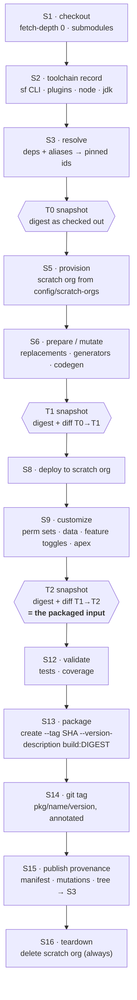
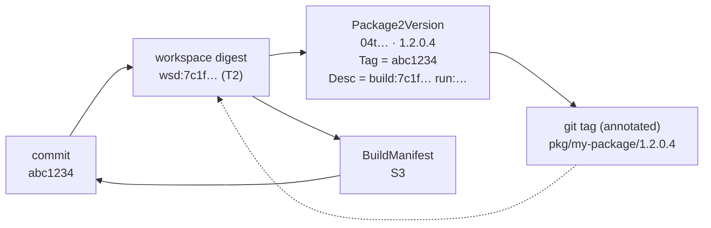

# CI Build & Package Version Handling — Provenance Design

**Companion to:** `2026-08-05-sf-selfheal-packaging-design.md` (architecture) and
`2026-08-05-sf-selfheal-flow-design.md` (flow).
**This document answers:** *what does the CI pipeline actually build, and how do we prove it
later?*

---

## 1. The problem this solves

The build mutates the source in place before packaging. `sfdx-project.json` `replacements`
substitute environment values, customization steps generate metadata, dependencies resolve to
concrete ids at build time. Your own `sf-develop-demo` already does this:

```json
"replacements": [{
  "filename": "…/GitHub_App_Settings.salesforce_gforce_devhub.md-meta.xml",
  "stringToReplace": "GITHUB_PRIVATE_KEY_BASE64_PLACEHOLDER",
  "replaceWithEnv": "GITHUB_PRIVATE_KEY_BASE64"
}]
```

That is an on-the-fly, environment-dependent, **secret-bearing** mutation. Three consequences:

1. **The commit hash does not identify what was packaged.** Two builds at the same commit can
   produce different packages.
2. **`git diff SHA_good..SHA_head` answers the wrong question.** It describes what a *developer*
   changed, not what the *build* fed to the packager.
3. **The most maddening failure class is invisible to git.** Nothing in the repo changed, the
   build broke anyway, because an env var rotated or a generator moved.

The fix is a **build materialization record**: capture what the tree actually looked like at the
moment it was packaged, plus everything that changed between checkout and that moment.

> **Scope decision:** packages are created from the **working tree only** — the scratch org is
> for deploy, customize, validate and test, never a source for packaged content. §8 explains why
> this matters and how the pipeline guards against drifting into org-derived packaging.

---

## 2. The canonical build pipeline



**Three snapshots, not one.** T0 tells you what was committed. T1 isolates *build mutations*
from *human changes*. T2 is the truth about what was packaged. When T1 ≠ T2 the customization
stage is writing to the working tree — usually a bug, always worth surfacing.

On failure at any stage, S15 still runs (`if: always()`) — provenance for a failed build is more
valuable than for a successful one.

---

## 3. The workspace digest

A content digest over exactly what the packager reads — nothing more, nothing less.

```
inputs = union of:
  · every file under each packageDirectories path, after .forceignore filtering
  · sfdx-project.json          (post-mutation — replacements alter it in effect)
  · .forceignore               (it changes the packaged file set)

digest = sha256( for each file, sorted by path:
                   path | mode | sha256(content) )
→ wsd:sha256:<hex>,  short form = first 12 hex chars
```

**`.forceignore` is a digest input on purpose.** A change to it alters the packaged file set
without touching a single source file — a silent cause that source diffing cannot see.

The short digest is carried in three places, so no single system is a bottleneck:

| Where | Field | Why |
|---|---|---|
| Dev Hub | `--version-description "build:<digest12> run:<runId>"` | the version record is self-describing |
| git | annotated tag message | resolvable offline, immutable |
| S3 | `BuildManifest.workspaceDigest` | the authority, with the full tree behind it |

`Package2Version.Tag` stays clean — it holds the commit SHA only, so it remains a git-resolvable
ref.

---

## 4. Mutation taxonomy

Every mutation is classified. The class determines reproducibility and risk.

| Class | Example | Reproducible? | Risk | Handling |
|---|---|---|---|---|
| **Declared-deterministic** | `replacements` with a literal `replaceWithFile` | yes | low | record the diff |
| **Env-dependent** | `replaceWithEnv: GITHUB_PRIVATE_KEY_BASE64` | only with the same value | **medium** | record a **fingerprint** of the value, never the value |
| **Generated** | script emits perm sets / labels | if the generator is pinned and deterministic | medium | record generator version + output diff |
| **Dependency-resolved** | alias → concrete `04t` id at build time | only if pinned | **high** | record resolved ids; unpinned floats are flagged |
| **Toolchain-driven** | plugin rewrites metadata on deploy prep | version-dependent | medium | toolchain record covers it |
| **Incidental contamination** | build junk landing in a package dir | no | **high** | detected and reported, never silently packaged |
| **Org-derived** | packaging content retrieved from the org | **no** | **highest** | out of scope by design (§8) |

### Secret-bearing mutations

Values substituted from environment variables are frequently secrets. The manifest records a
**fingerprint**, never the value:

```json
"envFingerprints": [
  { "name": "GITHUB_PRIVATE_KEY_BASE64", "valueSha256": "9f2a41c8b3d7", "length": 3268 }
]
```

And in the mutation patch itself:

```diff
-  <value>GITHUB_PRIVATE_KEY_BASE64_PLACEHOLDER</value>
+  <value>[redacted:sha256:9f2a41c8b3d7 len:3268]</value>
```

**This is why the fingerprint earns its place.** If that secret is rotated and the new value is
malformed, the package breaks with an opaque error and *nothing in git changed*. Comparing
`envFingerprints` between the last good build and this one names the cause in one step. There is
no other cheap way to find it.

### Contamination detection

At T2, every file in the digest input set must be explained by either (a) presence in git at
`sourceSha`, or (b) an entry in the mutation record. Anything else is untracked junk entering
the package. It is reported as `build.contamination` and, in strict mode, fails the build.

---

## 5. Data model

```ts
interface BuildManifest {
  schemaVersion: 1;
  buildId: string;                   // `${runId}-${attempt}`
  outcome: 'success' | 'failure';
  failedStage?: string;

  source: {
    repo: string; sourceSha: string; branch: string;
    prNumber?: number; isFork: boolean;
    submodules: { path: string; sha: string }[];
  };

  toolchain: {
    image: string; imageDigest: string;      // sha256 of the container image
    sfCli: string; plugins: Record<string,string>;
    node: string; jdk: string;
  };

  packageDef: {
    name: string; packageId: string;         // 0Ho…
    versionNumberTemplate: string;           // e.g. "1.2.0.NEXT"
    ancestorId?: string;
    dependencies: { alias: string; resolvedVersionId: string; pinned: boolean }[];
  };

  snapshots: {
    t0: { workspaceDigest: string; fileCount: number; bytes: number };
    t1: { workspaceDigest: string; fileCount: number; bytes: number };
    t2: { workspaceDigest: string; fileCount: number; bytes: number };  // packaged input
  };

  mutations: {
    t0_t1: MutationRecord;             // build mutations
    t1_t2: MutationRecord;             // customization touched the tree — usually should be empty
  };

  envFingerprints: { name: string; valueSha256: string; length: number }[];

  contamination: { path: string; reason: 'untracked' | 'unexplained' }[];

  result?: {
    versionId: string;                 // 04t…
    packageVersionId: string;          // 05i…
    versionNumber: string;             // 1.2.0.4
    gitTag: string;                    // pkg/my-package/1.2.0.4
    codeCoverage?: number;
  };

  artifacts: {
    treeKey?: string;                  // s3 key, content-addressed by t2 digest
    mutationsKey: string;
    evidenceKey?: string;              // failures only
  };
}

interface MutationRecord {
  changedFiles: number;
  patchSha256: string;                 // integrity of the stored patch
  byClass: Record<MutationClass, number>;
  entries: {
    path: string;
    op: 'add' | 'modify' | 'delete';
    class: MutationClass;
    redacted: boolean;
    beforeSha?: string; afterSha?: string;   // binary / redacted files
  }[];
}
```

---

## 6. Artifact store

**S3 primary** (via the OIDC role already used by `get-aws-secret`), GitHub artifacts as a
90-day convenience copy for humans.

```
s3://gforce-sf-build-provenance/
  <repo>/<package>/
    manifests/<sourceSha>/<buildId>.json        # small · retained indefinitely
    mutations/<sourceSha>/<buildId>.patch.zst   # small · retained indefinitely
    trees/<workspaceDigest>.tar.zst             # content-addressed · deduplicated
    evidence/<buildId>/evidence-bundle.json     # failures only · 1 year
```

**Trees are content-addressed by workspace digest**, so builds that mutate identically store one
copy. In practice most builds on a branch share a tree; storage grows with *distinct packaged
content*, not with build count.

| Object | Size | Retention |
|---|---|---|
| Manifest | ~10–50 KB | indefinite (Glacier IR after 1 year) |
| Mutation patch | ~1–500 KB | indefinite (Glacier IR after 1 year) |
| Tree | 1–100 MB | 180 d Standard-IA, **except** trees referenced by the last N successful versions per package, which are pinned indefinitely |
| Evidence bundle | ~1–5 MB | 1 year |

**Why not GitHub artifacts alone.** They cap at 90 days. A learning system routinely needs *"the
last successful build of this package was five months ago"* — and that is precisely the case
where a human is most stuck and the corpus is most valuable. Losing it defeats the purpose.

**Redaction happens before upload**, through the same rules as tool output. The manifest carries
a `RedactionReport`; nothing reaches S3 unredacted.

**Permissions:** the packaging job gets `s3:PutObject` scoped to its own repo prefix; the healer
gets `s3:GetObject` across the bucket, and no `Delete` on either. Neither role can reach any
production secret path.

---

## 7. Correlation — now three-way



The annotated tag message carries the whole set, so `git show pkg/my-package/1.2.0.4` answers
most questions with no network call:

```
pkg/my-package/1.2.0.4

package:        my-package
packageId:      0Ho...
versionId:      04t...
versionNumber:  1.2.0.4
commit:         abc1234
workspaceDigest: wsd:sha256:7c1f9a2b4e88
mutations:      12 files (env-dependent: 1, generated: 11)
toolchain:      sf 2.x.y · image sha256:…
buildId:        17384920-1
manifest:       s3://…/manifests/abc1234/17384920-1.json
```

---

## 8. Determinism and the org-derived trap

Packaging happens from the working tree. The scratch org is used to deploy, customize, validate
and test — **never as a source of packaged content.**

The pipeline guards this structurally rather than by convention:

- **T1 vs T2 must be empty** in the default profile. Any customization step that writes into a
  package directory shows up as a non-empty `t1_t2` mutation record and is reported.
- A `sf project retrieve` into a package directory is treated as `build.contamination` and fails
  the build in strict mode.

**Reproducibility grade** is computed per build and recorded in the manifest:

| Grade | Meaning |
|---|---|
| `deterministic` | all mutations declared-deterministic; all dependencies pinned |
| `env-reproducible` | reproducible given identical env fingerprints |
| `non-reproducible` | contains a floating dependency, a non-pinned generator, or contamination |

A `non-reproducible` build is not blocked, but the grade is surfaced in the findings — because
when such a build breaks, "it worked yesterday" carries no information, and the healer needs to
say so rather than hunt for a cause in the source.

---

## 9. How the AI consumes this

### New tools (`build.*` bundle, all A0)

| Tool | Returns |
|---|---|
| `build.getManifest(sha \| versionId \| buildId)` | the `BuildManifest` |
| `build.lastSuccessful(package)` | manifest of the last successful build |
| `build.diffManifests(a, b)` | toolchain, deps, env fingerprints, digests, mutation counts |
| `build.getMutationRecord(buildId)` | the redacted patch |
| `build.compareWorkspaces(a, b)` | file-level diff of what was **actually packaged** |

### New ladder step — L3b, mutation delta

```
L3   Delta (source)   git diff SHA_good..SHA_head
L3b  Delta (build) ★  manifest diff: toolchain · resolved deps · env fingerprints ·
                      mutation records · workspace digests
```

The decision table that makes L3b worth its place:

| Source diff | Workspace digest | Conclusion |
|---|---|---|
| empty | same | Not the build. Look at environment / platform / Dev Hub (L5) |
| empty | **differs** | **Build mutation drift** — env rotation, generator, floating dependency, or toolchain skew. Invisible to git |
| non-empty | differs, consistent with source | Ordinary source change — proceed on L3 |
| non-empty | differs **more** than source explains | Both a source change *and* mutation drift — investigate both, and say so |

Row 2 is the one that costs an engineer an afternoon today.

### New taxonomy group — `build.*`

| Class | Signal | Typical remediation |
|---|---|---|
| `build.mutation-drift` | same `sourceSha`, different `t2` digest | identify the drifting mutation; pin it |
| `build.env-rotation` | `envFingerprints` differ | validate the new value; usually escalate — often a secret problem |
| `build.dependency-float` | resolved id moved, `pinned: false` | pin the dependency → PR |
| `build.toolchain-skew` | CLI/plugin/image digest differs | pin the image tag → PR |
| `build.contamination` | unexplained files at T2 | add to `.forceignore` or fix the generator → PR |
| `build.forceignore-drift` | `.forceignore` changed the packaged file set | usually intentional; report the file-set delta |

All are A2-ceiling (propose a PR) except `build.env-rotation`, which is A0 — a rotated secret is
never something the agent should try to fix.

---

## 10. What this changes in the other documents

| # | Change |
|---|---|
| 1 | `EvidenceBundle` gains `buildManifestKey` and an inline `BuildManifest` summary |
| 2 | Ladder gains **L3b · mutation delta**, running whenever L3's source diff is empty or insufficient |
| 3 | New tool bundle `build.*` (all A0) and new taxonomy group `build.*` |
| 4 | Pipeline stages S1–S16 replace the informal "create + evidence" description |
| 5 | Packaging job gains S3 write (scoped prefix) via OIDC; healer gains S3 read |
| 6 | `--version-description "build:<digest12> run:<runId>"` added to every create |
| 7 | Reproducibility grade is reported in findings — a `non-reproducible` build changes how the healer reasons |
| 8 | v0 roadmap gains provenance capture; the failure-injection harness gains mutation-drift and env-rotation cases |

---

## 11. Open questions

1. **Bucket ownership** — new bucket `gforce-sf-build-provenance`, or a prefix in an existing one? Who owns the lifecycle policy?
2. **Strict mode default** — should contamination *fail* the build from day one, or warn for the first N builds while the baseline settles?
3. **`N` for pinned trees** — how many recent successful trees per package stay out of lifecycle expiry? (5 is a reasonable default.)
4. **Multi-package repos** — one manifest per package per build, or one manifest covering all packages built in a run? (Per package is cleaner for correlation; more objects.)
