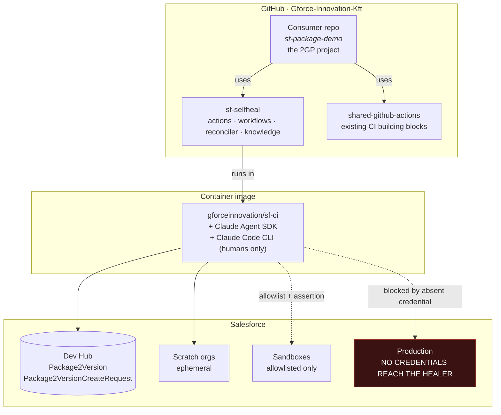
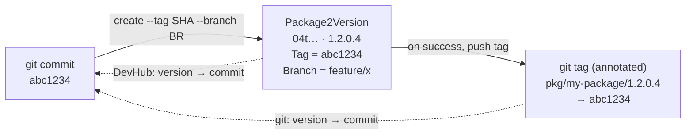
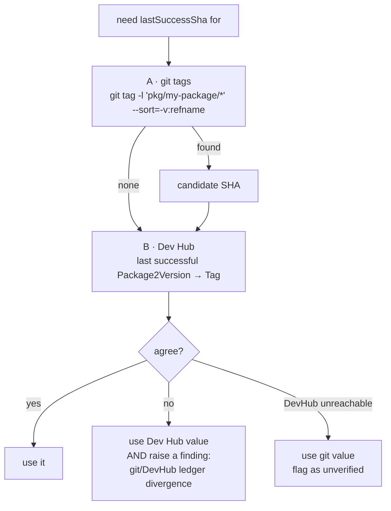
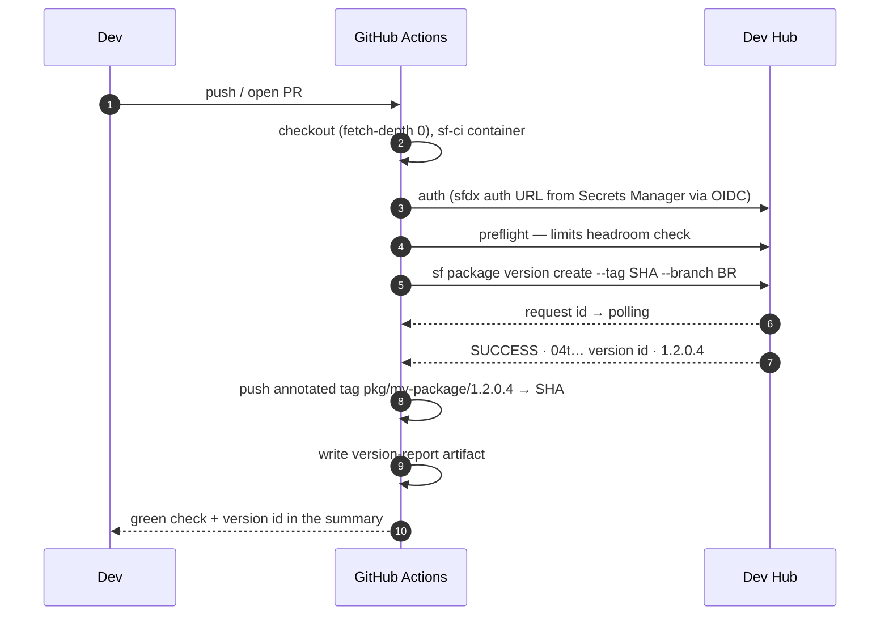
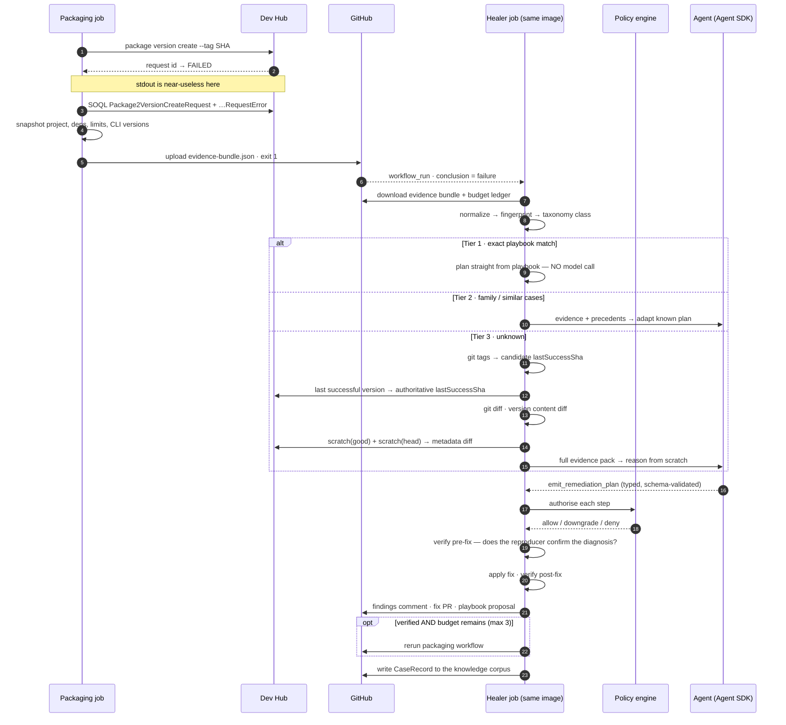
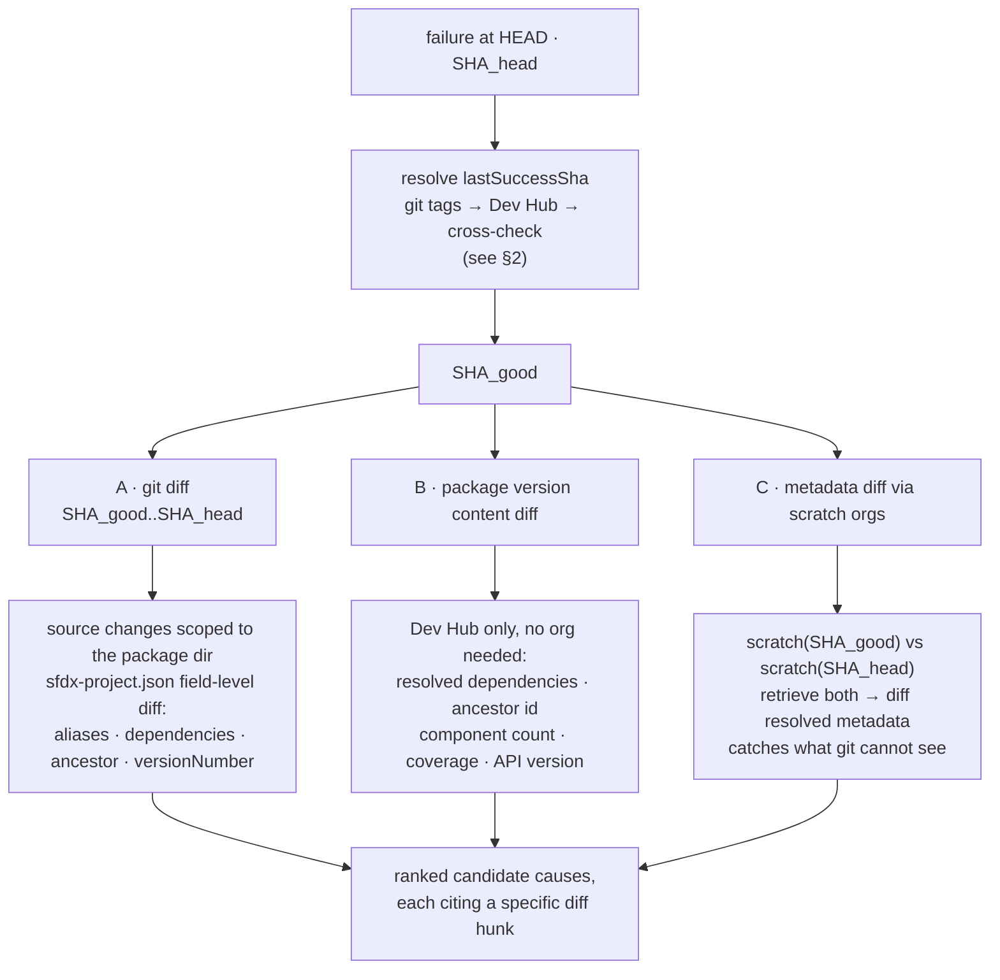
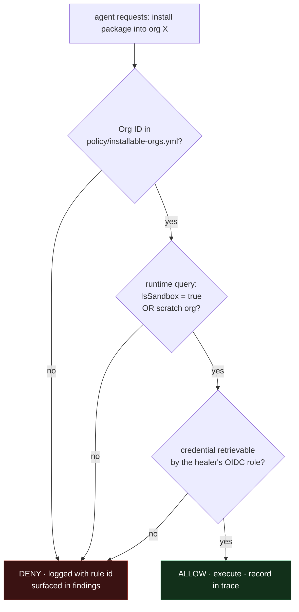
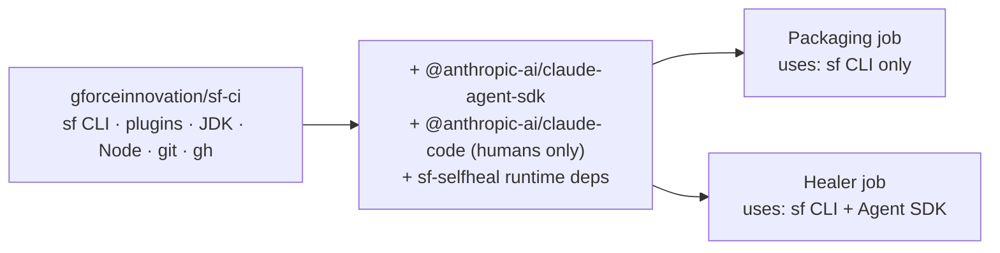
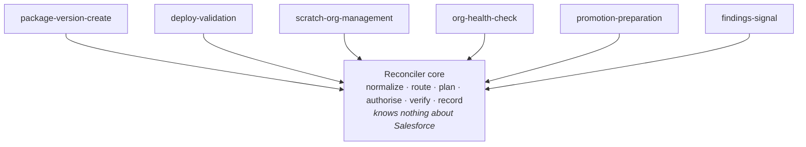
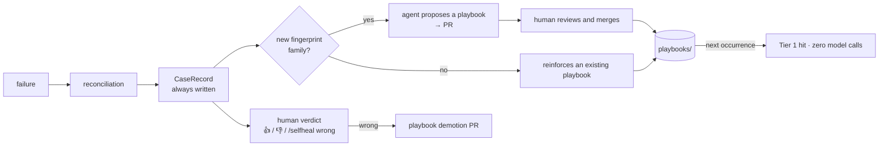

# sf-selfheal — Flow Design

**Companion to:** `2026-08-05-sf-selfheal-packaging-design.md` (the architecture).
**This document answers:** *what actually happens, step by step, and where does everything live.*

The architecture document says how the system is built. This one says how it **runs** — the
moving parts, the sequence, the correlation key that makes diagnosis possible, and the exact
boundary of what the AI may and may not do.

---

## 1. The landscape

Five things exist. Nothing else needs to.



| Piece | Role |
|---|---|
| **Consumer repo** | The 2GP project. Calls the reusable workflows. Owns nothing of the healer. |
| **`sf-selfheal`** | Actions, workflows, reconciler runtime, tools, policy, knowledge corpus. |
| **`sf-ci` image** | Salesforce CLI + plugins + Node + **Claude Agent SDK**. Same image for the pipeline and the healer — non-negotiable, see §7. |
| **Dev Hub** | Source of truth for package versions **and** for the correlation key. |
| **Production** | Not a participant. The healer's OIDC role cannot retrieve production credentials at all. |

---

## 2. The correlation key — the spine of the whole system

Everything downstream depends on answering *"what changed since this package last built
successfully?"* The correlation is written **in both directions**, at creation time, and never
mutated afterwards.



Two independent records of the same fact:

| Direction | Record | Written by | Read when |
|---|---|---|---|
| SF → git | `Package2Version.Tag = <sha>` | `sf package version create --tag` | authority; always available if the Dev Hub is reachable |
| git → SF | annotated tag `pkg/<package>/<version>` → commit | packaging job, after a successful create | instant, offline, human-browsable in the GitHub UI |

**The annotated tag carries the metadata in its message**, so git alone answers most questions:

```
pkg/my-package/1.2.0.4

package:       my-package
packageId:     0Ho...
versionId:     04t...
versionNumber: 1.2.0.4
branch:        feature/x
commit:        abc1234
runId:         17384920
```

### Resolving "last successful build"



**The redundancy is the point.** Git tags are instant and work without Dev Hub auth; the Dev Hub
is the authority. When they disagree, that disagreement is itself diagnostic — someone created a
version manually outside CI, or a tag push failed — and the system reports it rather than
silently picking one.

**The rule:** every `sf package version create`, in every workflow, passes `--tag <sha>` and
`--branch <branch>`; every **successful** create pushes the annotated git tag. No exceptions.
A create without both is a version the system cannot reason about later.

**This is not duplicate bookkeeping.** Both records are immutable, written once at creation, and
derived from the same event — unlike a mutable `last-success.json` in the repo, which would
drift and which the design explicitly rejects. Nothing ever updates either record after the
fact.

**Tag namespace hygiene.** The hierarchical `pkg/<package>/<version>` form keeps the namespace
filterable (`git tag -l 'pkg/my-package/*'`) and sortable (`--sort=-v:refname`) even with
hundreds of tags across several packages. Tags are cheap refs; a complete ledger is worth more
than a tidy `git tag` listing.

**Permission consequence:** the packaging job needs `contents: write` to push tags. It is
otherwise unchanged, and it still never calls the AI.

---

## 3. Flow A — the happy path



Nothing AI touches this path. If it is green, the healer never wakes up.

---

## 4. Flow B — the failure path, end to end

This is the flow. Read it once and the rest of the design follows.



**Three exits, always one of them:**

| Exit | Meaning | What you get |
|---|---|---|
| `fixed` | Verified fix applied, packaging re-run queued | Commit or PR + findings comment |
| `proposed` | Fix identified, but action class or budget forbids applying it | Draft PR + findings comment |
| `escalated` | No verified fix — unknown, contradicted, or budget/limits exhausted | Findings comment with everything learned + playbook proposal |

There is no fourth exit and no "keep trying".

---

## 5. The two-sided diff

You asked for the comparison on both sides. Both run, and they answer different questions.



| | Cost | Answers | When it runs |
|---|---|---|---|
| **A · git diff** | free | "what did a human change?" | always |
| **B · version content diff** | ~2 s, Dev Hub queries only | "what changed about the *package*, even if no source changed?" | always |
| **C · metadata diff via scratch orgs** | 2 scratch orgs, 5–10 min | "what does the platform actually resolve differently now?" | tier 3 only, budget-gated |

**Why C is worth its cost, but only sometimes.** git diff cannot see a dependency whose
resolved version moved, an API-version-driven shape change, or a component injected by an
installed package. C catches exactly the "nothing in the repo changed but it broke" class — and
that class is the one that costs an engineer an afternoon. It is gated behind `maxScratchOrgs`
and only fires when tiers 1 and 2 have both missed.

**Environment snapshot (L5) is separate and always on.** Dev Hub limits, org status,
CLI/plugin versions and namespace linkage are captured into every evidence bundle regardless of
tier. It is nearly free and it is how the system distinguishes "your code broke" from "your Dev
Hub ran out of quota".

---

## 6. What the AI may and may not do

Two independent controls, both must pass. This is deliberate — a single control is a single
point of failure.



**The third gate is the strongest and it is not a policy rule.** The healer's AWS role has no
IAM permission on the production secret path. Even a total compromise of the policy engine and
the prompt cannot produce a production credential, because it does not exist in that execution
context. Policy is defence in depth on top of that, not the primary control.

### Permission matrix by environment

| Action | Scratch org | Sandbox (allowlisted) | Production |
|---|:--:|:--:|:--:|
| Query / read metadata | ✅ auto | ✅ auto | ⛔ no credential |
| Create / delete org | ✅ auto (budgeted) | — | ⛔ |
| Deploy check-only (validate) | ✅ auto | ✅ auto | ⛔ |
| Deploy for real | ✅ auto | ⚠️ propose PR only | ⛔ |
| Run Apex tests | ✅ auto | ✅ auto | ⛔ |
| **Install package version** | ✅ auto | ✅ auto | ⛔ |
| Create package version | ✅ Dev Hub, budgeted, max 3 | — | — |
| Delete package version | ✅ unpromoted only | — | — |
| **Promote package version** | ⛔ human only | ⛔ | ⛔ |

### Repository-side permissions

| Action | Allowed? | Conditions |
|---|---|---|
| Read repo, git history, logs | ✅ | always |
| Comment on the PR | ✅ | always |
| Open a PR from a healer branch | ✅ | always |
| Commit to the failing feature branch | ⚠️ | non-protected **and** path allowlist **and** structural diff validation **and** not a fork |
| Commit to `main` or any protected branch | ⛔ | never |
| Edit `.github/workflows/**`, `policy/**`, `tools/**` | ⛔ | never — no tool can reach these paths |
| Rerun the packaging workflow | ⚠️ | verified fix + budget remaining + not a fork |

**Path allowlist for direct commits:**
```
sfdx-project.json            # alias / dependency / ancestor / versionNumber fields only
config/scratch-orgs/*.json   # feature enablement only
.sfdx-selfheal/*.json        # healer-owned state
```

---

## 7. The image

One image, two consumers. This is a correctness requirement, not a convenience.



**Why the same image.** CLI and plugin version skew between the failing job and the reproducer
is itself a diagnosable failure class (`tooling.*`). A reproducer running a different toolchain
than the job it is reproducing will confidently misdiagnose. Pinning both to one image makes
reproduction faithful by construction.

**Agent SDK drives the loop; the CLI is for you.** The healer imports
`@anthropic-ai/claude-agent-sdk`, disables every built-in tool (`Bash`, `Write`, `Edit`, `Read`,
`Glob`, `Grep`), and exposes only the typed tool registry through an in-process MCP server. The
Claude Code CLI is installed so you can `docker run` the image and debug a case by hand — it is
never invoked by any automated path.

**Credential:** `ANTHROPIC_API_KEY` is an organisation secret, exposed only to the healer job,
never to the packaging job. The packaging job must keep working if the AI is unavailable.

---

## 8. The skill family

Package creation is skill #1. The flow above is identical for every other skill — only the
evidence collector, verifiers and taxonomy change.



| Skill | Trigger | Typical failures | Ceiling |
|---|---|---|---|
| `package-version-create` | packaging job fails | dependency · ancestry · manifest · apex · quota | A4 |
| `deploy-validation` | validate job fails | metadata · component · coverage · API version | A2 |
| `scratch-org-management` | org create fails | shape/feature · quota · expiry · definition-file drift | A1 |
| `org-health-check` | **scheduled**, not failure-driven | quota trending to exhaustion, expiring orgs, namespace unlinked | A2 |
| `promotion-preparation` | promotion requested | prepares evidence + PR; **never executes** the promotion | A2 |
| `findings-signal` | any reconciliation completes | — | A2 |

**`promotion-preparation` is the heavy one you flagged.** It assembles everything a human needs
to approve: version lineage, ancestry chain, dependency closure, coverage, what changed since
the last released version, install test results from a scratch org. Then it stops. The GitHub
environment approval gate does the promotion. This holds at every version of the system.

**`findings-signal` is the integration surface.** A `FindingsSink` interface with pluggable
adapters — PR comment (always on), plus optional Slack/Teams webhook and Jira issue creation for
escalations. Adding a channel is an adapter, not a change to the reconciler.

---

## 9. Consumer repo wiring

**Everything derivable is derived.** A parameter the workflow can compute is a parameter that can
be passed wrong, so the input surface is close to empty:

| Was an input | Now derived from |
|---|---|
| `tag` | `github.sha` — the runner already knows it |
| `branch` | `github.ref_name` / the PR head ref |
| `package` | the default `packageDirectories` entry in `sfdx-project.json`; required **only** when the project defines more than one package |
| `skill` (healer) | `skillId` inside the evidence bundle |
| `max-action-class` | the skill's policy profile |

What a consuming project actually writes:

```yaml
# sf-package-demo/.github/workflows/package.yml
name: Package Version Create
on: [pull_request, push]

jobs:
  package:
    uses: Gforce-Innovation-Kft/sf-selfheal/.github/workflows/sf-package-create.yml@v1
    secrets: inherit
    permissions:
      contents: write        # push the version tag
```

```yaml
# sf-package-demo/.github/workflows/selfheal.yml
name: sf-selfheal
on:
  workflow_run:
    workflows: ["Package Version Create"]
    types: [completed]

jobs:
  heal:
    if: github.event.workflow_run.conclusion == 'failure'
    uses: Gforce-Innovation-Kft/sf-selfheal/.github/workflows/sf-selfheal.yml@v1
    secrets: inherit
```

Two files, zero required inputs in the common case. Multi-package projects add `package:` (or a
matrix over packages); everything else stays derived. The consumer never sees the reconciler,
the tools, the policy or the corpus.

**Overrides still exist** — `package`, `max-action-class` and `dry-run` remain optional inputs —
but the default path requires none of them. An input that must be supplied correctly on every
call is a defect waiting to happen.

---

## 10. What happens over time



**The system gets cheaper as it learns.** Each promoted playbook moves a failure class from
tier 3 (minutes, tokens, scratch orgs) to tier 1 (milliseconds, free). The metric that matters
is the **unknown rate** trending down over real cases — not the number of fixes applied.

**Playbooks are only ever created by a human-merged PR.** An agent that writes its own rules
unsupervised is a self-amplifying error source. Promotion requires: the same family seen twice,
a verifier that reproduces the failure, and a remediation the verifier confirms clears it.

---

## 11. Where this changes the architecture document

Deltas to fold into `2026-08-05-sf-selfheal-packaging-design.md`:

| # | Change |
|---|---|
| 1 | `sf-ci` image gains the Agent SDK (automated path) and the Claude Code CLI (human debugging only) |
| 2 | Production boundary is three gates: Org ID allowlist → runtime `IsSandbox`/scratch assertion → credential unavailability. The third is primary |
| 3 | Package install into scratch and allowlisted sandboxes is an **allowed** A1/A3 action; it was previously unspecified |
| 4 | Salesforce-side diff is two tools: version content diff (always) + metadata diff via scratch orgs (tier 3, budgeted) |
| 5 | Skill roster expands: `deploy-validation`, `scratch-org-management`, `org-health-check`, `promotion-preparation`, `findings-signal` |
| 6 | `FindingsSink` adapter interface added for the integration/signal surface |
| 7 | `policy/installable-orgs.yml` is an A5 path — no tool can reach it |
| 8 | Correlation is bidirectional: `Package2Version.Tag` **and** an annotated git tag `pkg/<package>/<version>`; divergence between them is a finding |
| 9 | Packaging job needs `contents: write` to push version tags |
| 10 | Workflow inputs derived from context (`tag`, `branch`, `package`, `skill`, `max-action-class`); overrides stay optional |

---

## 12. Open questions

1. **Which sandbox(es) go on the installable allowlist first**, and who owns approving additions to that file?
2. **`org-health-check` cadence** — daily is cheap and catches quota exhaustion before it bites; is a scheduled workflow in the consumer repo acceptable, or should it live centrally?
3. **Signal channels** — is a PR comment sufficient for v1, or do you want Slack from the start? (Adapter either way; it only changes what ships first.)
4. **Consumer repo** — is `sf-package-demo` a new repo I should scaffold, or does an existing project become the first consumer?
