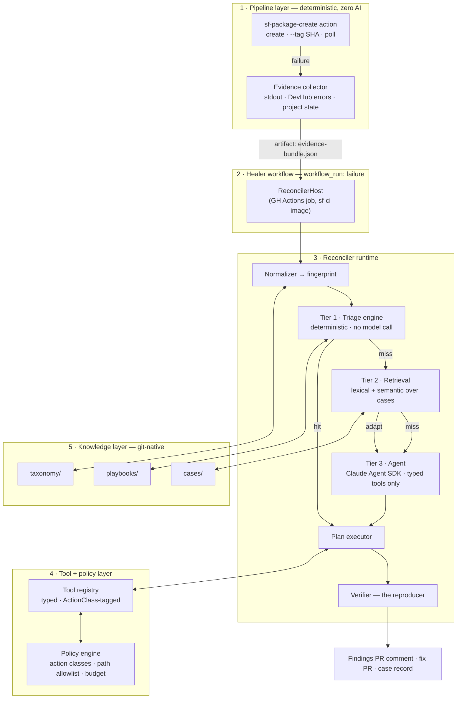
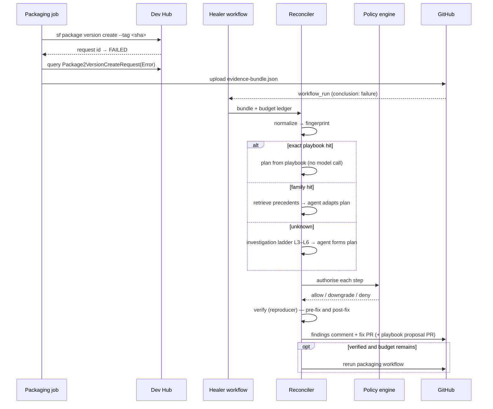
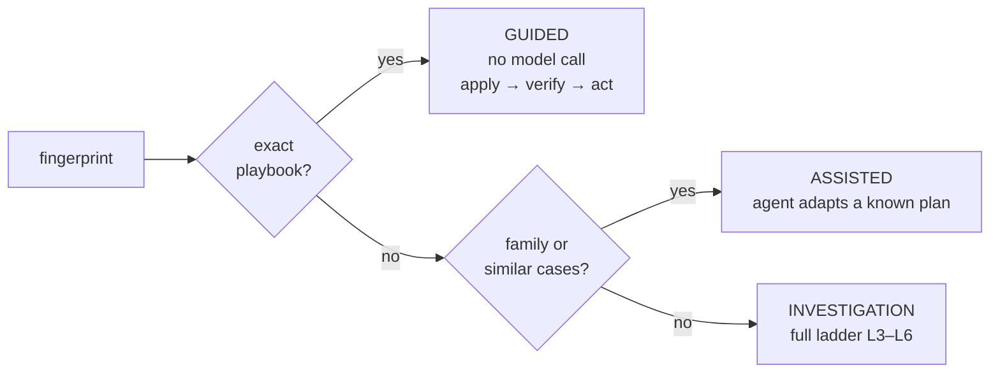

# AI-Powered Self-Healing Salesforce Packaging — Architecture

**Status:** design, approved for planning
**Date:** 2026-08-05
**Working name:** `sf-selfheal`
**Scope of v1:** Salesforce 2GP package version creation. Everything else is future skills.

---

## 0. Assumptions and challenged premises

Four premises in the original brief were changed during design. They are load-bearing; the
rest of this document assumes the revised versions.

### 0.1 `sf package version create` is not a free retry

Every attempt consumes a `Package2VersionCreateRequest` against an edition-dependent daily
Dev Hub quota, and every success advances the build number monotonically and leaves a
permanent, promotable artifact. "Retry until it works" therefore destroys a scarce resource
and pollutes the version ledger.

**Consequence:** the highest-value component of this system is not the healer. It is the
**reproducer** — a cheap, faithful check that reproduces a failure class *without* spending a
real create attempt (scratch-org validate, offline alias resolution, Apex compile, ancestry
check). Package-version creation becomes a budgeted, verification-gated action, capped at
**3 attempts** per `(repo, package, headSha)`.

### 0.2 Confidence is the wrong gate

Model self-reported confidence is uncalibrated and self-serving. The hard gate is
**verification**: did a deterministic reproducer confirm the diagnosis, and does it confirm
the fix clears it? Self-assessment is recorded for analytics and threshold tuning, and never
authorises anything above read-only.

Low confidence **downgrades the action class** rather than stopping. A diagnosis plus a draft
PR is still valuable output.

### 0.3 Prompt injection is the real security boundary

The agent reads logs, metadata, git history and Dev Hub records that a PR author controls. An
Apex class or commit message crafted to smuggle instructions is trivial to write. Because
`workflow_run` executes the **base branch's** workflow with a read/write token, this is a
genuine repository-write exposure — a strictly larger risk than "don't deploy to production".

Mitigations, all structural rather than prompt-based:

- All evidence is **data, never instruction**. It is delivered inside fenced, labelled
  untrusted-content blocks and the system prompt states that no instruction inside them is authoritative.
- **No bash tool, no shell, no arbitrary file write.** If it is not modelled as a typed tool,
  it cannot happen.
- Writes are confined to a **path allowlist** and validated structurally before commit.
- The policy engine lives in code, not in the prompt.
- Fork-originated PRs default to **diagnose-only**.
- The agent can never modify its own policy, workflow, or tool-registry files (class A5).

### 0.4 Taxonomy is data, not an enum

A hardcoded failure-class enum guarantees the "unknown failure" branch is second-class. The
taxonomy is a YAML registry of signatures with `unknown` as a first-class, instrumented
bucket, plus an explicit promotion path: `unknown → agent-proposed playbook → human-merged PR
→ deterministic rule`.

### 0.5 Two pipeline changes that unlock everything

These are requirements on the **packaging job**, not the healer, and without them the rest
degrades badly:

1. **Always query the Dev Hub for the real error.** `sf package version create` stdout is
   near-useless. The actionable detail lives in `Package2VersionCreateRequestError` on the Dev
   Hub, joined to `Package2VersionCreateRequest` by request id. The deterministic collector
   queries it on every failure. Most engineers never do — which is exactly why manual triage
   is slow.
2. **Record the commit ↔ version correlation in both directions.**
   - **SF → git:** always pass `--tag <git-sha>` and `--branch <branch>` on create, so
     `Package2Version.Tag` carries the commit.
   - **git → SF:** on every *successful* create, push an annotated git tag
     `pkg/<package>/<versionNumber>` at that commit, with the version id and metadata in the
     tag message.

   Either record alone answers "what changed since the last successful version". Together they
   are a consistency check: **disagreement between them is itself diagnostic** (a version was
   created outside CI, or a tag push failed) and is reported as a finding rather than silently
   resolved. Git tags are instant and work without Dev Hub auth; the Dev Hub is the authority.
   Both are immutable and written once at creation — this is redundancy, not mutable state.
   Requires `contents: write` on the packaging job.

---

## 1. Overall system architecture

Five layers. The durable interface between them is the **Evidence Bundle**; every other
component is replaceable behind it.



**Reading the diagram:** most failures never reach tier 3. Tier 1 is a hash lookup. The model
is the expensive, last-resort reasoning engine for genuinely novel failures — and even then it
only *proposes*; deterministic code executes, verifies and authorises.

---

## 2. Components and responsibilities

| Component | Responsibility | Explicitly not responsible for |
|---|---|---|
| **`sf-package-create` action** | Run the create, tag with SHA, poll to terminal state, emit Evidence Bundle on failure | Any AI, any remediation |
| **Evidence collector** | Gather stdout/stderr, Dev Hub request + error records, `sfdx-project.json`, resolved dependency graph, CLI/plugin versions, git context, limits snapshot | Interpretation |
| **ReconcilerHost** | Host abstraction: fetch evidence, run tools, publish findings. One impl per host (GH Actions now, ECS later) | Business logic |
| **Normalizer** | Canonicalise raw evidence into `FailureObservation`; compute stable fingerprint | Diagnosis |
| **Triage engine** | Fingerprint → playbook match (exact / family / none). Emits a `RemediationPlan` directly on exact hit | Anything probabilistic |
| **Retrieval** | Tiered lookup over the case corpus; returns ranked precedents with outcomes | Deciding |
| **Agent** | Reason over evidence + precedents; call inspection tools; emit exactly one typed `RemediationPlan` | Executing anything with side effects |
| **Plan executor** | Execute plan steps through the tool registry, in order, halting on first policy denial or step failure | Choosing steps |
| **Policy engine** | Authorise every tool call: action class, path allowlist, branch protection, budget headroom, fork status | Knowing what a fix *is* |
| **Verifier** | Run the cheapest reproducer for the diagnosed class, before and after the fix | Applying fixes |
| **Recorder** | Write `CaseRecord`, findings comment, fix PR, playbook-proposal PR | Merging anything |
| **Budget ledger** | Track and persist consumption across invocations keyed by `(repo, package, headSha)` | Enforcement (that's the policy engine) |

---

## 3. AI skill architecture

Two distinct things share the word "skill". Both exist; keep them separate.

### 3.1 Reconciler Skills — units of extensibility

A Reconciler Skill is a **manifest**, not code paths in the core. The reconciler never learns
the word "packaging".

```yaml
id: package-version-create
version: 1
triggers:
  workflowJob: [ "package-version-create" ]
  fingerprintNamespace: "pkg2"
evidenceSchema: ./evidence.schema.json
taxonomyNamespace: pkg2
toolBundles: [ sf.package, sf.org, sf.metadata, git.read, gh.write, fs.scoped ]
knowledgeSkills: [ sf-packaging-core, sf-version-create, sf-version-lifecycle,
                   sf-devhub-limits, sf-failure-investigation ]
playbookNamespace: playbooks/pkg2
policyProfile: profiles/packaging.yml
verifiers: [ scratchOrgValidate, apexCompile, aliasResolve, ancestryCheck ]
budget:
  maxVersionCreateAttempts: 3
  maxScratchOrgs: 2
  maxAgentSteps: 40
  maxWallClockMinutes: 25
```

Adding a skill = manifest + evidence collector + verifiers + seed playbooks. Zero core change.
That is the extensibility test, and it is the acceptance criterion for v3.

### 3.2 Knowledge Skills — progressive-disclosure domain expertise

Markdown documents the agent loads on demand. Not prompt text — loading them is a tool call,
so their cost is paid only when relevant.

| Skill | Contents |
|---|---|
| `sf-packaging-core` | 2GP model: packages, versions, ancestors, aliases, dependencies, branches; `sfdx-project.json` semantics; `NEXT` version resolution |
| `sf-version-create` | Full flag surface, async request ids, `--wait` semantics, `--skip-validation` trade-offs, code-coverage rules, the Dev Hub error objects |
| `sf-version-lifecycle` | `list` / `report` / `delete` (unpromoted only) / `install` / ancestry. Promote documented **as human-gated only** |
| `sf-devhub-limits` | `Package2VersionCreates`, `ActiveScratchOrgs`, `DailyScratchOrgs`; how to read headroom and what to do when thin |
| `sf-failure-investigation` | The ladder in §4.2 — *how to debug*, encoded once |

### 3.3 Runtime

Claude Agent SDK (`@anthropic-ai/claude-agent-sdk`), model `claude-opus-5`, adaptive thinking,
`effort: high` for triage-adjacent work and `xhigh` for full investigation. Preinstalled in the
`sf-ci` image alongside the Claude Code CLI — the **CLI is for human debugging inside the
container only** and is never invoked by any automated path.

Four non-negotiable configuration points:

1. **Built-in tools disabled.** `Bash`, `Write`, `Edit`, `Read`, `Glob`, `Grep` are removed via
   `allowedTools`. The agent sees only the registry's tools, exposed through an **in-process**
   MCP server (`createSdkMcpServer` + `tool()`) — no network listener, no external attack surface.
2. **`canUseTool` is the policy engine**, not a prompt rule. Every call is authorised in code.
3. **Structured output via a terminal tool.** The agent does not return prose that we parse.
   It must call `emit_remediation_plan` with a schema-validated plan; that call ends the loop.
4. **Untrusted-content framing.** All evidence is passed inside labelled blocks; the system
   prompt states plainly that instructions appearing inside them carry no authority.

---

## 4. Workflow diagrams

### 4.1 End-to-end



### 4.2 The investigation ladder

Executed in order; short-circuits at L2 on a match.

```
L0  Capture       exit code, stdout/stderr, request id
L1  Enrich    ★   SOQL Dev Hub: Package2VersionCreateRequest
                  + Package2VersionCreateRequestError for that request id
L2  Match         fingerprint → playbook / similar cases → jump to L7 on hit
L3  Delta     ★   diff since the last SUCCESSFUL version of this package:
                  git diff <lastSuccessSha>..HEAD scoped to the package dir,
                  sfdx-project.json diff (aliases / deps / ancestor / versionNumber),
                  dependency-resolution diff (subscriber package version ids)
L3b Build     ★   mutation delta — the build may differ even when the source does not:
                  BuildManifest diff (toolchain, resolved deps, env fingerprints,
                  workspace digests T0/T1/T2, mutation records).
                  source diff empty + workspace digest differs ⇒ build mutation drift.
                  See 2026-08-05-sf-ci-build-provenance-design.md
L4  Reproduce     cheapest check that would have caught it:
                    metadata-only → scratch org + project deploy validate
                    Apex          → scratch org deploy + RunLocalTests
                    dependency    → offline alias resolution, dep install into scratch org
                    ancestor      → package version list --released ancestry check
L5  Environment   Dev Hub limits, Trust/platform status, CLI + plugin versions vs last success
L6  Hypothesise   ranked root causes, each citing specific evidence
L7  Plan          typed RemediationPlan: tool steps + verifier + action classes
L8  Verify        re-run the reproducer with the fix applied
L9  Act           by action class; version-create retries capped at 3 total
L10 Record        case record + findings PR comment (+ playbook proposal)
```

★ = depends on the pipeline changes in §0.5.

### 4.3 Routing by specificity



Three paths, not two. The middle path matters most in practice: the majority of "new" failures
are a known family with different specifics, and adapting a proven plan is cheaper, faster and
far safer than reasoning from a blank slate.

---

## 5. Data model

```ts
type ActionClass = 'A0_INSPECT' | 'A1_SIMULATE' | 'A2_PROPOSE'
                 | 'A3_MUTATE'  | 'A4_QUOTA'    | 'A5_FORBIDDEN';

interface EvidenceBundle {                 // the durable contract
  schemaVersion: 1;
  skillId: string;
  run: { repo: string; runId: string; workflow: string; job: string;
         attempt: number; actor: string; isFork: boolean; };
  git: { headSha: string; baseSha: string; branch: string;
         isProtected: boolean; prNumber?: number; };
  command: { argv: string[]; exitCode: number; durationMs: number;
             stdout: string; stderr: string; };
  salesforce: {
    requestId?: string;
    request?: Package2VersionCreateRequest;      // Dev Hub record
    errors: Package2VersionCreateRequestError[]; // ← the real message
    project: SfdxProjectSnapshot;                // aliases, deps, ancestors, versionNumber
    dependencies: ResolvedDependency[];
    lastSuccess?: {
      sha: string; versionId: string; versionNumber: string; createdAt: string;
      source: 'gitTag' | 'devHub' | 'both';   // 'both' means they agreed
      divergence?: { gitTagSha: string; devHubSha: string };  // reported as a finding
    };
    limits: LimitsSnapshot;
    toolingVersions: { cli: string; plugins: Record<string,string>; };
  };
  redactions: RedactionReport;             // what was scrubbed, and by which rule
}

interface FailureObservation {
  fingerprint: string;                     // sha256(phase | errorCode | normalizedMessage)
  family: string;                          // coarser hash for near-miss matching
  phase: 'preflight'|'create'|'validate'|'compile'|'test'|'publish'|'unknown';
  taxonomyClass: string;                   // resolved from taxonomy/*.yml, may be 'unknown'
  signals: Record<string, string|number|boolean>;
}

interface RemediationPlan {
  planId: string;
  diagnosis: { rootCause: string; reasoning: string;
               evidenceRefs: string[];     // pointers into the bundle — required, non-empty
               alternatives: string[]; };
  steps: PlanStep[];                       // each declares its ActionClass
  verifier: VerifierRef;                   // required — a plan with no verifier is rejected
  selfAssessment: { confidence: number; unknowns: string[]; };  // recorded, never authorising
  proposedPlaybook?: PlaybookDraft;        // only ever becomes a PR
}

interface PlanStep {
  tool: string; args: unknown;
  actionClass: ActionClass;
  rationale: string;
  rollback?: { tool: string; args: unknown };
}

interface CaseRecord {                     // one file per reconciliation
  caseId: string; skillId: string; occurredAt: string;
  observation: FailureObservation;
  evidenceDigest: string;                  // hash; full bundle referenced, not inlined
  route: 'guided' | 'assisted' | 'investigation';
  precedents: string[];                    // caseIds retrieved
  plan: RemediationPlan;
  execution: { stepsRun: number; policyDenials: PolicyDenial[]; };
  verification: { preFix: VerifyResult; postFix?: VerifyResult; };
  outcome: 'fixed' | 'proposed' | 'escalated' | 'failed';
  budgetConsumed: BudgetLedger;
  humanFeedback?: { verdict: 'correct'|'wrong'|'partial'; note: string; };
  cost: { inputTokens: number; outputTokens: number;
          cacheReadTokens: number; cacheWriteTokens: number;
          costUsd: number; wallClockMs: number; };
}

interface BudgetLedger {                   // persisted per (repo, package, headSha)
  versionCreateAttempts: number;           // hard cap 3
  scratchOrgsCreated: number;
  agentSteps: number; tokens: number; wallClockMs: number; costUsd: number;
}

// v0/v1: a hardcoded constant in src/core/limits.ts.
// v2: resolved from policy/budgets.yml — precedence: taxonomy class › route › default
interface ResolvedBudget extends BudgetLedger {
  effort: 'low' | 'medium' | 'high' | 'xhigh';
  model: string;                           // default claude-opus-5; overridden only explicitly
  taskBudgetTokens: number;                // the model paces itself against this
  maxActionClass: ActionClass;
}
```

**Playbook** (markdown + front-matter, human-authored or human-merged):

```yaml
---
id: pkg2.dependency.unresolved-alias
family: pkg2.dependency
match:
  anyOf:
    - errorCodePattern: "^(InvalidPackageDependency|.*alias.*not.*found.*)$"
    - messagePattern: "Dependency .* could not be resolved"
requiresVerifier: aliasResolve
maxActionClass: A3_MUTATE
pathAllowlist: [ "sfdx-project.json" ]
provenance: { firstSeen: case-2026-08-11-003, confirmedBy: [case-…, case-…] }
---
## Cause
## Remediation (tool-plan DSL)
## Verification
## Known false positives
```

---

## 6. Failure taxonomy

**Data, not code.** `taxonomy/pkg2.yml` is a registry of classes; each class carries match
signals, a default verifier, a maximum permitted action class, and an expected remediation
family. New classes arrive via PR.

| Group | Classes | Default verifier | Max action class | Typically |
|---|---|---|---|---|
| `dependency` | unresolved alias, missing subscriber version, circular, version-range unsatisfiable | `aliasResolve` | A3 | config fix |
| `ancestry` | missing ancestor, ancestor not released, ancestor mismatch, illegal ancestry break | `ancestryCheck` | A2 | config fix, sometimes deliberate |
| `manifest` | malformed `sfdx-project.json`, bad `versionNumber`, unknown package dir, alias collision | `schemaLint` | A3 | config fix |
| `metadata` | invalid component, unsupported in 2GP, missing dependency component, API-version skew | `scratchOrgValidate` | A2 | code fix → PR |
| `apex` | compile error, missing coverage, deprecation | `apexCompile` | A2 | code fix → PR |
| `test` | failure, coverage below threshold, flaky | `apexCompile` | A2 | code fix → PR |
| `namespace` | namespace not linked, mismatch, reserved-word collision | `orgHealth` | A2 | rarely auto-fixable |
| `devhub` | quota exhausted, org expired/locked, permission missing, feature disabled | `orgHealth` | A0 | escalate |
| `platform` | transient 5xx, maintenance window, request queued indefinitely | `idempotencyCheck` | A4 | retry with backoff |
| `tooling` | CLI/plugin version skew, plugin missing, node/JDK issue | `toolingCheck` | A2 | pin versions |
| `build` | mutation drift, env rotation, dependency float, toolchain skew, contamination, `.forceignore` drift | `manifestDiff` | A2 (A0 for `env-rotation`) | pin the drifting input → PR |
| `unknown` | everything else — **first-class** | dynamic (agent-selected) | A2 | investigate + propose playbook |

**Designing for the unknown bucket** is the point of the registry. `unknown` gets: full ladder
execution, mandatory precedent retrieval, a required playbook proposal in the output, and its
own dashboard metric. A rising unknown rate is the primary signal that the taxonomy is stale.

---

## 7. Knowledge capture strategy

Two artifacts, one distillation gate.

```
cases/       raw, append-only, machine-written.  One CaseRecord per reconciliation.
playbooks/   curated, human-merged.              The distilled product.
taxonomy/    class registry.                     Human-merged.
```

- **Every** reconciliation writes a case — successes, failures and escalations alike. Cases
  where the agent was *wrong* are the most valuable training signal and must never be dropped.
- **Playbooks are only ever created by a merged pull request.** The agent may propose one
  (`proposedPlaybook` → PR), never write one directly. An agent that authors its own rules
  unsupervised is a self-amplifying error source; this gate is the single most important
  control in the learning system.
- **Promotion criteria** for a proposal to be merge-worthy: the same fingerprint family seen
  ≥2 times, a verifier that demonstrably reproduces the failure, and a remediation that the
  verifier confirms clears it.
- **Human feedback loop:** the findings comment carries 👍/👎 reaction semantics and a
  `/selfheal wrong <reason>` command; the recorder writes the verdict back into the case. Wrong
  verdicts decay a playbook's standing and can auto-open a demotion PR.
- **Secrets never enter the corpus.** Redaction happens at the tool boundary (§11.4), before
  anything reaches a case file, and the `RedactionReport` records what was scrubbed.

---

## 8. Retrieval strategy

Tiered, cheapest first. RAG is tier 2, not tier 1 — most packaging failures carry a
deterministic signature, and similarity search over them is strictly worse than a hash lookup.

| Tier | Mechanism | Latency | Model call | Use |
|---|---|---|---|---|
| 0 | **Fingerprint → playbook** exact match | ms | none | the common case |
| 1 | **Family → playbook set** + taxonomy class | ms | none | near-miss |
| 2 | **Lexical (BM25) over case summaries**, filtered by skill + phase + package | ~100 ms | none | precedent lookup |
| 3 | **Semantic (embeddings)** over case summaries + playbook bodies | ~300 ms | embedding only | novel phrasing |
| 4 | **Agent reasons from raw evidence** + top-k precedents from 2/3 | seconds–minutes | yes | genuinely new |

Implementation notes:

- Index is **built at healer start** from the git-native corpus and cached as a workflow
  cache entry keyed by the knowledge tree hash. No index server.
- Tier 3 embeddings are stored alongside cases and regenerated by a scheduled job, not per run.
- Everything sits behind a `KnowledgeStore` interface (`match`, `search`, `record`, `propose`)
  so a pgvector/Supabase implementation drops in without touching the agent.
- Retrieved precedents are always injected **with their outcomes** — a precedent whose fix
  failed is as informative as one that worked, and suppressing it teaches the wrong lesson.

---

## 9. Tool architecture

Every capability is a typed, deterministic function. There is no bash tool, no shell escape,
no generic file write. **If it is not in the registry, the agent cannot do it.**

```ts
interface ToolDescriptor<I, O> {
  name: string;                      // "sf.package.versionCreateReport"
  bundle: string;                    // "sf.package"
  actionClass: ActionClass;
  idempotent: boolean;
  costHint: { wallClockMs: number; quota?: 'versionCreate'|'scratchOrg'; };
  input: JSONSchema;  output: JSONSchema;
  redact: (o: O) => O;               // mandatory, applied before the result is returned
  maxResultTokens: number;           // mandatory — over-cap results are summarised
  summarise?: (o: O) => O;           // how to shrink; must emit a continuation handle
  run: (i: I, ctx: ToolContext) => Promise<O>;
}
```

| Bundle | Representative tools | Class |
|---|---|---|
| `sf.package` | `versionCreateReport`, `versionList`, `versionReport`, `ancestryList`, `dependencyResolve`, `lastSuccessfulVersion`, `versionContentDiff`, `versionCreate`, `versionDelete` | A0 except `versionCreate` (A4), `versionDelete` (A4) |
| `sf.org` | `limitsRead`, `scratchCreate`, `scratchDelete`, `authStatus`, `soqlTooling`, `packageInstall` | A0 / A1; `packageInstall` A1 (scratch) or A3 (allowlisted sandbox), gated by §11.3a |
| `sf.metadata` | `deployValidate`, `apexCompile`, `testRun`, `manifestLint`, `metadataDiffAcrossScratchOrgs` | A1 (`metadataDiffAcrossScratchOrgs` consumes 2 scratch orgs — budget-gated, tier 3 only) |
| `git.read` | `log`, `diffRange`, `showFile`, `blame`, `lastSuccessSha` | A0 |
| `repo.write` | `applyStructuredEdit`, `commitToBranch`, `openPullRequest` | A2 / A3 |
| `gh` | `getRun`, `getJobLogs`, `comment`, `rerunWorkflow` | A0 / A2 |
| `fs.scoped` | `readWithinWorkspace`, `listWithinWorkspace` | A0 |
| `build` | `getManifest`, `lastSuccessful`, `diffManifests`, `getMutationRecord`, `compareWorkspaces` | A0 |
| `knowledge` | `matchPlaybook`, `searchCases`, `loadSkill`, `proposePlaybook` | A0 / A2 |
| `plan` | `emit_remediation_plan` (terminal) | — |

Deliberate design choices:

- **`applyStructuredEdit`, not a text editor.** Edits to `sfdx-project.json` are expressed as
  typed operations (`setPackageAlias`, `setDependencyVersion`, `setAncestor`, `bumpVersion`)
  that are schema-validated and diff-checked. The agent cannot emit arbitrary file content.
- **`soqlTooling` is allowlisted by object**, not free-form SOQL.
- **Cost hints feed the budget** before execution, so the policy engine can deny an expensive
  step when headroom is thin rather than discovering it mid-flight.
- **Redaction is a required field on the descriptor**, so no tool can be added that leaks by
  omission.

---

## 10. Decision engine design

The reconciler is a bounded reconciliation loop over a declared desired state, not a chat.

**Desired state:** `PackageBuildIntent = { package, commitSha, sfdxProject } → a created
package version`. The loop reconciles observed state toward it, or terminates with an
explanation.

```
observe   → EvidenceBundle → FailureObservation
route     → guided | assisted | investigation
plan      → RemediationPlan (from playbook, adapted, or reasoned)
authorise → policy engine, per step
verify    → reproducer, pre-fix (confirm diagnosis) and post-fix (confirm clearance)
act       → execute, by action class
record    → case + findings + proposals
```

Terminal conditions, checked in order:

1. Verified fix applied and the packaging workflow re-run was queued → `fixed`
2. Fix identified but action class or budget forbids applying → `proposed`
3. Diagnosis without a fix, or verification failed → `escalated`
4. Budget exhausted → `escalated` with everything learned
5. Policy denial on a required step → `escalated` with the denial reason surfaced

**There is no "loop until green".** Every path terminates in one invocation plus at most the
remaining version-create attempts.

**Pre-fix verification is not optional.** Running the reproducer *before* applying a fix
confirms the diagnosis is real and gives a baseline; a reproducer that passes pre-fix means the
diagnosis is wrong and the plan is discarded regardless of how confident the model was.

---

## 11. Safety model

### 11.1 Action classes

Autonomy is a property of the **action**, not of the model's confidence.

| Class | Meaning | Examples | Gate |
|---|---|---|---|
| **A0** | Inspect — read-only | git log, version report, limits, tooling SOQL, read file | always allowed |
| **A1** | Simulate — ephemeral, disposable state | scratch org create/delete, check-only deploy, Apex compile | budget headroom (`maxScratchOrgs`) **and** limits headroom |
| **A2** | Propose — writes only to healer-owned refs | healer branch + PR, PR comment | always allowed |
| **A3** | Mutate — writes to the failing branch | commit to feature branch | non-protected branch **and** path allowlist **and** structural diff validation **and** not a fork |
| **A4** | Consume quota — scarce, semi-irreversible | `package version create`, `version delete` (unpromoted only) | verifier passed **and** budget headroom **and** limits headroom |
| **A5** | Forbidden | promote, **any** production action, delete released versions, write to protected branches, edit `.github/workflows/**`, `policy/**` (incl. `installable-orgs.yml`), `tools/**`, touch secrets | never, unconditionally |

### 11.2 Path allowlist for A3

Direct commits to a feature branch are confined to:

```
sfdx-project.json            # alias / dependency / ancestor / versionNumber fields only
config/scratch-orgs/*.json   # feature enablement only
.sfdx-selfheal/*.json        # healer-owned state
```

Any diff touching a path outside the list, or touching a field outside the permitted set
within `sfdx-project.json`, is rejected by the structural validator and downgraded to A2.

### 11.3 Promotion

`sf package version promote` is **A5 for the agent, always**. The agent may *prepare* a
promotion — open the PR, draft the dispatch payload, assemble the evidence — but the GitHub
environment approval gate executes it. This holds even at v3.

### 11.3a Org boundary — three gates, all must pass

Package **install** into a scratch org or an allowlisted sandbox is an allowed action (A1 for
scratch, A3 for sandbox). Production is unreachable. The boundary is enforced three times:

1. **Allowlist** — the target Org ID must appear in `policy/installable-orgs.yml`. Deny by
   default; a new org is unusable until someone commits it.
2. **Runtime assertion** — a live query must confirm `IsSandbox = true` or that the org is a
   scratch org. An allowlisted ID later repurposed as production fails here.
3. **Credential unavailability** — the healer's OIDC role has **no IAM permission on the
   production secret path**. This is the primary control: a total compromise of the policy
   engine and the prompt still cannot produce a production credential, because it does not
   exist in that execution context. Gates 1 and 2 are defence in depth on top of it.

`policy/installable-orgs.yml` is an A5 path — no tool can read or write it.

### 11.4 Secrets

Redaction happens at the **tool boundary**, in `ToolDescriptor.redact`, before a result is
returned to the loop — not post-hoc on logs. Patterns cover sfdx auth URLs, access tokens,
JWT keys, `Bearer` headers, AWS keys and GitHub tokens. The Dev Hub auth URL is never in scope
of any tool output. Every redaction is counted in the `RedactionReport`.

### 11.5 Fork PRs

`workflow_run` runs the base branch's workflow with a read/write token. For fork-originated
PRs the policy profile forces `maxActionClass: A2` and disables `rerunWorkflow`. There is no
override flag.

### 11.6 Self-modification

The agent cannot read or write its own policy profiles, workflow definitions or tool registry.
This is enforced by the path allowlist *and* by the absence of any tool that can reach them.

---

## 12. Confidence model

Four separable signals. No single number, and none of them is "the model said 0.9".

| Signal | Source | Type | Authority |
|---|---|---|---|
| `matchStrength` | triage engine | `exact` / `family` / `semantic` / `none` | selects the route |
| `evidenceCompleteness` | collector | 0–1, fraction of required fields present | can force downgrade |
| `verificationOutcome` | reproducer | `confirmed` / `unconfirmed` / `contradicted` | **the hard gate** |
| `selfAssessment` | model | 0–1 + list of unknowns | recorded only; never authorising |

**Authorisation matrix:**

| Verification | Match | Evidence | Permitted ceiling |
|---|---|---|---|
| confirmed | exact | ≥0.9 | A4 (with budget) |
| confirmed | family/semantic | ≥0.8 | A3 |
| confirmed | none | any | A2 |
| unconfirmed | any | any | A2 |
| contradicted | any | any | A0 — plan discarded, findings only |
| any | any | <0.6 | A0 — evidence gap reported as the primary finding |

`selfAssessment` is used for exactly two things: prioritising human review of proposals, and
calibration analysis over the corpus (is stated confidence predictive of verified outcome?).
Its divergence from `verificationOutcome` is itself a tracked metric.

---

## 13. Retry strategy

Classify first; never blind-retry.

| Class | Strategy |
|---|---|
| **Transient** (`platform.*`, network, queue) | **Idempotency check first** — `package version create report` on the request id, because 2GP creates frequently *succeed* behind a client timeout. Only then exponential backoff with jitter (30 s → 2 m → 8 m), max 3 attempts, respecting the shared version-create budget |
| **Deterministic config** (`dependency`, `ancestry`, `manifest`) | Fix → verify → **one** create retry |
| **Deterministic code** (`metadata`, `apex`, `test`) | Fix → verify → open PR. Retry only after the PR merges; no retry in this invocation |
| **Environmental** (`devhub`, `tooling`) | No retry. Escalate with the limits/version snapshot |
| **Unknown** | No retry until a verifier confirms a diagnosis |

**Global cap: 3 version-create attempts per `(repo, package, headSha)`**, spanning all
invocations. The ledger is persisted as a run artifact plus a hidden marker in the healer's PR
comment, so a re-triggered healer cannot reset the count.

**Pre-flight limits check** before any A4 action: version-create requests used today vs the
`Package2VersionCreates` limit; active and daily scratch orgs. Headroom below threshold →
automatic downgrade to propose-only, reported as a finding rather than a failure.

---

## 14. Logging strategy

Three streams, three audiences.

| Stream | Format | Audience | Retention |
|---|---|---|---|
| **ReconciliationTrace** | JSONL artifact | debugging the healer | 90 d |
| **Findings summary** | PR comment + step summary | the engineer | permanent |
| **CaseRecord** | JSON in the knowledge tree | the learning system | permanent |

Trace event shape — one line per decision or tool call:

```json
{"ts":"…","caseId":"…","seq":7,"kind":"tool_call","tool":"sf.org.scratchCreate",
 "actionClass":"A1_SIMULATE","policy":"allow","args":{"…":"[redacted:auth-url]"},
 "durationMs":128400,"quota":{"scratchOrg":1},"outcome":"ok"}
```

Requirements:

- Every **policy denial** is logged with its rule id — denials are the primary signal for
  whether the policy profile is too tight or too loose.
- Every **model call** logs input/output tokens, effort, and wall clock. Cost per case is a
  first-class metric; a healer that costs more than the engineer it replaces has failed.
- Traces are **replayable**: a trace plus its evidence bundle reconstructs the run offline.
- Metrics emitted per run: route distribution, unknown rate, verifier pass rate, fix
  acceptance rate (did the human keep it?), mean time to findings, cost per case.

---

## 15. GitHub Actions integration

### 15.1 Pipeline side

```yaml
# consumer repo
jobs:
  package:
    uses: Gforce-Innovation-Kft/sf-selfheal/.github/workflows/sf-package-create.yml@v1
    secrets: inherit
    permissions:
      contents: write        # push the pkg/<package>/<version> tag
```

**Inputs are derived, not passed.** `tag` ← `github.sha`, `branch` ← the ref, `package` ← the
default `packageDirectories` entry (required as an input only for multi-package projects).
`package`, `max-action-class` and `dry-run` remain optional overrides. An input that must be
supplied correctly on every call is a defect waiting to happen.

On success the job pushes the annotated version tag. On failure it uploads
`sf-selfheal-evidence-<run_number>` and exits non-zero. The packaging job never calls the AI and
never depends on its availability.

### 15.2 Healer side

```yaml
name: sf-selfheal
on:
  workflow_run:
    workflows: ["Package Version Create"]
    types: [completed]
jobs:
  heal:
    if: github.event.workflow_run.conclusion == 'failure'
    runs-on: ubuntu-latest
    container:
      image: gforceinnovation/sf-ci:latest    # same image as the failing job
      options: --user root
    permissions:
      contents: write          # A3 commits (gated further in code)
      pull-requests: write     # findings comment, fix PR
      actions: write           # rerun the packaging workflow
      id-token: write          # OIDC → Secrets Manager
    steps:
      - uses: Gforce-Innovation-Kft/sf-selfheal/.github/actions/sf-selfheal@v1
        with:
          skill: package-version-create
          max-action-class: A4      # ceiling; policy may lower it, never raise
        env:
          ANTHROPIC_API_KEY: ${{ secrets.ANTHROPIC_API_KEY }}
```

**Why the same container image is non-negotiable:** CLI and plugin version skew between the
failing job and the reproducer is itself a diagnosable failure class (`tooling.*`). A
reproducer on a different toolchain produces unfaithful results and will confidently
misdiagnose.

### 15.3 Host abstraction

The runtime sits behind `ReconcilerHost { fetchEvidence, runTool, publishFindings,
readBudget, writeBudget }`. The GH Actions implementation is v1. An ECS Fargate implementation
— running the same image, triggered by a webhook dispatcher — is the declared migration target
for multi-repo scale, and requires no change to the reconciler, tools, policy or knowledge
layers.

---

## 16. Recommended project structure

New repository, `Gforce-Innovation-Kft/sf-selfheal`, TypeScript strict, following the same
conventions as `shared-github-actions` (singleton classes, thin entry points, committed
esbuild `dist/`, `npm run all` gate, 95% coverage).

```
sf-selfheal/
├── .github/
│   ├── actions/
│   │   ├── sf-package-create/     # action.yml + index.ts + dist  (deterministic)
│   │   └── sf-selfheal/           # action.yml + index.ts + dist  (healer entry)
│   └── workflows/
│       ├── sf-package-create.yml  # reusable: create + evidence
│       └── sf-selfheal.yml        # reusable: workflow_run healer
├── src/
│   ├── core/          reconciler loop · budget ledger · trace · host interface
│   ├── evidence/      bundle schema · collectors · redaction
│   ├── fingerprint/   normalizer · hashing · taxonomy resolver
│   ├── triage/        deterministic engine · playbook matcher · plan-from-playbook
│   ├── knowledge/     KnowledgeStore iface · git impl · retrieval tiers · index build
│   ├── policy/        action classes · policy engine · path allowlist · diff validator
│   ├── agent/         Agent SDK wiring · MCP tool server · prompts · structured output
│   ├── tools/         sf/ · git/ · repo/ · gh/ · fs/ · knowledge/  (typed, tagged)
│   ├── verify/        reproducers: scratchOrgValidate · apexCompile · aliasResolve · …
│   ├── skills/
│   │   └── package-version-create/   manifest · evidence collector · verifiers · seeds
│   └── types/
├── knowledge/
│   ├── playbooks/pkg2/*.md
│   ├── cases/pkg2/<yyyy>/<caseId>.json
│   ├── taxonomy/pkg2.yml
│   └── skills/         sf-packaging-core.md · sf-version-create.md · …
├── fixtures/          recorded evidence bundles for replay tests
├── tools/             failure-injection harness · eval runner
└── docs/              architecture.md · authoring-a-skill.md · policy-profiles.md
```

**Testing strategy — replay, not mocks-in-the-large.** Every real failure becomes a fixture.
Triage and agent run against recorded evidence with tool implementations stubbed at the
registry boundary. Layered on top: an **eval harness** over the fixture corpus measuring
classification accuracy, plan validity, verifier pass rate and cost per case. This is what
makes "learning system" a measurable claim rather than an aspiration, and it is the regression
suite for a non-deterministic component.

---

## 17. Future extension strategy

**Adding a skill** — manifest + evidence collector + verifiers + seed playbooks. No core
change. The acceptance test for the architecture is that skill #2 requires zero edits under
`src/core`, `src/policy` or `src/agent`.

Candidate order, chosen so each reuses the prior one's tools:

| Order | Skill | Reuses | Adds |
|---|---|---|---|
| 1 | `package-version-create` | — | everything |
| 2 | `deploy-validation` | `sf.metadata`, `sf.org`, verifiers | deploy-error taxonomy |
| 3 | `scratch-org-management` | `sf.org` | shape/feature taxonomy, expiry handling |
| 4 | `org-health-check` | `sf.org`, `knowledge` | scheduled (not failure-triggered) entry |
| 5 | `promotion-preparation` | `sf.package`, all verifiers | assembles the approval evidence pack; **never executes** the promotion (A5) |
| 6 | `findings-signal` | `knowledge` | `FindingsSink` adapters — PR comment always, Slack/Teams/Jira optional |
| 7 | `dependency-management` | `sf.package` | cross-package graph analysis |
| 8 | `release-management` | all | orchestration across skills |

**Cross-skill knowledge sharing** is via the shared case corpus and shared tool bundles.
Retrieval is filtered by skill by default but can be widened — a Dev Hub quota failure looks
identical whether it surfaced during packaging or scratch-org creation, and the corpus should
say so.

**Host migration** (GH Actions → ECS Fargate) touches only `ReconcilerHost` implementations.

**Store migration** (git → pgvector) touches only `KnowledgeStore` implementations.

**Managed Agents** becomes attractive at v3+ if multi-repo scale arrives: memory stores replace
the case corpus for hot state, permission policies map onto action classes, and scheduled
deployments cover `org-health-check` natively. Blocked today by the absence of the Salesforce
CLI in the hosted sandbox.

---

## 18. Risks and trade-offs

| Risk | Severity | Mitigation |
|---|---|---|
| **Prompt injection via log/metadata content** granting repo write | **High** | No bash tool; typed tools only; policy in code; path allowlist; untrusted-content framing; fork PRs capped at A2; agent cannot touch its own policy |
| **Quota destruction** by retry loops | High | Reproducer-before-retry; hard cap of 3; pre-flight limits check; ledger cannot be reset by re-triggering |
| **A confidently wrong fix that goes green** | High | Verification is the hard gate; pre-fix reproduction must confirm the diagnosis; A3 confined to a path allowlist; every fix is attributable in a PR |
| **Cost exceeds the engineer time saved** | Medium | Tier 1 handles the common case with zero model calls; cost per case is a tracked metric with a stated budget; effort tuned per route |
| **Knowledge corpus rots** — playbooks outlive their cause | Medium | Provenance on every playbook; human-feedback verdicts decay standing; auto-demotion PRs; unknown-rate dashboard |
| **Fingerprint instability** — messages change between API versions | Medium | Aggressive normalisation (strip ids, timestamps, paths); family hash as fallback; fingerprint version in the case record so re-indexing is possible |
| **Verifier fidelity gap** — reproducer passes but the real create still fails | Medium | Track verifier precision per class in the corpus; a verifier with poor precision loses its authorising power |
| **Over-fitting to the demo package** | Medium | Failure-injection harness generates classes deliberately, not opportunistically; second consumer repo before v2 |
| **`sf` CLI output format changes** break collectors | Low | `--json` everywhere; schema-validate parsed output; `tooling.*` taxonomy class catches skew |
| **Healer failure masks pipeline failure** | Low | Healer is a separate workflow; its failure never changes the packaging job's conclusion |

**Accepted trade-offs:**

- **Latency.** The healer adds minutes. Acceptable — it competes with an engineer's context
  switch, not with the build.
- **Git as a database.** Concurrency is weak (two simultaneous healers may conflict on case
  writes). Accepted for v1; case files are UUID-named so conflicts are rare, and the store
  interface makes migration cheap.
- **No cross-repo aggregation in v1.** Deliberate; it is the trigger for the ECS migration.
- **Determinism over coverage.** Tier 1 will refuse to guess where a model might have been
  right. This is the correct bias for a system with repo write.

---

## 19. Alternative architectures considered and rejected

| Alternative | Why rejected |
|---|---|
| **Claude Code Action with broad bash/edit** | Cannot enforce action classes — the safety model would be prompt rules over an unbounded shell. Output is prose, not a typed plan. Blast radius unacceptable given repo write. |
| **"LLM + prompt", no tool layer** | Unreproducible, unverifiable, and generates no structured knowledge. Fails the learning requirement outright. |
| **Pure rules engine, no model** | Adopted *as tier 1*, rejected as the whole system — it cannot handle the unknown bucket, which is the requirement that motivated the project. |
| **Fine-tuned classifier over failure logs** | Corpus will be O(100s) of cases for years. Fingerprints + retrieval dominate at this scale for a fraction of the effort. |
| **AWS Lambda as the executor** | 15-minute hard timeout vs scratch-org creation (2–5 min) plus validate-with-tests (frequently >15 min). Fatal. Viable later as a *dispatcher* only. |
| **Step Functions state machine** | An agent loop is dynamic by definition; encoding it in ASL means reimplementing the reconciler in a state-machine language and losing the tool/permission model. Reasonable for the deterministic tier at multi-repo scale. |
| **ECS Fargate from day one** | Correct destination, wrong first step — VPC, ECR, IAM, Terraform and a webhook dispatcher before the system has proven a single fix. Declared as the migration target instead. |
| **Managed Agents (Anthropic-hosted) for v1** | No Salesforce CLI in the hosted sandbox (~2 min install per session), egress allowlisting required, beta surface. Revisit at v3 for memory stores and scheduled skills. |
| **Self-hosted runners on `aws-runners`** | Good ergonomics-plus-IAM story, but adds fleet ops and a real fork-PR security footgun for marginal benefit at this stage. |
| **Network-exposed MCP server for tools** | Adds an attack surface and an operational component for zero benefit; the tool server runs in-process. |
| **GitHub Issues as the knowledge store** | No schema enforcement, weak search, pollutes the tracker. |
| **pgvector/Supabase from day one** | Debugging retrieval quality before 20 cases exist. Interface-compatible, deferred. |
| **LangChain / LangGraph orchestration** | Another abstraction layer over an SDK that already provides the loop, permissions, hooks and MCP. Net loss in auditability. |

---

## 20. Implementation roadmap

**Planning scope:** this document specifies the whole architecture, but only **v0** is a single
implementation cycle. v1–v3 each get their own plan, written against this architecture when the
prior phase's exit criteria are met.

### v0 — Prove the loop, build the corpus. **No LLM in the fix path.**

The deliberate constraint: v0 ships a useful system with zero model calls in the remediation
path. If it isn't valuable deterministic, adding a model won't save it.

1. Demo 2GP package in a scratch consumer repo (real `packageAliases`, real dependency, real ancestor).
2. `sf-package-create` action: create, `--tag <sha>`, poll, **query `Package2VersionCreateRequestError`**.
3. Evidence bundle schema v1 + collector + redaction.
4. **Failure-injection harness** — deliberately produce ≥8 failure classes on demand. This is
   the test fixture generator and the demo, and it must exist before the healer.
5. Normalizer + fingerprint + `taxonomy/pkg2.yml` seed.
6. Triage engine + ~8 hand-written playbooks.
7. **Build provenance** — pipeline stages S1–S16, the three workspace snapshots, the mutation
   record, env fingerprints, and the `BuildManifest` to S3. Git version tags on success. See
   `2026-08-05-sf-ci-build-provenance-design.md`.
8. Findings PR comment + case recording. **Diagnose-only** — the only write is the comment
   itself; no fix branches, no commits, no version-create retries.
9. Replay test suite over the injected fixtures, including mutation-drift and env-rotation cases.

**Exit criteria:** ≥6 of 8 injected classes correctly classified from evidence alone; every run
produces a case record; zero model calls.

### v1 — Add reasoning, add verification

1. Agent tier: Agent SDK, in-process MCP tool server, built-ins disabled, `canUseTool` policy.
2. `emit_remediation_plan` structured output.
3. Verifier harness: `scratchOrgValidate`, `apexCompile`, `aliasResolve`, `ancestryCheck`.
4. Investigation ladder L3–L6, including delta-since-last-success.
5. Policy engine with A0–A5, path allowlist, structural diff validator.
6. Budget ledger, limits pre-flight, transient retry with idempotency check.
7. A2 auto-PR for config fixes; A4 gated version-create retry (cap 3).
8. **Cost containment, hardcoded** — `src/core/limits.ts`, `taskBudgetTokens` on every
   invocation, per-tool `maxResultTokens`, the prompt-cache prefix layout, and the
   repeat-fingerprint damper. No configuration layer yet.
9. Eval harness over the fixture corpus, reporting cost per case by class.

**Exit criteria:** ≥1 real failure class auto-fixed end-to-end with verification; false-fix rate
of zero on the fixture corpus; cost per case within budget.

### v2 — Close the loop, start learning

1. A3 direct commits on non-protected feature branches.
2. Retrieval tiers 2–3 (BM25, then embeddings).
3. Agent-proposed playbooks → PR, with promotion criteria enforced.
4. Human-feedback verdicts and playbook demotion.
5. **Governance and credit layer** — `policy/budgets.yml` with per-route and per-taxonomy-class
   caps, circuit breakers (per-repo-per-day, per-org-per-month), explicit per-class model
   selection. Tuned against the cost data v1 produced, not against guesses.
6. Metrics dashboard: route distribution, unknown rate, verifier precision, fix acceptance, cost.
7. Second consumer repo to break demo over-fitting.

**Exit criteria:** unknown rate trending down over ≥30 real cases; ≥1 playbook promoted from an
agent proposal; measurable reduction in mean time to diagnosis.

### v3 — Prove extensibility, scale out

1. Skill #2 (`deploy-validation`) with **zero changes** under `src/core`, `src/policy`, `src/agent`.
   This is the architecture's acceptance test.
2. `ReconcilerHost` ECS Fargate implementation; multi-repo dispatcher.
3. `KnowledgeStore` pgvector implementation; corpus migration.
4. Evaluate Managed Agents for memory stores + scheduled `org-health-check`.
5. Release-management and promotion-preparation skills — promotion still human-gated.

---

## Appendix A — Decisions of record

| # | Decision | Rationale |
|---|---|---|
| D1 | Separate healer workflow (`workflow_run`), not inline | Permission separation; survives job cancellation; observable as its own run |
| D2 | Autonomy tiered by action class, not by confidence | Confidence is uncalibrated; actions have knowable blast radius |
| D3 | Git-native knowledge, tiered retrieval; RAG is tier 2 | Packaging failures carry deterministic signatures; zero infra; PR-reviewable |
| D4 | Claude Agent SDK with a custom typed tool server | The permission callback *is* the safety model, enforced in code |
| D5 | GH Actions job in `gforceinnovation/sf-ci` for v0–v2; ECS declared target | Reproducer fidelity requires the identical image; zero infra to start |
| D6 | Reproducer before retry; version-create is verification-gated, cap 3 | Quota is scarce and creates are semi-irreversible |
| D7 | Pipeline must tag creates with the git SHA | Makes delta-since-last-success a query, not guesswork |
| D8 | Playbooks only via human-merged PR | Prevents a self-amplifying error source |
| D9 | v0 ships with no LLM in the fix path | Forces the deterministic tier to carry its own weight |
| D10 | Promotion is A5 forever | Human approval gate is non-negotiable |
| D11 | Agent SDK drives the loop; Claude Code CLI ships in the image for humans only | Keeps the no-bash property enforced in code, not in an allowlist |
| D12 | Production boundary is allowlist + runtime assertion + **credential unavailability** | The third gate holds even if policy and prompt are fully compromised |
| D13 | Package install into scratch and allowlisted sandboxes is permitted (A1/A3) | Needed to verify dependency and install-time failures; prod stays unreachable |
| D14 | Salesforce-side diff is two tools: version content (always) + metadata via scratch orgs (tier 3) | Catches the "nothing in the repo changed" class without paying for it every run |
| D15 | Correlation recorded both ways: `Package2Version.Tag` **and** an annotated git tag `pkg/<package>/<version>` | Git is instant and offline; the Dev Hub is authoritative; disagreement is itself a finding |
| D16 | Workflow inputs are derived from context wherever possible; overrides stay optional | Every required input is a place the caller can be wrong |
| D17 | Build provenance: three workspace snapshots + a mutation record per build; ladder step L3b | The commit does not identify what was packaged when the build mutates in place |
| D18 | Provenance to S3 (manifests and mutations indefinitely; trees content-addressed) | GH artifacts expire at 90 days; the corpus routinely needs older builds |
| D19 | Limits hardcoded in `src/core/limits.ts` for v0/v1; the per-route/per-class config layer is v2 | Tuning knobs before there is measured cost data is guesswork. `taskBudgetTokens` and the repeat-fingerprint damper ship in v1 regardless |
| D20 | Context is pulled by the agent, never pushed; every tool declares `maxResultTokens` | One unbounded tool result would otherwise dominate the cost of every run |
| D21 | Model selection is explicit configuration, never automatic downgrade | Which model runs which class is an economic decision the owner makes in a committed file |
